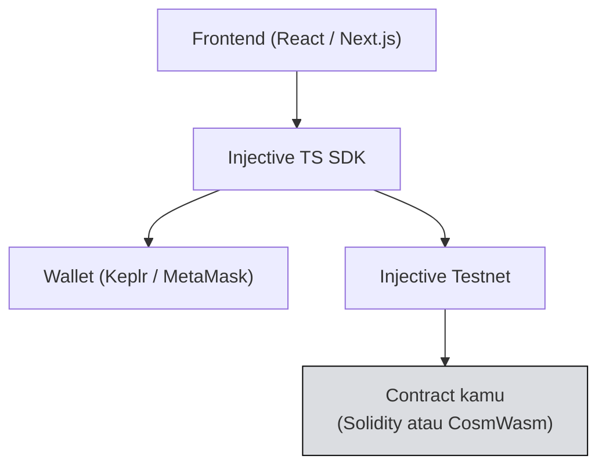

# 🎯 Unit 1 — Project Overview

:::info Goal Unit Ini
Di akhir unit ini kamu akan:
- Tahu persis **apa yang harus dibangun** dan seberapa besar
- Punya **definisi selesai** yang jelas
- Sudah **memilih ide proyek**
- Punya **rencana kerja** yang realistis untuk sisa waktu camp
:::

:::note Prasyarat
- ✅ [TS-SDK Unit 4](../TS-SDK/build-transaction) selesai — kamu bisa query dan broadcast transaksi
- ✅ Minimal satu contract sudah ter-deploy dari [Phase 2](../../Phase-2-Smart-Contracts/Solidity/deploy-ke-injective-evm)
:::

---

## 📏 Seberapa Besar Proyeknya?

**Lebih kecil dari yang kamu pikirkan.**

Kamu punya waktu sekitar satu minggu, dibagi dengan menyelesaikan Learning Track, menghadiri townhall, dan kemungkinan kuliah atau pekerjaan.

:::danger Kesalahan paling umum di camp mana pun
Peserta memilih ide ambisius, menghabiskan lima hari untuk arsitektur, lalu tidak punya apa pun untuk didemokan di hari terakhir.

**Proyek kecil yang selesai dan berjalan mengalahkan proyek besar yang setengah jadi** — untuk kelulusan, untuk portofoliomu, dan untuk apa yang benar-benar kamu pelajari.

Kalau ragu antara dua ide, **pilih yang lebih kecil.** Kamu selalu bisa menambah fitur kalau waktunya cukup. Kamu tidak bisa menyelamatkan proyek yang tidak jalan.
:::

---

## ✅ Definisi Selesai

Proyekmu dianggap selesai kalau memenuhi ini:

| Kriteria | Detail |
|---|---|
| **Contract ter-deploy** | Di Injective testnet, alamatnya tercatat |
| **Frontend berjalan** | Bisa dibuka dan dipakai, tidak harus cantik |
| **Wallet terhubung** | Pengguna bisa menghubungkan Keplr atau MetaMask |
| **Minimal satu aksi tulis** | Ada transaksi yang benar-benar mengubah state on-chain |
| **Minimal satu aksi baca** | Menampilkan data yang dibaca dari chain |
| **Menangani error** | Tidak crash saat transaksi gagal atau dibatalkan |
| **README** | Cara menjalankan, alamat contract, penjelasan singkat |
| **Video demo** | 2–3 menit, menunjukkan fitur yang berjalan |

:::tip "Tidak harus cantik" itu serius
Antarmuka polos dengan fungsi yang benar-benar berjalan jauh lebih baik daripada antarmuka indah dengan tombol yang tidak melakukan apa-apa.

Kerjakan fungsinya dulu. Percantik hanya kalau waktunya tersisa.
:::

---

## 💡 Pilihan Ide Proyek

### Opsi A — Celengan Target (direkomendasikan)

Lanjutan langsung dari contract `Celengan` di [Phase 2 Unit 1](../../Phase-2-Smart-Contracts/Solidity/solidity-dasar). Kamu sudah punya fondasinya, jadi bisa langsung fokus ke fitur dan frontend.

**Fitur inti:**
- Pengguna membuat target tabungan (nama + jumlah target)
- Siapa pun bisa menyetor ke sebuah target
- Progress bar menampilkan persentase tercapai
- Pembuat target bisa menarik dana setelah target tercapai

**Kenapa bagus untuk camp:** ruang lingkupnya jelas, membangun di atas kode yang sudah kamu pahami, dan mudah didemokan dalam tiga menit.

### Opsi B — Papan Komitmen On-Chain

- Pengguna menulis komitmen publik (misalnya "saya akan ship proyek ini")
- Menyetor sejumlah kecil INJ sebagai taruhan
- Menandai selesai untuk mengambil kembali taruhannya
- Papan menampilkan semua komitmen dan statusnya

**Kenapa bagus:** menunjukkan pola mapping, event, dan penarikan dengan syarat.

### Opsi C — Dashboard Pasar Injective

- Membaca daftar pasar spot dari indexer
- Menampilkan orderbook secara langsung
- Menghitung dan menampilkan spread
- Hanya baca, tanpa transaksi

**Kenapa bagus:** paling cepat dikerjakan, dan langsung memakai fitur khas Injective.
**Catatan:** proyek ini murni baca. Kalau kamu memilih ini, tambahkan minimal satu aksi tulis (misalnya menyimpan daftar pasar favorit ke sebuah contract) supaya memenuhi definisi selesai.

### Opsi D — Ide sendiri

Dipersilakan. Ceklah dengan panitia di grup Telegram supaya ruang lingkupnya masuk akal.

:::tip Sudut lokal itu bernilai
Ingat pembahasan di [Phase 1](../../Phase-1-Fundamentals/Concept-2-Ekosistem/dapps-dan-helix): antarmuka bahasa Indonesia, tampilan nilai dalam rupiah, alur onboarding untuk pengguna yang baru pertama kali punya wallet.

Ini bukan sekadar penyesuaian kosmetik — ini celah nyata yang tidak digarap tim global, dan menunjukkan kamu memikirkan pengguna, bukan hanya kode.
:::

---

## 🏗️ Arsitektur

### Pilih jalur contract

| | **Solidity (EVM)** | **CosmWasm (Rust)** |
|---|---|---|
| Kalau kamu | Lebih nyaman dengan JS/Solidity | Ingin mendalami Rust |
| Deploy | Hardhat / Foundry | injectived + Docker |
| Panggil dari frontend | ethers.js atau Injective SDK | `MsgExecuteContractCompat` |
| Tingkat kesulitan | 🟢 Lebih mudah | 🟡 Lebih menantang |

:::tip Rekomendasi
Pakai **Solidity** kecuali kamu punya alasan khusus untuk CosmWasm.

Kamu sudah menyelesaikan kedua jalur di Phase 2, jadi persyaratan Learning Track sudah terpenuhi. Untuk guided project, pilih jalur yang membuatmu **selesai**, bukan yang paling mengesankan.
:::

---

## 📅 Rencana Kerja

Sesuaikan dengan waktumu, tapi urutannya penting:

| Tahap | Isi | Perkiraan |
|---|---|---|
| **1. Scope** | Tetapkan fitur, tulis definisi selesai sendiri | 30 menit |
| **2. Contract** | Tulis, test lokal, deploy ke testnet | 3–4 jam |
| **3. Frontend dasar** | Setup project, koneksi wallet | 2 jam |
| **4. Integrasi** | Sambungkan baca & tulis ke contract | 3–4 jam |
| **5. Poles** | Penanganan error, status loading | 1–2 jam |
| **6. Dokumentasi** | README, screenshot | 1 jam |
| **7. Demo** | Rekam video 2–3 menit | 1 jam |

:::warning Jangan kerjakan tahap 7 di hari terakhir
Rekam video demo **satu hari sebelum** deadline. Selalu ada yang tidak beres saat merekam — testnet lambat, faucet kosong, atau bug yang baru ketahuan.

Menyisakan satu hari penyangga adalah perbedaan antara lulus dan tidak.
:::

---

## 🚫 Batasi Ruang Lingkup Sekarang

Tulis daftar ini sebelum mulai ngoding, dan patuhi:

**Yang akan saya bangun:**
- ...

**Yang TIDAK akan saya bangun (meski tergoda):**
- ...

Contoh daftar "tidak" yang bagus: autentikasi, dukungan multi-bahasa, mode gelap, aplikasi mobile, dukungan multi-chain, panel admin.

:::tip Ini teknik profesional, bukan jalan pintas
Menetapkan batas ruang lingkup secara eksplisit adalah salah satu keterampilan paling berharga dalam rekayasa perangkat lunak.

Kalau kamu bisa menunjukkan daftar ini di showcase dan menjelaskan **kenapa** kamu memotong sesuatu, itu justru menunjukkan kedewasaan teknis — bukan kekurangan.
:::

---

## ✅ Checklist Sebelum Mulai Ngoding

- [ ] Ide proyek dipilih
- [ ] Daftar fitur ditulis (maksimal 3–4 fitur inti)
- [ ] Daftar "tidak akan dibangun" ditulis
- [ ] Jalur contract dipilih (Solidity atau CosmWasm)
- [ ] Definisi selesai versimu sendiri sudah tertulis
- [ ] Ada waktu penyangga di jadwal untuk merekam demo

---

## 🎯 Rangkuman

:::tip Yang Harus Kamu Ingat
- **Kecil dan selesai** mengalahkan besar dan setengah jadi
- Definisi selesai: contract ter-deploy · frontend jalan · wallet terhubung · **satu aksi baca dan satu aksi tulis** · error tertangani · README · video demo
- Fungsi dulu, tampilan belakangan
- Pilih **Solidity** kecuali ada alasan khusus — pilih jalur yang membuatmu selesai
- Tulis daftar **"tidak akan dibangun"** dan patuhi
- **Rekam demo satu hari sebelum deadline**, bukan di hari-H
:::

---

**Lanjut:** [Unit 2 — Kontrak & Backend](./kontrak-dan-backend) 👉
