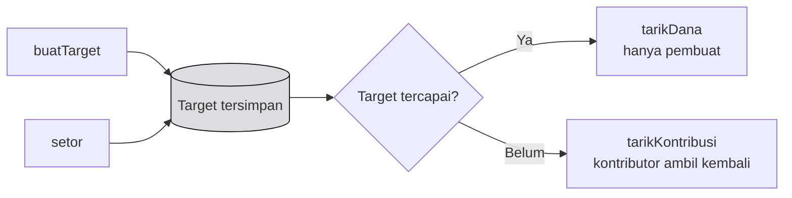

# 📝 Unit 2 — Kontrak & Backend

:::info Goal Unit Ini
Di akhir unit ini kamu akan punya:
- Contract **Celengan Target** yang lengkap dan teruji
- Contract **ter-deploy** di Injective EVM testnet
- **ABI** yang siap dipakai frontend
- Pemahaman tentang keputusan keamanan di dalamnya
:::

:::note Prasyarat
- ✅ [Unit 1](./project-overview) — ide dan ruang lingkup sudah ditetapkan
- ✅ [Phase 2 Solidity](../../Phase-2-Smart-Contracts/Solidity/deploy-ke-injective-evm) — Hardhat atau Foundry sudah bisa deploy
:::

---

## 📐 Rancangan

Contract mengelola banyak **target tabungan**. Setiap target punya pembuat, nama, jumlah target, dan total terkumpul.



---

## 📜 Contract

Buat `contracts/CelenganTarget.sol`:

```solidity
// SPDX-License-Identifier: MIT
pragma solidity ^0.8.20;

/// @title CelenganTarget — guided project CLC11 Injective
/// @notice Buat target tabungan bersama; dana cair setelah target tercapai
contract CelenganTarget {
    // ---- Tipe ----
    struct Target {
        address pembuat;
        string nama;
        uint256 jumlahTarget;
        uint256 terkumpul;
        bool sudahDicairkan;
    }

    // ---- State ----
    Target[] public daftarTarget;
    mapping(uint256 => mapping(address => uint256)) public kontribusi;

    // ---- Event ----
    event TargetDibuat(uint256 indexed id, address indexed pembuat, string nama, uint256 jumlahTarget);
    event Disetor(uint256 indexed id, address indexed penyetor, uint256 jumlah);
    event DanaDicairkan(uint256 indexed id, address indexed pembuat, uint256 jumlah);
    event KontribusiDitarik(uint256 indexed id, address indexed kontributor, uint256 jumlah);

    // ---- Error ----
    error TargetTidakAda();
    error JumlahNol();
    error BukanPembuat();
    error TargetBelumTercapai();
    error SudahDicairkan();
    error TidakAdaKontribusi();
    error TargetSudahTercapai();
    error PengirimanGagal();

    // ---- Buat target ----
    function buatTarget(string calldata nama, uint256 jumlahTarget) external returns (uint256) {
        if (jumlahTarget == 0) revert JumlahNol();
        if (bytes(nama).length == 0) revert JumlahNol();

        daftarTarget.push(Target({
            pembuat: msg.sender,
            nama: nama,
            jumlahTarget: jumlahTarget,
            terkumpul: 0,
            sudahDicairkan: false
        }));

        uint256 id = daftarTarget.length - 1;
        emit TargetDibuat(id, msg.sender, nama, jumlahTarget);
        return id;
    }

    // ---- Setor ke sebuah target ----
    function setor(uint256 id) external payable {
        if (id >= daftarTarget.length) revert TargetTidakAda();
        if (msg.value == 0) revert JumlahNol();

        Target storage t = daftarTarget[id];
        if (t.sudahDicairkan) revert SudahDicairkan();

        t.terkumpul += msg.value;
        kontribusi[id][msg.sender] += msg.value;

        emit Disetor(id, msg.sender, msg.value);
    }

    // ---- Pembuat mencairkan setelah target tercapai ----
    function tarikDana(uint256 id) external {
        if (id >= daftarTarget.length) revert TargetTidakAda();

        Target storage t = daftarTarget[id];
        if (msg.sender != t.pembuat) revert BukanPembuat();
        if (t.sudahDicairkan) revert SudahDicairkan();
        if (t.terkumpul < t.jumlahTarget) revert TargetBelumTercapai();

        // Effects sebelum interactions
        uint256 jumlah = t.terkumpul;
        t.sudahDicairkan = true;

        emit DanaDicairkan(id, msg.sender, jumlah);

        (bool sukses, ) = msg.sender.call{value: jumlah}("");
        if (!sukses) revert PengirimanGagal();
    }

    // ---- Kontributor menarik kembali jika target belum tercapai ----
    function tarikKontribusi(uint256 id) external {
        if (id >= daftarTarget.length) revert TargetTidakAda();

        Target storage t = daftarTarget[id];
        if (t.sudahDicairkan) revert SudahDicairkan();
        if (t.terkumpul >= t.jumlahTarget) revert TargetSudahTercapai();

        uint256 jumlah = kontribusi[id][msg.sender];
        if (jumlah == 0) revert TidakAdaKontribusi();

        // Effects sebelum interactions
        kontribusi[id][msg.sender] = 0;
        t.terkumpul -= jumlah;

        emit KontribusiDitarik(id, msg.sender, jumlah);

        (bool sukses, ) = msg.sender.call{value: jumlah}("");
        if (!sukses) revert PengirimanGagal();
    }

    // ---- View ----
    function jumlahTarget() external view returns (uint256) {
        return daftarTarget.length;
    }

    function ambilTarget(uint256 id) external view returns (Target memory) {
        if (id >= daftarTarget.length) revert TargetTidakAda();
        return daftarTarget[id];
    }

    function persentase(uint256 id) external view returns (uint256) {
        if (id >= daftarTarget.length) revert TargetTidakAda();
        Target storage t = daftarTarget[id];
        // Kalikan dulu baru bagi — hindari kehilangan presisi
        return (t.terkumpul * 100) / t.jumlahTarget;
    }
}
```

---

## 🔒 Keputusan Keamanan di Dalamnya

Perhatikan pola-pola dari [Phase 2 Unit 2](../../Phase-2-Smart-Contracts/Solidity/solidity-lanjutan) yang dipakai di sini:

| Pola | Di mana | Kenapa |
|---|---|---|
| **Checks-effects-interactions** | `tarikDana`, `tarikKontribusi` | State diubah **sebelum** mengirim token — mencegah reentrancy |
| **Custom error** | Semua validasi | Lebih murah dari string, membawa konteks |
| **Kontrol akses** | `tarikDana` cek `msg.sender != t.pembuat` | Hanya pembuat yang bisa mencairkan |
| **Kalikan sebelum bagi** | `persentase` | `(a * 100) / b`, bukan `(a / b) * 100` |
| **Tidak ada loop tanpa batas** | Seluruh contract | Pengguna mengambil sendiri (pull), tidak ada distribusi massal |
| **Validasi indeks** | Setiap function yang menerima `id` | Mencegah akses di luar batas array |

:::warning Batasan yang disengaja
Contract ini **tidak punya tenggat waktu**. Kalau sebuah target tidak pernah tercapai, dana bisa ditarik kembali kontributor kapan saja — tapi tidak ada yang memaksa penyelesaian.

Untuk versi produksi kamu akan menambahkan tenggat waktu dan pengembalian otomatis. **Untuk camp ini, batasan itu wajar** — dan menyebutkannya saat demo justru menunjukkan kamu memahami keterbatasan karyamu sendiri.

Mengetahui apa yang tidak dilakukan kodemu sama pentingnya dengan mengetahui apa yang dilakukannya.
:::

---

## 🧪 Test

Buat `test/CelenganTarget.test.js` (Hardhat):

```javascript
const { expect } = require("chai");
const { ethers } = require("hardhat");

describe("CelenganTarget", function () {
  let contract, pemilik, alice, bob;

  beforeEach(async function () {
    [pemilik, alice, bob] = await ethers.getSigners();
    const Factory = await ethers.getContractFactory("CelenganTarget");
    contract = await Factory.deploy();
    await contract.waitForDeployment();
  });

  it("membuat target", async function () {
    await contract.buatTarget("Laptop baru", ethers.parseEther("10"));
    expect(await contract.jumlahTarget()).to.equal(1);

    const t = await contract.ambilTarget(0);
    expect(t.nama).to.equal("Laptop baru");
    expect(t.terkumpul).to.equal(0);
  });

  it("menerima setoran dan menghitung persentase", async function () {
    await contract.buatTarget("Laptop baru", ethers.parseEther("10"));
    await contract.connect(alice).setor(0, { value: ethers.parseEther("2.5") });

    expect(await contract.persentase(0)).to.equal(25);
  });

  it("menolak pencairan sebelum target tercapai", async function () {
    await contract.buatTarget("Laptop baru", ethers.parseEther("10"));
    await contract.connect(alice).setor(0, { value: ethers.parseEther("1") });

    await expect(contract.tarikDana(0))
      .to.be.revertedWithCustomError(contract, "TargetBelumTercapai");
  });

  it("menolak pencairan oleh selain pembuat", async function () {
    await contract.buatTarget("Laptop baru", ethers.parseEther("10"));
    await contract.connect(alice).setor(0, { value: ethers.parseEther("10") });

    await expect(contract.connect(bob).tarikDana(0))
      .to.be.revertedWithCustomError(contract, "BukanPembuat");
  });

  it("mengizinkan pencairan setelah target tercapai", async function () {
    await contract.buatTarget("Laptop baru", ethers.parseEther("10"));
    await contract.connect(alice).setor(0, { value: ethers.parseEther("10") });

    await expect(contract.tarikDana(0)).to.not.be.reverted;

    const t = await contract.ambilTarget(0);
    expect(t.sudahDicairkan).to.equal(true);
  });

  it("mengizinkan kontributor menarik kembali sebelum target tercapai", async function () {
    await contract.buatTarget("Laptop baru", ethers.parseEther("10"));
    await contract.connect(alice).setor(0, { value: ethers.parseEther("3") });

    await expect(contract.connect(alice).tarikKontribusi(0)).to.not.be.reverted;

    const t = await contract.ambilTarget(0);
    expect(t.terkumpul).to.equal(0);
  });
});
```

Jalankan:

```bash
npx hardhat test
```

:::tip Perhatikan bahwa empat dari enam test menguji penolakan
Test yang paling berharga bukan "apakah fiturnya jalan", tapi **"apakah yang seharusnya ditolak benar-benar ditolak"**.

Kalau kamu hanya menulis test jalur bahagia, kamu tidak menguji keamanan sama sekali.
:::

---

## 🚀 Deploy

Buat `scripts/deploy-celengan.js`:

```javascript
const hre = require("hardhat");

async function main() {
  const [deployer] = await hre.ethers.getSigners();
  console.log("Deploy dari:", deployer.address);

  const Factory = await hre.ethers.getContractFactory("CelenganTarget");
  const contract = await Factory.deploy();
  await contract.waitForDeployment();

  const alamat = await contract.getAddress();
  console.log("CelenganTarget di:", alamat);
  console.log("Explorer: https://testnet.blockscout.injective.network/address/" + alamat);
}

main().catch((e) => {
  console.error(e);
  process.exitCode = 1;
});
```

```bash
npx hardhat run scripts/deploy-celengan.js --network injectiveTestnet
```

**Catat alamat contract-nya.** Frontend membutuhkannya di Unit berikutnya.

### Ambil ABI untuk frontend

Setelah compile, ABI ada di:

```
artifacts/contracts/CelenganTarget.sol/CelenganTarget.json
```

Salin field `abi` dari file itu ke project frontend-mu.

---

## ✅ Checklist

- [ ] Contract ter-compile tanpa peringatan
- [ ] Semua test lolos, termasuk test penolakan
- [ ] Contract ter-deploy ke Injective testnet
- [ ] Alamat contract tercatat
- [ ] ABI disalin untuk frontend
- [ ] Contract terlihat di [Blockscout](https://testnet.blockscout.injective.network/)
- [ ] (Opsional) Source code terverifikasi di explorer

---

## 🎯 Rangkuman

:::tip Yang Harus Kamu Ingat
- Contract memakai **checks-effects-interactions** di kedua function penarikan
- **Custom error** dipakai di semua validasi
- `persentase` **mengalikan sebelum membagi** untuk menjaga presisi
- Tidak ada loop tanpa batas — pengguna **menarik sendiri**
- **Mayoritas test menguji penolakan**, bukan jalur bahagia
- Batasan yang disengaja (tidak ada tenggat waktu) — **sebutkan saat demo**, itu menunjukkan kedewasaan
- Simpan **alamat contract dan ABI** — keduanya dibutuhkan frontend
:::

---

**Lanjut:** [Unit 3 — Frontend Integration](./frontend-integration) 👉
