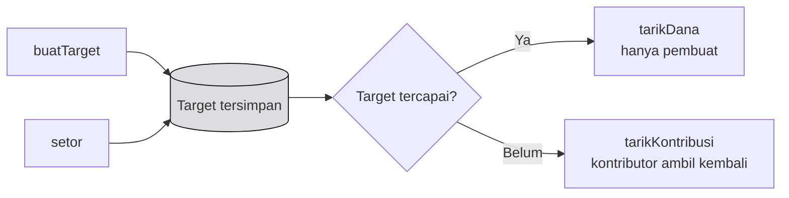

# 📝 Unit 2 — Kontrak & Backend

:::info Goal Unit Ini
Di akhir unit ini kamu akan punya:
- Contract **Celengan Target** yang lengkap dan teruji
- Contract **ter-deploy** di Injective EVM testnet
- Contract **terverifikasi** di Blockscout
- **ABI** yang siap dipakai frontend
- Pemahaman tentang keputusan keamanan di dalamnya
:::

:::note Prasyarat
- ✅ [Unit 1](./project-overview) — ide dan ruang lingkup sudah ditetapkan
- ✅ [Phase 2 Solidity](../../Phase-2-Smart-Contracts/Solidity/deploy-ke-injective-evm) — Hardhat sudah bisa deploy
- 💻 **Node.js v22+** — cek dengan `node --version`
:::

---

## 📐 Rancangan

Contract mengelola banyak **target tabungan**. Setiap target punya pembuat, nama, jumlah target, dan total terkumpul.



---

## 🏗️ Setup Project

:::danger Baca ini sebelum menjalankan perintah install
Dua paket yang dulu dipakai di tutorial Hardhat **sudah tidak bisa dipakai lagi**:

1. `npm install --save-dev hardhat` sekarang memasang **Hardhat 3**, yang format konfigurasinya sama sekali berbeda dari Hardhat 2.
2. `npm install --save-dev @nomicfoundation/hardhat-toolbox` memasang versi 7 — sebuah **paket kosong** yang isinya cuma pesan peringatan:

   ```text
   Warning: You installed the `latest` version of @nomicfoundation/hardhat-toolbox,
   which does not work with Hardhat 2 nor 3.
   ```

Jadi **jangan** memakai dua perintah itu apa adanya. Pakai yang di bawah ini.
:::

```bash
mkdir celengan-contract
cd celengan-contract
npm init -y
npm install --save-dev hardhat@^3 @nomicfoundation/hardhat-toolbox-mocha-ethers@^3 dotenv
mkdir contracts scripts test
```

Lalu buka `package.json` dan tambahkan `"type": "module"` — Hardhat 3 memakai ESM:

```json
{
  "name": "celengan-contract",
  "type": "module",
  "scripts": {
    "compile": "hardhat compile",
    "test": "hardhat test mocha",
    "deploy": "hardhat run scripts/deploy-celengan.js --network injectiveTestnet"
  }
}
```

:::note Masih pakai Hardhat 2?
Boleh, tapi versinya **wajib dipin** supaya tidak ikut naik ke 3:

```bash
npm install --save-dev hardhat@^2.26 @nomicfoundation/hardhat-toolbox@^5 dotenv
```

Kalau memilih jalur ini, config dan script-nya memakai `require()` / `module.exports` / `hre.ethers` seperti gaya lama. Sisa unit ini memakai **Hardhat 3**.
:::

### Simpan private key

Buat `.env`:

```bash
PRIVATE_KEY=isi_private_key_wallet_latihanmu_disini
```

Dan **segera** amankan:

```bash
printf "node_modules\n.env\nartifacts\ncache\n" > .gitignore
cat .gitignore
```

:::danger Verifikasi sekarang, bukan nanti
Output `cat .gitignore` harus memuat baris `.env` **sebelum** kamu `git commit` apa pun. Bot memindai GitHub untuk private key terus-menerus.

Pakai **wallet khusus latihan** yang hanya berisi testnet INJ.
:::

---

## ⚙️ Konfigurasi Hardhat

Buat `hardhat.config.js`:

```javascript
import { defineConfig } from "hardhat/config";
import hardhatToolboxMochaEthers from "@nomicfoundation/hardhat-toolbox-mocha-ethers";
import "dotenv/config";

const PRIVATE_KEY = process.env.PRIVATE_KEY ?? "";

export default defineConfig({
  plugins: [hardhatToolboxMochaEthers],

  solidity: {
    version: "0.8.20",
    settings: {
      optimizer: { enabled: true, runs: 200 },
    },
  },

  networks: {
    injectiveTestnet: {
      type: "http",                 // ← wajib di Hardhat 3
      chainType: "l1",
      url: "https://testnet.sentry.chain.json-rpc.injective.network/",
      chainId: 1439,
      accounts: PRIVATE_KEY ? [PRIVATE_KEY] : [],
      timeout: 120_000,
    },
  },

  // Hardhat 3 tidak mengenal chain 1439 — tanpa blok ini `hardhat verify` gagal
  chainDescriptors: {
    1439: {
      name: "Injective EVM Testnet",
      chainType: "l1",
      blockExplorers: {
        blockscout: {
          name: "Blockscout",
          url: "https://testnet.blockscout.injective.network",
          apiUrl: "https://testnet.blockscout-api.injective.network/api",
        },
      },
    },
  },

  verify: {
    blockscout: { enabled: true },
    etherscan: { enabled: false, apiKey: "" },
    sourcify: { enabled: false },
  },
});
```

:::danger ⚠️ Jangan pakai RPC `k8s.testnet.json-rpc.injective.network`
Endpoint itu masih beredar di banyak tutorial, tapi **rusak untuk deploy**.

Ia **menerima** transaksimu — transaksi benar-benar masuk chain, nonce naik, saldo berkurang — tetapi **selalu menjawab `null`** untuk `eth_getTransactionByHash` dan `eth_getTransactionReceipt`.

Artinya `await contract.waitForDeployment()` dan `tx.wait()` akan **menunggu selamanya**. Kamu akan melihat terminal diam bermenit-menit dan menyimpulkan deploy gagal — padahal **contract-mu sudah ter-deploy**.

Saat unit ini ditulis ulang, tiga percobaan deploy yang "menggantung" ternyata menghasilkan tiga contract yang hidup di chain.

Pakai endpoint sentry di config di atas.
:::

:::note Kenapa `sourcify: { enabled: false }`?
Sourcify belum mengenal chain 1439. Kalau dibiarkan aktif, `hardhat verify` keluar dengan **exit code 1** meskipun verifikasi Blockscout-nya sudah sukses — bikin bingung, dan bikin CI merah tanpa sebab.
:::

---

## 📜 Contract

Buat `contracts/CelenganTarget.sol`:

```solidity
// SPDX-License-Identifier: MIT
pragma solidity ^0.8.20;

/// @title CelenganTarget — guided project CLC11 Injective
/// @notice Buat target tabungan bersama; dana cair setelah target tercapai
contract CelenganTarget {
    // ---- Tipe ----
    struct Target {
        address pembuat;
        string nama;
        uint256 jumlahTarget;
        uint256 terkumpul;
        bool sudahDicairkan;
    }

    // ---- State ----
    Target[] public daftarTarget;
    mapping(uint256 => mapping(address => uint256)) public kontribusi;

    // ---- Event ----
    event TargetDibuat(uint256 indexed id, address indexed pembuat, string nama, uint256 jumlahTarget);
    event Disetor(uint256 indexed id, address indexed penyetor, uint256 jumlah);
    event DanaDicairkan(uint256 indexed id, address indexed pembuat, uint256 jumlah);
    event KontribusiDitarik(uint256 indexed id, address indexed kontributor, uint256 jumlah);

    // ---- Error ----
    error TargetTidakAda();
    error JumlahNol();
    error NamaKosong();
    error BukanPembuat();
    error TargetBelumTercapai();
    error SudahDicairkan();
    error TidakAdaKontribusi();
    error TargetSudahTercapai();
    error PengirimanGagal();

    // ---- Buat target ----
    function buatTarget(string calldata nama, uint256 jumlahTarget) external returns (uint256) {
        if (jumlahTarget == 0) revert JumlahNol();
        if (bytes(nama).length == 0) revert NamaKosong();

        daftarTarget.push(Target({
            pembuat: msg.sender,
            nama: nama,
            jumlahTarget: jumlahTarget,
            terkumpul: 0,
            sudahDicairkan: false
        }));

        uint256 id = daftarTarget.length - 1;
        emit TargetDibuat(id, msg.sender, nama, jumlahTarget);
        return id;
    }

    // ---- Setor ke sebuah target ----
    function setor(uint256 id) external payable {
        if (id >= daftarTarget.length) revert TargetTidakAda();
        if (msg.value == 0) revert JumlahNol();

        Target storage t = daftarTarget[id];
        if (t.sudahDicairkan) revert SudahDicairkan();

        t.terkumpul += msg.value;
        kontribusi[id][msg.sender] += msg.value;

        emit Disetor(id, msg.sender, msg.value);
    }

    // ---- Pembuat mencairkan setelah target tercapai ----
    function tarikDana(uint256 id) external {
        if (id >= daftarTarget.length) revert TargetTidakAda();

        Target storage t = daftarTarget[id];
        if (msg.sender != t.pembuat) revert BukanPembuat();
        if (t.sudahDicairkan) revert SudahDicairkan();
        if (t.terkumpul < t.jumlahTarget) revert TargetBelumTercapai();

        // Effects sebelum interactions
        uint256 jumlah = t.terkumpul;
        t.sudahDicairkan = true;

        emit DanaDicairkan(id, msg.sender, jumlah);

        (bool sukses, ) = msg.sender.call{value: jumlah}("");
        if (!sukses) revert PengirimanGagal();
    }

    // ---- Kontributor menarik kembali jika target belum tercapai ----
    function tarikKontribusi(uint256 id) external {
        if (id >= daftarTarget.length) revert TargetTidakAda();

        Target storage t = daftarTarget[id];
        if (t.sudahDicairkan) revert SudahDicairkan();
        if (t.terkumpul >= t.jumlahTarget) revert TargetSudahTercapai();

        uint256 jumlah = kontribusi[id][msg.sender];
        if (jumlah == 0) revert TidakAdaKontribusi();

        // Effects sebelum interactions
        kontribusi[id][msg.sender] = 0;
        t.terkumpul -= jumlah;

        emit KontribusiDitarik(id, msg.sender, jumlah);

        (bool sukses, ) = msg.sender.call{value: jumlah}("");
        if (!sukses) revert PengirimanGagal();
    }

    // ---- View ----
    function totalTarget() external view returns (uint256) {
        return daftarTarget.length;
    }

    function ambilTarget(uint256 id) external view returns (Target memory) {
        if (id >= daftarTarget.length) revert TargetTidakAda();
        return daftarTarget[id];
    }

    function persentase(uint256 id) external view returns (uint256) {
        if (id >= daftarTarget.length) revert TargetTidakAda();
        Target storage t = daftarTarget[id];
        // Kalikan dulu baru bagi — hindari kehilangan presisi
        return (t.terkumpul * 100) / t.jumlahTarget;
    }
}
```

Compile:

```bash
npx hardhat compile
```

**Yang seharusnya kamu lihat:**

```text
Compiled 1 Solidity file with solc 0.8.20 (evm target: shanghai)
```

Tanpa satu pun warning.

:::tip Kenapa `totalTarget()` dan bukan `jumlahTarget()`?
Ini contoh bagus kenapa penamaan itu penting.

Kalau function view-nya dinamai `jumlahTarget()`, ia bentrok dengan **parameter** `jumlahTarget` di `buatTarget` dan **field** `jumlahTarget` di struct. solc langsung protes:

```text
Warning: This declaration has the same name as another declaration.
```

Selain memicu warning, namanya juga membingungkan: `jumlahTarget` bisa berarti "nominal target" **atau** "berapa banyak target". `totalTarget()` menghilangkan keraguan itu.

Perhatikan juga `NamaKosong()`: kalau nama kosong dijawab dengan `JumlahNol()`, pengguna yang lupa mengisi nama akan melihat pesan "Jumlah harus lebih dari nol" dan bingung. **Satu error, satu arti.**
:::

---

## 🔒 Keputusan Keamanan di Dalamnya

Perhatikan pola-pola dari [Phase 2 Unit 2](../../Phase-2-Smart-Contracts/Solidity/solidity-lanjutan) yang dipakai di sini:

| Pola | Di mana | Kenapa |
|---|---|---|
| **Checks-effects-interactions** | `tarikDana`, `tarikKontribusi` | State diubah **sebelum** mengirim token — mencegah reentrancy |
| **Custom error** | Semua validasi | Lebih murah dari string, membawa konteks |
| **Kontrol akses** | `tarikDana` cek `msg.sender != t.pembuat` | Hanya pembuat yang bisa mencairkan |
| **Kalikan sebelum bagi** | `persentase` | `(a * 100) / b`, bukan `(a / b) * 100` |
| **Tidak ada loop tanpa batas** | Seluruh contract | Pengguna mengambil sendiri (pull), tidak ada distribusi massal |
| **Validasi indeks** | Setiap function yang menerima `id` | Mencegah akses di luar batas array |

:::warning Batasan yang disengaja
Contract ini **tidak punya tenggat waktu**. Kalau sebuah target tidak pernah tercapai, dana bisa ditarik kembali kontributor kapan saja — tapi tidak ada yang memaksa penyelesaian.

Untuk versi produksi kamu akan menambahkan tenggat waktu dan pengembalian otomatis. **Untuk camp ini, batasan itu wajar** — dan menyebutkannya saat demo justru menunjukkan kamu memahami keterbatasan karyamu sendiri.

Mengetahui apa yang tidak dilakukan kodemu sama pentingnya dengan mengetahui apa yang dilakukannya.
:::

---

## 🧪 Test

Buat `test/CelenganTarget.test.js`:

:::note Beda besar dari Hardhat 2
Di Hardhat 3 **tidak ada lagi objek global `ethers` atau `hre`**. Kamu mengambil `ethers` dari sebuah koneksi jaringan:

```javascript
const { ethers } = await network.create();
```

Matcher `.to.not.be.reverted` juga sudah dihapus, diganti `.to.not.revert(ethers)`.
:::

```javascript
import { expect } from "chai";
import { network } from "hardhat";

const { ethers } = await network.create();

describe("CelenganTarget", function () {
  let contract, pemilik, alice, bob;

  beforeEach(async function () {
    [pemilik, alice, bob] = await ethers.getSigners();
    const Factory = await ethers.getContractFactory("CelenganTarget");
    contract = await Factory.deploy();
    await contract.waitForDeployment();
  });

  it("membuat target", async function () {
    await contract.buatTarget("Laptop baru", ethers.parseEther("10"));
    expect(await contract.totalTarget()).to.equal(1);

    const t = await contract.ambilTarget(0);
    expect(t.nama).to.equal("Laptop baru");
    expect(t.terkumpul).to.equal(0);
  });

  it("menolak target dengan nominal nol", async function () {
    await expect(contract.buatTarget("Laptop baru", 0))
      .to.be.revertedWithCustomError(contract, "JumlahNol");
  });

  it("menolak target tanpa nama", async function () {
    await expect(contract.buatTarget("", ethers.parseEther("10")))
      .to.be.revertedWithCustomError(contract, "NamaKosong");
  });

  it("menerima setoran dan menghitung persentase", async function () {
    await contract.buatTarget("Laptop baru", ethers.parseEther("10"));
    await contract.connect(alice).setor(0, { value: ethers.parseEther("2.5") });

    expect(await contract.persentase(0)).to.equal(25);
  });

  it("memancarkan event Disetor dengan argumen yang benar", async function () {
    await contract.buatTarget("Laptop baru", ethers.parseEther("10"));

    await expect(contract.connect(alice).setor(0, { value: ethers.parseEther("1") }))
      .to.emit(contract, "Disetor")
      .withArgs(0, alice.address, ethers.parseEther("1"));
  });

  it("menolak setoran ke target yang tidak ada", async function () {
    await expect(contract.setor(99, { value: ethers.parseEther("1") }))
      .to.be.revertedWithCustomError(contract, "TargetTidakAda");
  });

  it("menolak pencairan sebelum target tercapai", async function () {
    await contract.buatTarget("Laptop baru", ethers.parseEther("10"));
    await contract.connect(alice).setor(0, { value: ethers.parseEther("1") });

    await expect(contract.tarikDana(0))
      .to.be.revertedWithCustomError(contract, "TargetBelumTercapai");
  });

  it("menolak pencairan oleh selain pembuat", async function () {
    await contract.buatTarget("Laptop baru", ethers.parseEther("10"));
    await contract.connect(alice).setor(0, { value: ethers.parseEther("10") });

    await expect(contract.connect(bob).tarikDana(0))
      .to.be.revertedWithCustomError(contract, "BukanPembuat");
  });

  it("mengizinkan pencairan setelah target tercapai", async function () {
    await contract.buatTarget("Laptop baru", ethers.parseEther("10"));
    await contract.connect(alice).setor(0, { value: ethers.parseEther("10") });

    await expect(contract.tarikDana(0)).to.not.revert(ethers);

    const t = await contract.ambilTarget(0);
    expect(t.sudahDicairkan).to.equal(true);
  });

  it("mengizinkan kontributor menarik kembali sebelum target tercapai", async function () {
    await contract.buatTarget("Laptop baru", ethers.parseEther("10"));
    await contract.connect(alice).setor(0, { value: ethers.parseEther("3") });

    await expect(contract.connect(alice).tarikKontribusi(0)).to.not.revert(ethers);

    const t = await contract.ambilTarget(0);
    expect(t.terkumpul).to.equal(0);
  });

  it("menolak tarikKontribusi kalau target sudah tercapai", async function () {
    await contract.buatTarget("Laptop baru", ethers.parseEther("10"));
    await contract.connect(alice).setor(0, { value: ethers.parseEther("10") });

    await expect(contract.connect(alice).tarikKontribusi(0))
      .to.be.revertedWithCustomError(contract, "TargetSudahTercapai");
  });

  it("menolak tarikKontribusi kalau tidak pernah menyetor", async function () {
    await contract.buatTarget("Laptop baru", ethers.parseEther("10"));
    await contract.connect(alice).setor(0, { value: ethers.parseEther("1") });

    await expect(contract.connect(bob).tarikKontribusi(0))
      .to.be.revertedWithCustomError(contract, "TidakAdaKontribusi");
  });

  it("menolak pencairan dua kali", async function () {
    await contract.buatTarget("Laptop baru", ethers.parseEther("10"));
    await contract.connect(alice).setor(0, { value: ethers.parseEther("10") });
    await contract.tarikDana(0);

    await expect(contract.tarikDana(0))
      .to.be.revertedWithCustomError(contract, "SudahDicairkan");
  });
});
```

Jalankan:

```bash
npx hardhat test
```

**Yang seharusnya kamu lihat:**

```text
  CelenganTarget
    ✔ membuat target
    ✔ menolak target dengan nominal nol
    ✔ menolak target tanpa nama
    ✔ menerima setoran dan menghitung persentase
    ✔ memancarkan event Disetor dengan argumen yang benar
    ✔ menolak setoran ke target yang tidak ada
    ✔ menolak pencairan sebelum target tercapai
    ✔ menolak pencairan oleh selain pembuat
    ✔ mengizinkan pencairan setelah target tercapai
    ✔ mengizinkan kontributor menarik kembali sebelum target tercapai
    ✔ menolak tarikKontribusi kalau target sudah tercapai
    ✔ menolak tarikKontribusi kalau tidak pernah menyetor
    ✔ menolak pencairan dua kali

  13 passing (276ms)
```

:::tip Perhatikan bahwa 10 dari 13 test menguji penolakan
Test yang paling berharga bukan "apakah fiturnya jalan", tapi **"apakah yang seharusnya ditolak benar-benar ditolak"**.

Kalau kamu hanya menulis test jalur bahagia, kamu tidak menguji keamanan sama sekali.

Coba **sengaja rusak** salah satunya: hapus baris `if (msg.sender != t.pembuat) revert BukanPembuat();` lalu jalankan ulang. Test "menolak pencairan oleh selain pembuat" akan gagal — dan itulah bedanya punya test dengan tidak.
:::

---

## 🚀 Deploy

Buat `scripts/deploy-celengan.js`:

```javascript
import { network } from "hardhat";
import { writeFileSync } from "node:fs";

// Hardhat 3: tidak ada `hre.ethers` global. `getOrCreate()` tanpa argumen
// memakai jaringan yang dipilih lewat flag `--network`.
const { ethers, networkName } = await network.getOrCreate();

const [deployer] = await ethers.getSigners();
if (deployer === undefined) {
  throw new Error("Tidak ada signer — cek PRIVATE_KEY di .env");
}

console.log("Jaringan   :", networkName);
console.log("Deploy dari:", deployer.address);

const saldo = await ethers.provider.getBalance(deployer.address);
console.log("Saldo      :", ethers.formatEther(saldo), "INJ");

if (saldo === 0n) {
  throw new Error("Saldo 0 INJ — ambil dulu di https://testnet.faucet.injective.network/");
}

const Factory = await ethers.getContractFactory("CelenganTarget");
const contract = await Factory.deploy();
await contract.waitForDeployment();

const alamat = await contract.getAddress();
const txHash = contract.deploymentTransaction()?.hash;

console.log("");
console.log("CelenganTarget di:", alamat);
console.log("Tx hash          :", txHash);
console.log("Explorer         : https://testnet.blockscout.injective.network/address/" + alamat);

// Simpan supaya frontend & script lain tidak perlu copy-paste alamat
writeFileSync(
  "deployments.json",
  JSON.stringify({ network: networkName, chainId: 1439, address: alamat, txHash }, null, 2) + "\n"
);
```

```bash
npx hardhat run scripts/deploy-celengan.js --network injectiveTestnet
```

**Yang seharusnya kamu lihat** (alamat akan berbeda):

```text
Jaringan   : injectiveTestnet
Deploy dari: 0xD0c5cCB47FDf06DA8Bd01A0Cf087C4A34c27b685
Saldo      : 0.89885601463 INJ

CelenganTarget di: 0x4C14e7aA621A8be324c3a23AC3e1FE7190128854
Tx hash          : 0x315500fc2ad1def775dd825eca6ddcec026d16e47f4c828c5ccd326c1a40ab5f
Explorer         : https://testnet.blockscout.injective.network/address/0x4C14…8854
```

**Catat alamat contract-nya.** Frontend membutuhkannya di Unit berikutnya.

:::tip 🧪 Kalau deploy-mu terlihat menggantung
Jangan langsung menekan Ctrl+C dan mengulang — kamu berisiko men-deploy contract yang sama berkali-kali dan membuang gas.

Cek dulu apakah sebenarnya sudah berhasil:

```bash
# nonce naik = transaksimu masuk chain
cast nonce <ALAMAT_WALLET> --rpc-url https://testnet.sentry.chain.json-rpc.injective.network/
```

Atau buka alamat wallet-mu di [Blockscout](https://testnet.blockscout.injective.network/) dan lihat daftar transaksinya. Kalau ada `Contract Creation` yang sukses, contract-mu sudah jadi — kamu hanya tidak menerima receipt-nya.

Ini gejala klasik RPC `k8s.…`. Pastikan config-mu memakai endpoint **sentry**.
:::

---

## 🔍 Verifikasi di Blockscout

```bash
npx hardhat verify --network injectiveTestnet ALAMAT_CONTRACT_KAMU
```

**Yang seharusnya kamu lihat:**

```text
=== Blockscout ===

📤 Submitted source code for verification on Blockscout:

  contracts/CelenganTarget.sol:CelenganTarget
  Address: 0x4C14e7aA621A8be324c3a23AC3e1FE7190128854

⏳ Waiting for verification result...

✅ Contract verified successfully on Blockscout!
```

:::danger URL API Blockscout berbeda dari URL explorer-nya
Ini menjebak banyak orang, termasuk tutorial yang beredar:

| | URL |
|---|---|
| UI explorer (dibuka di browser) | `https://testnet.blockscout.injective.network` |
| **API** (dipakai `hardhat verify`) | `https://testnet.blockscout-api.injective.network/api` |

Menebak bahwa API-nya ada di `<url-explorer>/api` menghasilkan **404**. Perhatikan sisipan `-api` pada nama host — itu host yang berbeda, bukan path.
:::

Setelah berhasil, buka tab **Contract** di Blockscout. Sekarang ada centang hijau, source code Solidity-mu terlihat, dan muncul sub-tab **Read Contract** / **Write Contract** yang bisa dipakai langsung tanpa menulis kode.

---

## 📤 Ambil ABI untuk frontend

Setelah compile, ABI ada di `artifacts/contracts/CelenganTarget.sol/CelenganTarget.json` pada field `abi`.

Daripada copy-paste manual setiap contract berubah, buat `scripts/export-abi.js`:

```javascript
import { readFileSync, writeFileSync, mkdirSync } from "node:fs";

const { abi } = JSON.parse(
  readFileSync("artifacts/contracts/CelenganTarget.sol/CelenganTarget.json", "utf8")
);

const tujuan = "../celengan-ui/src/lib/config/constants/CELENGAN_TARGET_ABI.json";
mkdirSync(tujuan.slice(0, tujuan.lastIndexOf("/")), { recursive: true });
writeFileSync(tujuan, JSON.stringify(abi, null, 2) + "\n");

console.log(`ABI (${abi.length} entri) disalin ke ${tujuan}`);
```

```bash
node scripts/export-abi.js
```

:::tip Kenapa repot bikin script ini?
Karena kamu **akan** mengubah contract lagi. Setiap kali itu terjadi, ABI di frontend harus ikut berubah — dan lupa menyalinnya menghasilkan error yang membingungkan (`function does not exist`, atau hasil decode yang aneh) yang terlihat seperti bug frontend padahal bukan.

Satu perintah menghilangkan seluruh kelas bug itu.
:::

---

## 🌱 Isi data demo (opsional tapi disarankan)

Contract yang baru di-deploy itu kosong. Saat merekam demo nanti, jauh lebih enak kalau sudah ada beberapa target dengan progress berbeda-beda.

Buat `scripts/seed.js`:

```javascript
import { network } from "hardhat";
import { readFileSync } from "node:fs";

const { ethers } = await network.getOrCreate();
const ALAMAT = JSON.parse(readFileSync("deployments.json", "utf8")).address;
const contract = await ethers.getContractAt("CelenganTarget", ALAMAT);

const TARGETS = [
  { nama: "Laptop buat ngoding", target: "0.05", setor: "0.02" },
  { nama: "Dana darurat komunitas", target: "0.02", setor: "0.02" },
  { nama: "Tiket Townhall offline", target: "0.03", setor: "0.005" },
];

for (const t of TARGETS) {
  const tx = await contract.buatTarget(t.nama, ethers.parseEther(t.target));
  await tx.wait();
  console.log("dibuat:", t.nama);
}

const total = Number(await contract.totalTarget());
for (let i = 0; i < TARGETS.length; i++) {
  const id = total - TARGETS.length + i;
  const tx = await contract.setor(id, { value: ethers.parseEther(TARGETS[i].setor) });
  await tx.wait();
  console.log(`setor #${id}:`, Number(await contract.persentase(id)) + "%");
}
```

```bash
npx hardhat run scripts/seed.js --network injectiveTestnet
```

Hasilnya: satu target 40%, satu 100% (siap dicairkan — bagus untuk mendemokan `tarikDana`), satu 16%.

---

## 🛠️ Troubleshooting

<details>
<summary><strong>Deploy jalan lama lalu tidak selesai-selesai</strong></summary>

Hampir pasti kamu memakai RPC `k8s.testnet.json-rpc.injective.network`. Ganti ke endpoint **sentry** di `hardhat.config.js`.

Sebelum mengulang deploy, **cek dulu** apakah contract sebelumnya sudah jadi — buka alamat wallet-mu di Blockscout. Mengulang deploy tanpa mengecek hanya membuang gas dan menghasilkan contract kembar.

</details>

<details>
<summary><strong>"The network injectiveTestnet with chain id 1439 is not supported"</strong></summary>

Blok `chainDescriptors` belum ada di `hardhat.config.js`. Blok `etherscan.customChains` gaya Hardhat 2 **tidak dipakai** oleh Hardhat 3.

</details>

<details>
<summary><strong>`hardhat verify` gagal dengan 404</strong></summary>

`apiUrl`-nya salah. Harus `https://testnet.blockscout-api.injective.network/api` — perhatikan `-api` di nama host.

</details>

<details>
<summary><strong>`hardhat verify` sukses tapi exit code 1</strong></summary>

Sourcify masih aktif dan tidak mengenal chain 1439. Tambahkan `sourcify: { enabled: false }` di blok `verify`.

</details>

<details>
<summary><strong>"ethers is not defined" atau "hre is not defined"</strong></summary>

Kamu memakai contoh kode Hardhat 2 di project Hardhat 3. Ambil `ethers` dari koneksi jaringan: `const { ethers } = await network.getOrCreate();`

</details>

<details>
<summary><strong>"Cannot use import statement outside a module"</strong></summary>

`"type": "module"` belum ada di `package.json`.

</details>

<details>
<summary><strong>"insufficient funds for gas"</strong></summary>

Ambil testnet INJ di [faucet](https://testnet.faucet.injective.network/). Script deploy di atas mencetak `Saldo:` di awal — kalau `0.0`, di situlah masalahnya.

</details>

---

## ✅ Checklist

- [ ] Hardhat 3 + `hardhat-toolbox-mocha-ethers` terpasang (**bukan** `hardhat-toolbox`)
- [ ] `"type": "module"` ada di `package.json`
- [ ] Contract ter-compile **tanpa peringatan**
- [ ] Semua 13 test lolos, termasuk test penolakan
- [ ] `hardhat.config.js` memakai RPC **sentry**, bukan `k8s.…`
- [ ] Contract ter-deploy ke Injective testnet
- [ ] Alamat contract tercatat (`deployments.json`)
- [ ] Contract **terverifikasi** di Blockscout, tab Contract menampilkan source
- [ ] ABI ter-export ke project frontend

---

## 🎯 Rangkuman

:::tip Yang Harus Kamu Ingat
- `@nomicfoundation/hardhat-toolbox` terbaru adalah **paket kosong** — pakai `hardhat-toolbox-mocha-ethers` untuk Hardhat 3
- Hardhat 3 memakai **ESM + `defineConfig` + `plugins[]`**, dan **tidak punya `hre.ethers` global**
- **Jangan pakai RPC `k8s.…`** — ia menerima transaksi tapi tidak pernah mengembalikan receipt, jadi deploy terlihat menggantung padahal berhasil
- API Blockscout ada di **host terpisah** (`blockscout-api`), bukan `<explorer>/api`
- `chainDescriptors` diperlukan supaya Hardhat 3 mengenal chain 1439; matikan Sourcify
- Contract memakai **checks-effects-interactions**, **custom error**, dan **kalikan sebelum bagi**
- **Satu error, satu arti** — `NamaKosong()` bukan `JumlahNol()`
- **Mayoritas test menguji penolakan**, bukan jalur bahagia
- Simpan **alamat contract dan ABI** — keduanya dibutuhkan frontend
:::

---

**Lanjut:** [Unit 3 — Frontend Integration](./frontend-integration) 👉
