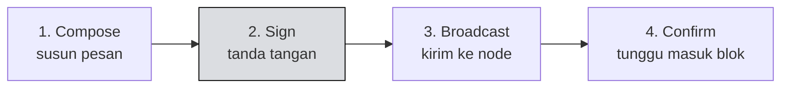

# ✍️ Unit 4 — Build & Broadcast Transaction

:::info Goal Unit Ini
Di akhir unit ini kamu akan:
- Paham alur **compose → sign → broadcast → confirm**
- Bisa mengirim **MsgSend** dari script Node maupun dari browser
- Bisa memanggil **execute contract CosmWasm** dari TypeScript
- Bisa menangani **kegagalan transaksi** dengan benar
:::

:::note Prasyarat
- ✅ [Unit 3](./wallet-integration) selesai
- ✅ Ada testnet INJ di wallet-mu
:::

---

## 🔄 Alur Sebuah Transaksi



Perhatikan bahwa ini adalah versi sisi klien dari perjalanan transaksi yang kita bahas di [Phase 1 Unit 1](../../Phase-1-Fundamentals/Concept-1-Arsitektur/arsitektur-injective). Sekarang kamu yang menulis kodenya.

---

## 🖥️ Cara 1 — Dari Script Node (Private Key)

Cocok untuk bot, script otomatis, dan pengujian. **Tidak pernah untuk kode yang berjalan di browser.**

```typescript
import { Network } from "@injectivelabs/networks";
import { toChainFormat } from "@injectivelabs/utils";
import { MsgSend } from "@injectivelabs/sdk-ts/core/modules";
import { MsgBroadcasterWithPk } from "@injectivelabs/sdk-ts/core/tx";

const privateKey = process.env.PRIVATE_KEY!;
const injectiveAddress = "inj1alamat_pengirim";
const tujuan = "inj1alamat_tujuan";

async function kirimINJ() {
  const amount = {
    denom: "inj",
    amount: toChainFormat(0.01).toFixed(),  // 0.01 INJ
  };

  const msg = MsgSend.fromJSON({
    amount,
    srcInjectiveAddress: injectiveAddress,
    dstInjectiveAddress: tujuan,
  });

  const txHash = await new MsgBroadcasterWithPk({
    privateKey,
    network: Network.Testnet,
  }).broadcast({
    msgs: msg,
  });

  console.log("Berhasil. Tx hash:", txHash);
}

kirimINJ().catch(console.error);
```

:::danger Private key di script
Sama seperti di [Phase 2 Unit 3](../../Phase-2-Smart-Contracts/Solidity/deploy-ke-injective-evm):

- Simpan di **`.env`**, dan pastikan `.env` ada di **`.gitignore`**
- Pakai **wallet latihan** yang hanya berisi testnet INJ
- **Jangan pernah** memakai `MsgBroadcasterWithPk` di kode frontend — private key akan terkirim ke browser semua pengunjung

Untuk browser, pakai Cara 2 di bawah.
:::

---

## 🌐 Cara 2 — Dari Browser (Wallet)

Di browser, private key **tidak pernah** menyentuh kodemu. Wallet yang menandatangani.

```typescript
import { MsgSend } from "@injectivelabs/sdk-ts/core/modules";
import { MsgBroadcaster } from "@injectivelabs/wallet-core";
import { Network } from "@injectivelabs/networks";
import { toChainFormat } from "@injectivelabs/utils";
import { walletStrategy } from "../wallet";

const broadcaster = new MsgBroadcaster({
  walletStrategy,
  network: Network.Testnet,
});

export async function kirimINJ(dari: string, ke: string, jumlah: number) {
  const msg = MsgSend.fromJSON({
    amount: {
      denom: "inj",
      amount: toChainFormat(jumlah).toFixed(),
    },
    srcInjectiveAddress: dari,
    dstInjectiveAddress: ke,
  });

  // Wallet akan memunculkan popup konfirmasi di sini
  const hasil = await broadcaster.broadcast({
    msgs: msg,
    injectiveAddress: dari,
  });

  return hasil.txHash;
}
```

:::note Nama kelas broadcaster bisa berbeda antar versi
Bergantung versi SDK, broadcaster berbasis wallet bisa berada di `@injectivelabs/wallet-core`, `@injectivelabs/wallet-ts`, atau diekspor dari `@injectivelabs/sdk-ts`.

Kalau impor di atas gagal, jalankan `npm ls | grep injectivelabs` dan cek [API reference](https://injectivelabs.github.io/injective-ts/). **Polanya tetap sama**: satu broadcaster yang menerima `walletStrategy` dan jaringan, lalu method `broadcast` yang menerima pesan.
:::

---

## 📜 Memanggil Contract CosmWasm

Ini menyambungkan contract dari [Phase 2 Jalur B](../../Phase-2-Smart-Contracts/Rust-CosmWasm/build-deploy-cosmwasm) ke aplikasi web-mu.

```typescript
import { MsgExecuteContractCompat } from "@injectivelabs/sdk-ts/core/modules";

export async function panggilIncrement(pengirim: string, alamatContract: string) {
  const msg = MsgExecuteContractCompat.fromJSON({
    sender: pengirim,
    contractAddress: alamatContract,
    msg: {
      increment: {},          // ExecuteMsg yang sama dengan di terminal
    },
  });

  const hasil = await broadcaster.broadcast({
    msgs: msg,
    injectiveAddress: pengirim,
  });

  return hasil.txHash;
}

export async function panggilReset(
  pengirim: string,
  alamatContract: string,
  nilaiBaru: number
) {
  const msg = MsgExecuteContractCompat.fromJSON({
    sender: pengirim,
    contractAddress: alamatContract,
    msg: {
      reset: { count: nilaiBaru },
    },
  });

  const hasil = await broadcaster.broadcast({
    msgs: msg,
    injectiveAddress: pengirim,
  });

  return hasil.txHash;
}
```

:::tip Lingkarannya tertutup
`{ increment: {} }` di sini adalah objek yang **sama persis** dengan:
- Varian `ExecuteMsg::Increment {}` yang kamu tulis dalam Rust
- String `'{"increment":{}}'` yang kamu ketik di terminal `injectived`

Satu definisi, tiga tempat pemakaian. Inilah kenapa memahami enum di [CosmWasm Starter](../../Phase-2-Smart-Contracts/Rust-CosmWasm/cosmwasm-starter) terbayar sekarang.
:::

---

## ⚠️ Menangani Kegagalan Transaksi

Transaksi bisa gagal di dua tempat berbeda, dan konsekuensinya berbeda.

| Gagal di | Kapan | Gas terpotong? |
|---|---|---|
| **Sebelum masuk blok** | Signature salah, saldo tidak cukup, format salah | ❌ Tidak |
| **Saat eksekusi** | Logika contract menolak (`Unauthorized`, dsb) | ✅ **Ya** |

```typescript
export async function kirimDenganPenanganan(
  dari: string,
  ke: string,
  jumlah: number
) {
  // Validasi sebelum menyentuh jaringan
  if (!ke.startsWith("inj1")) {
    return { sukses: false, pesan: "Alamat tujuan tidak valid" };
  }
  if (jumlah <= 0) {
    return { sukses: false, pesan: "Jumlah harus lebih dari nol" };
  }

  try {
    const txHash = await kirimINJ(dari, ke, jumlah);
    return {
      sukses: true,
      txHash,
      url: `https://testnet.blockscout.injective.network/tx/${txHash}`,
    };
  } catch (error) {
    return { sukses: false, pesan: terjemahkanError(error) };
  }
}

function terjemahkanError(error: unknown): string {
  const pesan = error instanceof Error ? error.message : String(error);

  if (pesan.includes("insufficient funds")) {
    return "Saldo tidak cukup. Ambil testnet INJ dari faucet.";
  }
  if (pesan.includes("rejected") || pesan.includes("denied")) {
    return "Transaksi dibatalkan.";
  }
  if (pesan.includes("out of gas")) {
    return "Gas tidak cukup. Coba naikkan batas gas.";
  }
  if (pesan.includes("Unauthorized")) {
    return "Akun ini tidak punya izin untuk aksi tersebut.";
  }
  if (pesan.includes("account sequence")) {
    return "Ada transaksi lain yang belum selesai. Tunggu sebentar lalu coba lagi.";
  }

  return `Transaksi gagal: ${pesan}`;
}
```

:::warning Selalu tampilkan tautan explorer
Ketika transaksi berhasil, berikan pengguna tautan ke Blockscout.

Ini membangun kepercayaan (mereka bisa memverifikasi sendiri), sangat membantu saat debugging, dan menjadi bukti yang bisa kamu tunjukkan di showcase.
:::

---

## 🎨 Pola UI Transaksi

Transaksi butuh waktu. Antarmuka harus mencerminkan itu.

```tsx
type StatusTx = "idle" | "menandatangani" | "menunggu" | "sukses" | "gagal";

export function FormKirim({ alamat }: { alamat: string }) {
  const [status, setStatus] = useState<StatusTx>("idle");
  const [txHash, setTxHash] = useState<string | null>(null);
  const [pesan, setPesan] = useState<string | null>(null);

  async function handleKirim(tujuan: string, jumlah: number) {
    setStatus("menandatangani");
    setPesan(null);

    try {
      const hasil = await kirimDenganPenanganan(alamat, tujuan, jumlah);

      if (hasil.sukses) {
        setTxHash(hasil.txHash!);
        setStatus("sukses");
      } else {
        setPesan(hasil.pesan!);
        setStatus("gagal");
      }
    } catch {
      setPesan("Terjadi kesalahan tak terduga");
      setStatus("gagal");
    }
  }

  return (
    <div>
      {status === "menandatangani" && <p>Konfirmasi di wallet-mu...</p>}
      {status === "menunggu" && <p>Menunggu konfirmasi jaringan...</p>}
      {status === "sukses" && txHash && (
        <p>
          Berhasil.{" "}
          <a
            href={`https://testnet.blockscout.injective.network/tx/${txHash}`}
            target="_blank"
            rel="noreferrer"
          >
            Lihat di explorer
          </a>
        </p>
      )}
      {status === "gagal" && <p role="alert">{pesan}</p>}
    </div>
  );
}
```

:::tip Tiga status, bukan dua
Pemula biasanya hanya membuat "loading" dan "selesai". Tapi pengguna perlu tahu bedanya:

- **"Konfirmasi di wallet-mu"** — bola ada di tangan pengguna, mereka harus bertindak
- **"Menunggu konfirmasi jaringan"** — bola ada di tangan chain, mereka tinggal menunggu

Tanpa perbedaan ini, pengguna akan menatap spinner sambil bertanya-tanya kenapa tidak ada yang terjadi — padahal popup wallet menunggu di balik jendela browser.
:::

---

## 🧪 Latihan

1. Kirim 0,01 testnet INJ dari script Node ke alamat keduamu
2. Verifikasi transaksinya di Blockscout
3. Buat halaman web sederhana dengan tombol koneksi wallet dan form kirim
4. Panggil `increment` pada contract CosmWasm-mu dari browser
5. Sengaja picu kegagalan (kirim melebihi saldo) dan pastikan pesan errornya ramah

---

## 🎯 Rangkuman

:::tip Yang Harus Kamu Ingat
- Alur: **compose → sign → broadcast → confirm**
- **Private key hanya untuk script Node**, tidak pernah di browser
- Di browser, **wallet yang menandatangani** — kodemu tidak pernah menyentuh key
- Objek pesan CosmWasm **sama persis** di Rust, terminal, dan TypeScript
- Gagal **sebelum blok** = gas tidak terpotong; gagal **saat eksekusi** = gas terpotong
- **Terjemahkan error** jadi kalimat yang bisa ditindaklanjuti
- Selalu berikan **tautan explorer** setelah berhasil
- Bedakan status **"menandatangani"** dan **"menunggu jaringan"** di UI
:::

### ✅ Quick Check

1. Kenapa `MsgBroadcasterWithPk` tidak boleh dipakai di frontend?
2. Transaksi gagal karena `Unauthorized`. Apakah gas terpotong?
3. Apa hubungan `{ increment: {} }` di TypeScript dengan kode Rust-mu?
4. Kenapa "menandatangani" dan "menunggu jaringan" harus jadi dua status berbeda?

---

🎉 **Bagian TypeScript SDK selesai!** Ini mencakup Learning Track Phase 6 dan sebagian Phase 7.

**Lanjut:** [Guided Project — Overview](../Guided-Project/project-overview) 👉
