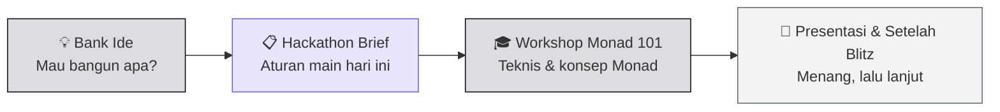

# 🟣 Monad Blitz Jakarta

**Monad Blitz Jakarta 2026** adalah hackathon satu hari yang diselenggarakan **Monad Foundation** bersama co-host lokal. Bukan hackathon maraton berhari-hari — ini *sprint*: kamu datang pagi tanpa kode, dan pulang sore dengan aplikasi yang sudah live di Monad.

Dokumentasi ini adalah kompilasi lengkap dari deck acara: **hackathon brief** dan **workshop Monad 101**.

:::info Yang Akan Kamu Dapatkan dari Dokumentasi Ini
- Paham **aturan main** dan enam syarat agar project-mu sah dinilai
- Paham **kenapa Monad ada** — masalah throughput yang dipecahkannya
- Paham **arsitektur Monad** di level konsep, lengkap dengan analogi sederhana
- Tahu **apa yang berubah untuk developer** (dan apa yang sama persis dengan Ethereum)
- Punya **katalog tooling & infra** supaya tidak membangun dari nol
- Tahu **cara presentasi** yang membuat demo-mu menang
- Tahu **ke mana melanjutkan** setelah Blitz selesai
:::

---

## ⚡ Ringkasan Acara

| Item | Detail |
|---|---|
| **Nama acara** | Monad Blitz Jakarta |
| **Tahun** | 2026 |
| **Format** | Hackathon satu hari (*innovation sprint*) |
| **Venue** | The Studio |
| **Deploy ke** | Monad Testnet atau Mainnet |
| **Submission & voting** | [blitz.devnads.com](https://blitz.devnads.com) |
| **Submission freeze** | **17:45 WIB** |
| **Total hadiah** | 1.500 USD (5 pemenang) |
| **WiFi** | Network `MFS Guest` · Password `GMONADGUEST` |

:::warning Satu Deadline yang Tidak Bisa Ditawar
**Submission freeze jam 17:45.** Lewat dari itu, form tertutup. Urutan submission juga menentukan urutan kamu pitching — submit lebih awal, pitching lebih awal.
:::

---

## 🎤 Pembicara

| Pembicara | Peran | Sesi |
|---|---|---|
| **Kartikey Garg** | Developer Activations · Monad Foundation ([@geeky_kartikey](https://x.com/geeky_kartikey)) | Hackathon Brief |
| **Revo Arya** | SEA Developer Relations · HackQuest Developer Ecosystem Lead · Ethereum Jakarta ([@verestraa](https://x.com/verestraa)) | Workshop Monad 101 |

---

## 🤝 Co-Host

Monad Blitz Jakarta diselenggarakan bersama:

- **BlockDev**
- **ETHJKT** (Ethereum Jakarta)
- **Komdigi** — Kementerian Komunikasi dan Digital Republik Indonesia
- **Garuda Spark Innovation Hub**
- **Gerakan Nasional 1000 Startup Digital**

---

## 👨‍⚖️ Mentor & Juri

| Nama | Posisi |
|---|---|
| **Alvin Evander** | Vice President at MDI Ventures |
| **Yevonnael Andrew** | Co-founder at PBA Labs |
| **Febi Mettasari** | Co-founder at PIVY |
| **Revo Arya** | SEA DevRel at HackQuest · Developer Ecosystem Lead at Ethereum Jakarta |
| **Kartikey Garg** | Developer Activations at Monad Foundation |
| **Lexy Samuel** | DevRel at BlockDev |
| **Ron** | Community Manager at BlockDev |

:::tip Manfaatkan Mentor
Mentor ada di ruangan sepanjang hari. Kalau kamu stuck lebih dari 20 menit di satu masalah, tanya. Waktu adalah sumber daya paling langka hari ini.
:::

---

## 🗺️ Peta Dokumentasi

Dokumentasi ini dibagi empat bagian:

### 💡 [Bank Ide](./bank-ide)

Hasil riset atas **±110 project nyata** yang dibangun di Monad Blitz sepuluh kota lain — pola yang berulang, kategori yang sudah jenuh, dan **29 ide siap bangun** untuk Jakarta. Termasuk **sepuluh ide bersudut Indonesia** yang dibedah tuntas (konteks pasar, rambu-rambu regulasi, lingkup satu hari, template pitch). Baca ini lebih dulu kalau kamu belum punya ide.

### 📋 [Hackathon Brief](./Hackathon-Brief/apa-itu-monad-blitz)

| Halaman | Isi |
|---|---|
| [Apa itu Monad Blitz](./Hackathon-Brief/apa-itu-monad-blitz) | Filosofi acara, jejak global, dan fokus hari ini |
| [Aturan & Eligibility](./Hackathon-Brief/aturan-dan-eligibility) | 4 aturan main + 6 syarat kelulusan submission |
| [Demo, Penjurian & Hadiah](./Hackathon-Brief/demo-penjurian-dan-hadiah) | Format demo 3 menit, sistem voting, hadiah |
| [House Rules & Submission](./Hackathon-Brief/house-rules-dan-submission) | Etika venue dan cara submit |

### 🎓 [Workshop Monad 101](./Monad-101/kenapa-butuh-throughput-tinggi)

| Halaman | Isi |
|---|---|
| [Kenapa Butuh Throughput Tinggi](./Monad-101/kenapa-butuh-throughput-tinggi) | Masalah yang Monad pecahkan, lengkap dengan angkanya |
| [Apa itu Monad](./Monad-101/apa-itu-monad) | Definisi, angka pembanding, dan filosofi desentralisasi |
| [Arsitektur Monad](./Monad-101/arsitektur-monad) | Enam primitif + analogi restoran dan teller bank |
| [Monad untuk Developer](./Monad-101/monad-untuk-developer) | Apa yang sama, apa yang baru, apa yang jadi mungkin |
| [Tooling & Framework](./Monad-101/tooling-dan-framework) | viem, Monad Foundry, skills, x402, MPP, ERC-8004 |
| [Ekosistem Infra](./Monad-101/ekosistem-infra) | Indexer, bridge, oracle, wallet, RPC, account abstraction |

### 🚀 [Presentasi & Setelah Blitz](./Setelah-Blitz/tips-presentasi)

| Halaman | Isi |
|---|---|
| [Tips Presentasi](./Setelah-Blitz/tips-presentasi) | Tiga tips yang membedakan demo biasa dan demo menang |
| [Peluang Setelah Blitz](./Setelah-Blitz/peluang-setelah-blitz) | MOST, BuildAnything, Delta V, AI Blueprint, komunitas |
| [Referensi & Network Info](./Setelah-Blitz/referensi-dan-network-info) | Konfigurasi network, semua link, glosarium |

---

## ✅ Checklist Cepat Sebelum Mulai Ngoding

- [ ] Wallet sudah terhubung ke **Monad Testnet** (chain ID `10143`) — [panduan lengkap](./Setelah-Blitz/referensi-dan-network-info)
- [ ] Sudah klaim MON testnet dari [faucet.monad.xyz](https://faucet.monad.xyz)
- [ ] Repo GitHub **publik** sudah dibuat, kosong tidak apa-apa
- [ ] Sudah buka [blitz.devnads.com](https://blitz.devnads.com) dan tahu di mana tombol submit
- [ ] Sudah baca [enam syarat eligibility](./Hackathon-Brief/aturan-dan-eligibility) — jangan sampai project bagus gugur karena hal administratif
- [ ] Sudah lihat [katalog infra](./Monad-101/ekosistem-infra) supaya tidak membangun ulang yang sudah ada
- [ ] Sudah baca [Bank Ide](./bank-ide) — biar tidak membangun sesuatu yang sudah muncul di sepuluh kota lain

---

:::tip Siap Mulai?
Belum punya ide? Mulai dari [Bank Ide](./bank-ide).

Sudah punya ide? Langsung ke [Apa itu Monad Blitz](./Hackathon-Brief/apa-itu-monad-blitz) untuk memahami aturan mainnya, atau ke [Workshop Monad 101](./Monad-101/kenapa-butuh-throughput-tinggi) kalau kamu sudah tidak sabar mengenal chain-nya.
:::
