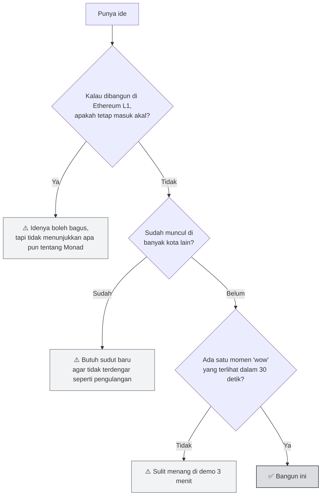
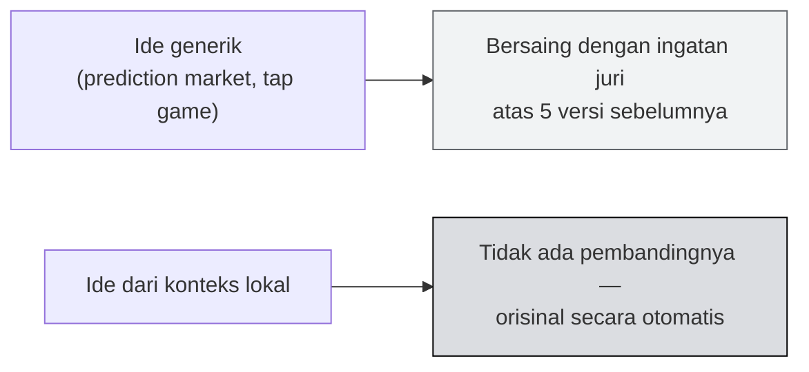

# 💡 Bank Ide — Belajar dari 10 Kota

:::info Goal Halaman Ini
Di akhir halaman ini kamu akan:
- Tahu **apa saja yang sudah pernah dibangun** di Monad Blitz kota lain
- Paham **pola yang berulang** dan kategori mana yang sudah **jenuh**
- Punya **29 ide konkret** yang bisa diselesaikan dalam satu hari
- Tahu **konteks pasar Indonesia** dan **rambu-rambu regulasi** yang wajib kamu tahu sebelum memilih ide
- Punya **cara memilih ide** yang cocok dengan kriteria penilaian Blitz
:::

---

## 🔬 Dari Mana Data Ini

Monad Foundation menyimpan repo submission resmi per kota di GitHub: `github.com/monad-developers/monad-blitz-<kota>`. Peserta melakukan fork lalu membuka Pull Request berisi nama dan deskripsi project. **Daftar PR di repo-repo itu adalah daftar project yang benar-benar dibangun.**

Halaman ini merangkum submission dari repo-repo tersebut, ditambah repo peserta yang menyebut "Monad Blitz" di deskripsinya.

| Kota yang diriset | Sumber |
|---|---|
| Bangalore, Bangkok, Seoul, Hyderabad, Delhi, Mumbai, Lagos, Denver | Repo submission resmi |
| Toronto, Shenzhen, Ankara | Repo peserta |

Konteks skalanya, menurut blog resmi Monad: **±30 Blitz dalam sembilan bulan**, sekitar **1.700 developer** masuk ke ekosistem, dan **282 project** ter-deploy hanya dari sembilan acara di 2026.

:::warning Cara Membaca Daftar Ini
Daftar di bawah adalah **submission**, bukan semuanya pemenang. Status juara jarang dicatat di repo. Anggap ini sebagai peta "apa yang orang pikirkan saat diberi satu hari di Monad" — berguna justru untuk tahu **apa yang sudah terlalu ramai**.
:::

---

## 📊 Pola yang Terlihat

### Tema resmi bergeser ke Agent Economy

Beberapa edisi terbaru punya tema eksplisit:

| Edisi | Tema |
|---|---|
| Mumbai V3, Pune V2 | **The Agent Economy** |
| San Francisco | **x402 Edition** |
| Beberapa edisi 2026 | AI agent & infrastruktur pendukungnya |

Ini konsisten dengan isi deck workshop: [x402, MPP, dan ERC-8004](./Monad-101/tooling-dan-framework) mendapat porsi besar. Kalau kamu ingin selaras dengan arah ekosistem, **AI agent yang bertransaksi** adalah arah yang jelas.

### Distribusi kategori

Dari sekitar 110 submission yang teridentifikasi:

| Kategori | Kepadatan | Catatan |
|---|---|---|
| 🤖 **AI agent & agent economy** | Sangat tinggi | Kategori terbesar di kota-kota 2026 |
| 🎲 **Prediction market & betting** | **Jenuh** | Muncul di hampir setiap kota |
| 🎮 **Game & consumer** | Tinggi | Banyak tap-to-earn dan clicker |
| 💸 **Payment & DeFi** | Sedang | Justru di sini ide paling orisinal muncul |
| 🧑‍🤝‍🧑 **Sosial & identitas** | Sedang | Banyak klon platform Web2 |
| 🔧 **Infra & tooling** | **Rendah** | Paling sedikit pesaing |

---

## 🗂️ Katalog Project Nyata

### 🤖 AI Agent & Agent Economy

| Project | Kota | Yang dibangun |
|---|---|---|
| **Agent Subconscious** | Bangalore | Memori onchain persisten untuk AI agent |
| **AgentMandi** | Bangalore | Manajemen tenaga kerja AI dengan reputasi & koordinasi ekonomi |
| **Shared Agent Notebook** | Bangalore | Lapisan kepercayaan untuk agent economy |
| **Parallel AI Agent Orchestrator** | Bangalore | Orkestrasi agent yang berjalan paralel |
| **Vox Protocol** | Bangalore | Bukti panggilan onchain untuk voice AI agent |
| **ContractGuard** | Bangalore | Deteksi risiko smart contract bertenaga AI |
| **VoiceForms AI** | Bangalore | Formulir berbasis suara |
| **AgentVault**, **Agent Monad**, **Memoria** | Bangalore | Infrastruktur agent |
| **BlackBox** | Toronto | Pasar tenaga kerja AI agent dengan *flight recorder* onchain |
| **Agent Settlement Mesh** | Toronto | Lima AI agent yang menyelesaikan setiap panggilan layanan sebagai pembayaran nyata |
| **SentimentFi** | Mumbai | Oracle sentimen onchain bertenaga AI |
| **Molfi** | Hyderabad | Marketplace bot trading otonom |
| **Monad Watch** | Hyderabad | Penganalisis portofolio berbasis AI |
| **Telegram DCA trading agent** | Bangkok | Agent DCA lewat Telegram |
| **AI Gateway**, **MonadAI** | Bangkok | Layanan AI |
| **agentgig** | Ankara | Gig marketplace untuk agent |

### 🎲 Prediction Market & Betting

| Project | Kota |
|---|---|
| **NadBet** | Bangkok |
| **Hylo** — prediction market spekulatif | Hyderabad |
| **Molybets** | Delhi |
| **nad.bet** | Seoul |
| **polybetty_bot** — bot betting sosial Telegram *(top 3 voting on-site)* | Shenzhen |
| **Velocitas Auctions** | Bangkok |

:::danger Kategori Paling Jenuh — dan di Jakarta, Paling Berisiko
Prediction market muncul di **hampir setiap kota**. Kalau kamu membangun ini di Jakarta, kamu bersaing dengan ingatan juri atas lima versi sebelumnya.

Tapi di Jakarta ada alasan kedua yang jauh lebih serius: **Komdigi adalah co-host acara ini**, dan Komdigi memblokir Polymarket pada Mei 2026 karena diduga bermuatan judi online.

👉 Baca [rambu-rambu regulasi](#rambu-rambu) sebelum memutuskan.
:::

### 💸 Payment & DeFi

| Project | Kota | Yang dibangun |
|---|---|---|
| **MONOSMS** | Hyderabad | Kirim kripto lewat SMS — transaksi SMS-native |
| **StealthMode** | Bangalore | Pembayaran tak terlacak dengan stealth address ERC-5564 |
| **BitMon** | Bangalore | Atomic swap Bitcoin ↔ Monad |
| **SAMM** | Bangalore | AMM ter-shard dengan routing multi-hop |
| **MonadIntents** | Toronto | Intent solver yang memanfaatkan eksekusi paralel |
| **Basket Stablecoin** | Seoul | Stablecoin berbasis keranjang aset |
| **wandash** | Lagos | Giveaway publik terverifikasi, **tanpa perlu wallet** |
| **Paylink**, **sendpay**, **gasless-savings** | Lagos | Rel pembayaran & tabungan tanpa gas |
| **Spin.Fun**, **sniper maxi**, **VibeFi** | Bangkok, Hyderabad, Bangalore | Trading & DeFi konsumer |

:::tip Perhatikan Pola Lagos
Lagos menghasilkan kluster ide yang jelas: **pembayaran tanpa wallet, tanpa gas, lewat SMS**. Itu jawaban atas kondisi lokal mereka.

Jakarta punya konteks lokalnya sendiri — QRIS, e-wallet, pengiriman uang pekerja migran, arisan, koperasi. Sudut lokal adalah cara termurah untuk terdengar orisinal.
:::

### 🎮 Game & Consumer

| Project | Kota |
|---|---|
| **DRIPPY CAT** — arcade adventure | Hyderabad |
| **battle monads**, **mona tx rpg**, **Monstar** | Seoul |
| **MON Go** / **Monad GO** | Bangalore, Seoul |
| **PokeMON**, **Tapnad** | Bangalore |
| **DiceParty**, **POP KOMODO** | Bangkok |
| **Nadcraft** — PFP NFT bergaya Minecraft | Seoul |

:::warning Hati-hati dengan Tap-to-Earn
Game clicker/tap adalah kategori kedua paling ramai. Mudah dibuat dalam sehari — dan justru karena itu, **semua orang membuatnya**.

Kalau mau masuk kategori game, pastikan mekaniknya **mustahil di chain lambat**: misalnya real-time PvP di mana setiap gerakan adalah transaksi onchain.
:::

### 🧑‍🤝‍🧑 Sosial & Identitas

| Project | Kota | Yang dibangun |
|---|---|---|
| **Monaddit** | Seoul | Forum ala Reddit onchain |
| **MONologue**, **MonaDAO** | Seoul | Sosial & governance |
| **ProofOfMeet** | Delhi | Bukti pertemuan onchain |
| **Soulnad**, **Who Is This** | Bangkok | Identitas & reputasi |
| **OnceQR** | Bangkok | QR sekali pakai |
| **FlickShare**, **Social Trading Detox** | Bangkok | Sosial konsumer |
| **Capsule**, **IPVerse** | Hyderabad | Konten & IP |
| **ContributionDAO**, **Krow** | Bangkok, Bangalore | Koordinasi kontributor |

### 🔧 Infra & Tooling

| Project | Kota | Yang dibangun |
|---|---|---|
| **Cadence BlackBox** | Toronto | Mengukur interval blok Monad, lalu membangun aplikasi yang memang membutuhkannya |
| **Monad Cadence** | Toronto | Mengukur pemangkasan block time 25% |
| **NFT-Terminal** | Hyderabad | Terminal untuk NFT |
| **State Clash** | Mumbai | Terkait konflik state pada eksekusi paralel |

:::tip Kategori dengan Pesaing Paling Sedikit
Infra & tooling adalah kategori **paling sepi**. Dan perhatikan pendekatan Cadence BlackBox: mereka **mengukur karakteristik Monad terlebih dahulu**, lalu membangun sesuatu yang hanya masuk akal karena karakteristik itu.

Itu persis narasi yang membuat juri teknis terkesan — dan sangat mungkin diselesaikan dalam sehari.
:::

---

## 🎯 Cara Memilih Ide

Sebelum melihat daftar ide, saring dengan tiga pertanyaan ini:



---

## 🚀 29 Ide Siap Bangun

Setiap ide di bawah dipilih agar: **(a)** memanfaatkan sesuatu yang khas Monad, **(b)** realistis diselesaikan dalam satu hari, dan **(c)** punya momen demo yang terlihat.

:::note Legenda Tingkat Kesulitan
🟢 Ringan · 🟡 Sedang · 🔴 Menantang
:::

:::tip Grup F Dibedah Lebih Dalam
Lima grup pertama (A–E, ide #1–19) disajikan ringkas sebagai pemantik. **[Grup F — Sudut Indonesia](#sudut-indonesia) (ide #20–29)** dibahas jauh lebih detail: konteks pasarnya, rambu-rambu regulasi, lingkup satu hari, sampai template pitch.

Kalau kamu ingin langsung ke rekomendasi terkuat, loncat ke sana.
:::

### A. Memanfaatkan Finality 600ms

| # | Ide | Kenapa butuh Monad | Momen demo |
|---|---|---|---|
| 1 🟢 | **Onchain reaction test** — dua pemain berlomba menekan tombol, pemenang ditentukan urutan transaksi onchain | Di chain 12 detik, permainan reaksi tidak masuk akal | Dua orang dari audiens bertanding langsung |
| 2 🟡 | **Real-time onchain drawing board** — setiap coretan adalah transaksi | Butuh ribuan transaksi kecil yang cepat | Ajak seluruh ruangan menggambar bersama |
| 3 🟡 | **Live auction dengan hitung mundur 10 detik** — setiap bid memperpanjang waktu | Bidding perlu konfirmasi instan | Perang bid langsung di ruangan |
| 4 🔴 | **Onchain rhythm game** — ketukan diverifikasi onchain | Toleransi waktu di bawah satu detik | Bermain di panggung, transaksi mengalir di layar |

### B. Memanfaatkan `eth_sendRawTransactionSync`

| # | Ide | Kenapa butuh Monad | Momen demo |
|---|---|---|---|
| 5 🟢 | **"No-spinner" checkout** — pembayaran onchain tanpa status pending sama sekali | Receipt sinkron menghapus pola polling | Tampilkan berdampingan dengan dApp biasa yang masih berputar |
| 6 🟡 | **Onchain form submit** — data langsung tersimpan, konfirmasi seketika | UX web biasa di atas blockchain | Isi form, hasil langsung muncul |
| 7 🟡 | **Turnstile onchain** — QR check-in acara, verifikasi instan | Antrean tidak boleh menunggu blok | Peserta scan QR, hitungan naik seketika |

### C. Agent Economy — x402, MPP, ERC-8004

| # | Ide | Kenapa butuh Monad | Momen demo |
|---|---|---|---|
| 8 🟡 | **API berbayar per panggilan** — API membalas `402`, agent membayar, permintaan diulang | Facilitator x402 gratis di Monad | Jalankan agent, tunjukkan pembayaran mengalir per panggilan |
| 9 🔴 | **Pasar jasa antar-agent** — agent A menyewa agent B, dibayar onchain | Butuh mikropembayaran cepat | Tampilkan log negosiasi dan pembayaran real-time |
| 10 🟡 | **Registry reputasi agent** dengan ERC-8004 | Identitas agent onchain | Tunjukkan agent membangun rekam jejak |
| 11 🟡 | **Agent belanja bahan makanan** — agent membandingkan harga lalu membayar sendiri | Pembayaran otonom | Beri satu prompt, agent menyelesaikan transaksinya |
| 12 🔴 | **Dompet dengan batas pengeluaran untuk agent** — agent punya budget harian yang dipaksakan kontrak | Keamanan agentic payments | Coba lampaui limit, transaksi ditolak onchain |

### D. Infra & Tooling — Kategori Paling Sepi

| # | Ide | Kenapa berharga | Momen demo |
|---|---|---|---|
| 13 🟡 | **Visualisasi eksekusi paralel** — tampilkan transaksi mana yang bentrok dan diulang | Belum ada yang benar-benar memvisualkan ini | Kirim transaksi bentrok, tunjukkan proses redo |
| 14 🟡 | **Dasbor perbandingan latensi** — Monad vs chain lain secara langsung | Membuat klaim kecepatan bisa diukur | Kirim transaksi ke dua chain berdampingan |
| 15 🔴 | **Penguji batas kontrak 256KB** — deploy kontrak yang mustahil muat di Ethereum | Menunjukkan fitur yang jarang disentuh | Deploy kontrak 200KB secara live |
| 16 🟡 | **Konsumer event stream** — dasbor real-time langsung dari node, tanpa indexer | Memanfaatkan execution event streams | Bandingkan jeda dengan pendekatan indexer |

### E. Sudut Baru untuk Kategori Jenuh

Kalau tetap ingin masuk kategori ramai, ini cara membedakannya:

| # | Ide | Pembedanya |
|---|---|---|
| 17 🟡 | **Forecasting tanpa taruhan** — reputasi berbasis akurasi prediksi, tanpa mempertaruhkan uang | Mekanik prediction market, tanpa risiko regulasi (lihat [rambu-rambu](#rambu-rambu)) |
| 18 🟡 | **Game yang setiap aksinya transaksi onchain** — tanpa server game sama sekali | Kebanyakan "game onchain" hanya menyimpan skor akhir |
| 19 🟡 | **Sosial tanpa wallet** — login sosial via embedded wallet, pengguna tidak sadar sedang memakai blockchain | Meniru pendekatan wandash dari Lagos |

---

## 🇮🇩 F. Sudut Indonesia — Bagian Mendalam {#sudut-indonesia}

Grup ini sengaja dibedah jauh lebih dalam daripada lima grup di atas, karena **di sinilah keunggulan kompetitif Jakarta berada.**

### Kenapa sudut lokal menang

Dari riset ±110 submission di sepuluh kota, satu pola paling konsisten: **kota yang menghasilkan ide paling orisinal adalah kota yang membangun untuk masalah kotanya sendiri.**

Lagos adalah contoh terjelas. Submission mereka mengelompok rapat di satu tema — **pembayaran tanpa wallet, tanpa gas, lewat SMS** (wandash, Paylink, sendpay, dan MONOSMS di Hyderabad). Tidak ada kota lain yang menghasilkan kluster seperti itu, karena tidak ada kota lain yang punya masalah yang sama.



Ada keuntungan kedua yang sering dilupakan: **kamu sudah paham masalahnya tanpa perlu riset.** Di hackathon satu hari, tidak membuang waktu memahami domain adalah keunggulan besar.

---

### 📊 Peta konteks Indonesia

Angka-angka ini berguna untuk dua hal: memilih ide, dan membuka pitch tiga menitmu dengan satu kalimat yang punya bobot.

| Domain | Angka | Sumber & waktu |
|---|---|---|
| **Pengguna QRIS** | 57,6 juta pengguna · ~40 juta merchant | Bank Indonesia, Agustus 2025 |
| **Komposisi merchant QRIS** | **93% adalah UMKM** | Bank Indonesia, 2025 |
| **Volume transaksi QRIS** | 15,51 miliar transaksi sepanjang 2025 (**+148,54%** YoY) | Bank Indonesia |
| **Investor kripto** | **20,19 juta** orang | OJK, Desember 2025 |
| **Nilai transaksi kripto** | Rp482,23 triliun sepanjang 2025 | OJK |
| **Regulator kripto** | OJK mengambil alih dari Bappebti sejak **Mei 2025** | OJK |
| **Remitansi pekerja migran** | Rp253,3 triliun (US$15,7 miliar) pada 2024 · ~Rp288 triliun pada 2025 | KP2MI / BP2MI |
| **Keluhan utama remitansi** | Biaya admin tinggi memotong dana yang diterima keluarga | KP2MI |

:::tip Cara Memakai Angka Ini
Bandingkan dua pembuka pitch:

❌ *"Kami membangun aplikasi patungan onchain."*

✅ *"QRIS punya 57 juta pengguna dan 40 juta merchant, 93% di antaranya UMKM. Tapi tidak ada satu pun cara transparan untuk patungan bareng. Kami membangun itu."*

Kalimat kedua butuh tambahan lima detik, dan langsung membuat ruangan paham kenapa ini penting.
:::

---

### 🚨 Rambu-rambu: yang sebaiknya tidak dibangun di Jakarta {#rambu-rambu}

Ini bagian yang tidak akan kamu temukan di daftar ide generik, dan justru paling penting.

#### ⛔ Prediction market & segala bentuk taruhan

Kategori ini sudah jenuh secara global. Di Jakarta, ada alasan kedua yang jauh lebih serius:

| Fakta | Implikasi |
|---|---|
| **Komdigi adalah co-host acara ini** | Kamu akan pitching ke ruangan yang berisi perwakilan kementerian terkait |
| Komdigi memblokir **3,45 juta situs judi online** (Okt 2024–Mei 2026) | Ini prioritas penegakan yang sedang sangat aktif |
| Komdigi **memblokir Polymarket** pada Mei 2026, diduga bermuatan judi online | **Prediction market secara spesifik sudah pernah ditindak di Indonesia** |
| Perputaran dana judi online Rp286 triliun (2025) | Isu ini sangat sensitif secara politik dan sosial |
| UU No. 4 Tahun 2026 memperkuat sinergi antarlembaga | Kerangka hukumnya justru sedang diperketat |

:::danger Kesimpulan yang Tegas
Membangun prediction market atau aplikasi bernuansa taruhan di acara yang **di-co-host Komdigi** bukan sekadar pilihan ide yang lemah — itu salah membaca ruangan.

Kalau mekanik "menebak hasil" memang inti idemu, ubah kerangkanya jadi sesuatu tanpa pertaruhan uang: **forecasting tanpa stake**, **reputasi berbasis akurasi prediksi**, atau **pasar informasi internal tim** (lihat ide #17). Mekaniknya menarik, risikonya hilang.
:::

#### ⚠️ Apa pun yang menyerupai bursa atau penghimpunan dana

Sejak Mei 2025, pengawasan aset kripto ada di OJK dengan daftar entitas berizin yang terbatas. Untuk demo di testnet ini tidak jadi masalah — tapi **jangan memposisikan project-mu sebagai layanan keuangan siap pakai** dalam pitch. Sebut sebagai prototipe dan riset.

#### 💡 Catatan soal juri

Salah satu juri hari ini adalah co-founder **PIVY**, produk pembayaran privat berbasis *stealth address*. Artinya ada **ahli domain pembayaran privat di ruangan**.

Ini bisa jadi dua hal: risiko kalau kamu membangun stealth payment secara dangkal, atau keuntungan kalau kamu membangunnya dengan serius dan siap berdiskusi teknis. Pilih secara sadar.

---

### 🚀 Sepuluh ide Indonesia yang sudah dibedah

Format tiap ide sama: **konteks → kenapa Monad → lingkup satu hari → momen demo → pembeda**.

#### 20. 🟡 Arisan Onchain

**Konteks.** Arisan adalah praktik keuangan komunitas yang nyaris universal di Indonesia: sekelompok orang menyetor rutin, satu orang menerima seluruh pot tiap putaran, sampai semua kebagian. Masalah klasiknya selalu sama — **siapa yang pegang uangnya, apakah undiannya jujur, dan bagaimana kalau ada yang kabur setelah dapat giliran.**

**Kenapa Monad.** Arisan butuh banyak transaksi kecil dan berulang dari banyak orang. Di chain lambat dan mahal, biaya gas bisa melebihi nilai setorannya. Di Monad, setoran mingguan dari 20 orang jadi murah, dan pengundian bisa diselesaikan seketika di depan semua anggota.

**Lingkup satu hari.**

```solidity
contract Arisan {
    function buatArisan(uint256 iuran, uint256 jumlahAnggota) external;
    function gabung(uint256 arisanId) external payable;
    function setor(uint256 arisanId) external payable;
    function undi(uint256 arisanId) external;      // pemenang putaran ini
    function klaim(uint256 arisanId) external;     // pemenang tarik pot
}
```

Frontend: satu halaman berisi daftar anggota, status setoran per putaran, tombol undi, dan riwayat pemenang. **Yang dipotong:** notifikasi, multi-grup, penalti keterlambatan.

**Momen demo.** Ajak 4–5 orang dari audiens ikut satu putaran arisan langsung di panggung, lalu jalankan undian di depan mereka. Pot berpindah dalam hitungan detik.

**Pembeda.** Belum muncul di sepuluh kota yang diriset. ROSCA memang ada di banyak negara, tapi tidak ada yang membangunnya di Blitz.

#### 21. 🟢 Patungan & Split Bill Instan

**Konteks.** Patungan makan, patungan kado, patungan sewa lapangan futsal. Hari ini dikerjakan lewat grup WhatsApp dan screenshot bukti transfer, dengan satu orang yang selalu jadi "bendahara dadakan" dan harus menagih satu per satu.

**Kenapa Monad.** Ini kasus paling murni untuk `eth_sendRawTransactionSync`. Setiap orang membayar dan **statusnya langsung berubah di layar semua orang**, tanpa spinner, tanpa screenshot.

**Lingkup satu hari.** Kontrak tagihan dengan daftar peserta dan nominal per orang; frontend berupa satu link yang bisa dibagikan ke grup. **Yang dipotong:** pembagian tidak rata, banyak token, riwayat panjang.

**Momen demo.** Buat tagihan makan siang tim, bagikan QR ke audiens, minta 3 orang bayar bersamaan. Semua status berubah hijau seketika di layar proyektor.

**Pembeda.** Kesederhanaannya justru kekuatan: dalam tiga menit, penonton langsung paham dan langsung merasakan bedanya dengan aplikasi biasa.

#### 22. 🔴 Rel Remitansi Pekerja Migran

**Konteks.** Remitansi pekerja migran Indonesia mencapai **Rp253,3 triliun (US$15,7 miliar) pada 2024** dan sekitar **Rp288 triliun pada 2025**. Keluhan yang berulang menurut KP2MI: **biaya admin tinggi memotong dana yang sampai ke keluarga.**

**Kenapa Monad.** Transfer nilai kecil yang sering hanya masuk akal kalau biaya per transaksi hampir nol dan konfirmasinya cepat. Ini persis profil Monad.

**Lingkup satu hari.** Jangan bangun rel remitansi sungguhan — mustahil dalam sehari dan menyentuh regulasi. Bangun **simulasi ujung ke ujung**: pengirim di "Malaysia" mengirim stablecoin, penerima di "Indonesia" melihat saldo bertambah seketika, plus perbandingan biaya berdampingan dengan jalur konvensional.

**Momen demo.** Tampilkan dua panel bersebelahan: jalur konvensional (biaya X%, tiba dalam hitungan hari) versus jalurmu (biaya mendekati nol, tiba dalam 600ms). Kontras itu yang menjual.

**Pembeda.** Pasarnya besar dan angkanya bisa kamu sebut. Risikonya: mudah terdengar seperti "kirim stablecoin biasa" — jadi **fokuskan demo pada perbandingan biaya**, bukan pada mekanisme transfernya.

#### 23. 🟡 Transparansi Donasi & Patungan Sosial

**Konteks.** Indonesia sangat dermawan, tapi kepercayaan pada penyaluran donasi berulang kali terguncang oleh kasus penyalahgunaan. Pertanyaan donatur selalu sama: **uang saya benar-benar sampai ke mana?**

**Kenapa Monad.** Setiap rupiah bisa dilacak, dan yang lebih penting — dengan [execution event streams](./Monad-101/monad-untuk-developer#03--execution-event-streams), dasbor penyaluran bisa diperbarui **real-time tanpa indexer**. Donatur melihat dananya bergerak saat itu juga.

**Lingkup satu hari.** Kontrak kampanye dengan alokasi berkategori (logistik, medis, operasional) dan penarikan yang wajib berlabel. Frontend: dasbor live aliran dana. **Yang dipotong:** verifikasi identitas penerima, integrasi rupiah.

**Momen demo.** Minta audiens berdonasi lewat QR, lalu lakukan satu penarikan berlabel di panggung. Grafik alokasi bergerak di depan mata mereka.

**Pembeda.** Ini use case di mana **transparansi blockchain benar-benar menjawab masalah**, bukan sekadar tempelan teknologi. Argumen yang kuat di sesi tanya jawab.

#### 24. 🟡 Kasir UMKM Onchain

**Konteks.** QRIS punya **~40 juta merchant, 93% di antaranya UMKM**. Warung, kedai kopi, dan toko kelontong sudah terbiasa dengan alur "scan, bayar, terdengar bunyi konfirmasi".

**Kenapa Monad.** Alur kasir tidak mentoleransi spinner. Pembeli tidak akan menunggu 12 detik sambil memegang ponsel di depan kasir. **`eth_sendRawTransactionSync` membuat konfirmasi terasa persis seperti QRIS** — dan itu satu-satunya cara pembayaran kripto bisa masuk ke warung.

**Lingkup satu hari.** Kontrak merchant sederhana (registrasi, terima pembayaran, catat) + dua tampilan: layar kasir yang menampilkan QR, dan halaman pembeli. **Yang dipotong:** konversi rupiah, inventaris, laporan.

**Momen demo.** Jadikan panggung sebagai warung. Jual sesuatu yang nyata ke penonton — kopi, stiker — dan tunjukkan konfirmasi berbunyi seketika, sama seperti QRIS.

**Pembeda.** Sangat mudah dipahami audiens Indonesia, dan **secara langsung memamerkan fitur khas Monad** yang paling jarang dipakai peserta lain.

#### 25. 🟡 Registry Anti-Penipuan

**Konteks.** Penipuan transfer adalah masalah harian di Indonesia. Cara orang mengeceknya sekarang: menyalin nomor rekening ke Google atau situs pelaporan yang datanya terpusat, tidak terverifikasi, dan bisa disalahgunakan.

**Kenapa Monad.** Registry laporan yang bisa ditulis siapa saja, murah, dan tidak bisa dihapus diam-diam. Volume laporan bisa sangat besar — butuh biaya transaksi rendah agar masuk akal.

**Lingkup satu hari.** Kontrak berisi laporan (hash identitas rekening/nomor + kategori + timestamp + pelapor), dengan bobot berdasarkan reputasi pelapor. Frontend: kotak pencarian sederhana. **Yang dipotong:** proses banding, verifikasi bukti, moderasi.

**Momen demo.** Ketik sebuah identitas di kotak pencarian, tunjukkan riwayat laporannya muncul seketika. Lalu tambahkan laporan baru secara live, dan hasil pencarian langsung berubah.

**Pembeda.** Belum ada padanannya di sepuluh kota. Sekaligus menunjukkan sisi blockchain yang **bukan tentang uang** — nilai plus di ruangan yang sudah penuh aplikasi finansial.

:::warning Rancang dengan Hati-Hati
Registry tuduhan publik bisa disalahgunakan untuk memfitnah. Simpan **hash**, bukan data pribadi mentah, dan jelaskan pertimbangan ini saat pitch. Juri akan menghargai kesadaran itu — dan hampir pasti akan menanyakannya.
:::

#### 26. 🟡 Koperasi Simpan Pinjam Mikro

**Konteks.** Koperasi adalah bentuk lembaga keuangan yang sangat khas Indonesia dan disebut langsung dalam konstitusi. Masalah yang berulang: **pembukuan tidak transparan dan anggota tidak bisa mengaudit.**

**Kenapa Monad.** Setoran rutin, bunga, dan pinjaman kecil dari banyak anggota berarti transaksi bervolume tinggi bernilai kecil. Butuh chain murah dan cepat.

**Lingkup satu hari.** Kontrak dengan simpanan pokok/wajib, pool pinjaman, dan pembagian sisa hasil usaha (SHU) proporsional. Frontend: dasbor anggota. **Yang dipotong:** penilaian kelayakan kredit, jaminan, penagihan.

**Momen demo.** Tunjukkan pembagian SHU dihitung dan didistribusikan ke semua anggota **dalam satu transaksi**, transparan di explorer.

**Pembeda.** Sangat lokal, menyentuh institusi yang dikenal semua orang Indonesia, dan jarang dicoba secara serius.

#### 27. 🟢 Sawer Kreator Real-Time

**Konteks.** Budaya *sawer* di live streaming Indonesia sangat kuat. Platform yang ada memotong komisi besar dan pencairannya lambat.

**Kenapa Monad.** Sawer adalah **mikropembayaran berfrekuensi tinggi** — puluhan kiriman kecil per menit saat streaming ramai. Ini profil beban yang hanya masuk akal di chain berthroughput tinggi, dan kreator menerima dananya seketika, bukan setelah periode pencairan.

**Lingkup satu hari.** Kontrak tip + overlay streaming yang menampilkan animasi setiap kali tip masuk. **Yang dipotong:** integrasi platform sungguhan, konversi rupiah, leaderboard rumit.

**Momen demo.** Jalankan streaming sungguhan di panggung, minta audiens mengirim sawer dari ponsel mereka. Overlay meledak dengan notifikasi real-time. **Ini salah satu momen demo paling ramai yang bisa kamu buat.**

**Pembeda.** Sangat visual dan melibatkan ruangan — dan [ingat bahwa setengah bobot penilaian ada di tangan peserta lain](./Hackathon-Brief/demo-penjurian-dan-hadiah#sistem-voting). Demo yang mengajak seluruh ruangan ikut bermain punya keuntungan struktural.

#### 28. 🔴 Agent Pemantau Harga Pangan

**Konteks.** Harga bahan pokok berfluktuasi tajam antar pasar dan antar daerah. Pemantauannya hari ini manual dan lambat.

**Kenapa Monad.** Ini menggabungkan **sudut lokal dengan arah resmi ekosistem** ([agent economy](./Monad-101/tooling-dan-framework)). Agent memantau sumber harga, menuliskan temuannya onchain, dan membayar sesama agent untuk data lewat **x402** yang facilitator-nya gratis di Monad.

**Lingkup satu hari.** Dua agent saja cukup: satu mengumpulkan data harga, satu membayar untuk mengaksesnya lewat x402. Kontrak: registry harga + log pembayaran. **Yang dipotong:** sumber data sungguhan (pakai data contoh), banyak komoditas, prediksi.

**Momen demo.** Jalankan kedua agent live, tampilkan log pembayaran per panggilan mengalir di layar sementara data harga diperbarui.

**Pembeda.** **Ini kombinasi paling kuat yang bisa kamu ambil**: konteks Indonesia yang orisinal, dibangun dengan primitif yang persis sedang didorong Monad. Sulit, tapi hadiahnya sepadan.

#### 29. 🟢 Bukti Kehadiran & Reputasi Komunitas

**Konteks.** Skena meetup Jakarta aktif — ETHJKT, BlockDev, dan komunitas lain rutin mengadakan acara. Tapi tidak ada rekam jejak portabel untuk orang yang benar-benar konsisten hadir dan berkontribusi.

**Kenapa Monad.** Klaim massal serentak. Kalau 100 orang di satu ruangan melakukan klaim bersamaan, chain lambat akan tersendat — di Monad, semuanya masuk dalam hitungan detik. **Ini juga demo eksekusi paralel yang paling mudah dipertunjukkan.**

**Lingkup satu hari.** Kontrak badge kehadiran per acara + halaman profil yang menampilkan riwayat. **Yang dipotong:** anti-sybil yang serius, integrasi kalender, badge bertingkat.

**Momen demo.** **Minta seluruh ruangan melakukan klaim bersamaan.** Tampilkan penghitung naik cepat dan explorer menyerap semuanya tanpa tersendat.

**Pembeda.** Delhi punya *ProofOfMeet*, jadi konsepnya bukan hal baru secara global. Pembedamu adalah **demo klaim massal serentak** — mengubah bukti kehadiran biasa menjadi peragaan throughput.

---

### 🧭 Matriks pemilihan ide Indonesia

| Ide | Kesulitan | Kekuatan demo | Orisinalitas |
|---|---|---|---|
| 20. Arisan Onchain | 🟡 | Tinggi | **Sangat tinggi** |
| 21. Split Bill Instan | 🟢 | Tinggi | Sedang |
| 22. Remitansi PMI | 🔴 | Sedang | Tinggi |
| 23. Transparansi Donasi | 🟡 | Tinggi | Tinggi |
| 24. Kasir UMKM | 🟡 | **Sangat tinggi** | Tinggi |
| 25. Registry Anti-Penipuan | 🟡 | Sedang | **Sangat tinggi** |
| 26. Koperasi Mikro | 🟡 | Sedang | **Sangat tinggi** |
| 27. Sawer Real-Time | 🟢 | **Sangat tinggi** | Tinggi |
| 28. Agent Harga Pangan | 🔴 | Tinggi | **Sangat tinggi** |
| 29. Bukti Kehadiran | 🟢 | **Sangat tinggi** | Sedang |

| Kalau kamu… | Ambil ini |
|---|---|
| **Solo, waktu terbatas** | #21 Split Bill, #27 Sawer, atau #29 Bukti Kehadiran — ringan tapi demonya kuat |
| **Tim lengkap, ingin menang** | #24 Kasir UMKM atau #20 Arisan — orisinal, dan demonya mudah dipahami |
| **Kuat di AI/agent** | #28 Agent Harga Pangan — paling selaras dengan arah ekosistem |
| **Ingin dikenang, bukan sekadar menang** | #25 Registry Anti-Penipuan — bukan aplikasi finansial, dan menjawab masalah nyata |

---

### 🎤 Template pitch tiga menit versi lokal

Struktur ini memakai data dari peta konteks di 20 detik pertama:

```text
[0:00–0:20] MASALAH — sebutkan satu angka
"Di Indonesia ada 40 juta merchant QRIS, 93% UMKM.
 Tidak satu pun bisa menerima pembayaran kripto,
 karena tidak ada yang mau menunggu 12 detik di depan kasir."

[0:20–0:40] SOLUSI — satu kalimat
"Kami membuat kasir onchain yang konfirmasinya seinstan QRIS."

[0:40–2:40] DEMO LIVE — jangan bicara berlebihan, tunjukkan
 - Jual sesuatu yang nyata ke penonton
 - Tunjukkan konfirmasi berbunyi seketika
 - Buka explorer, tunjukkan transaksinya sudah final

[2:40–3:00] KENAPA MONAD — satu kalimat teknis
"Ini hanya mungkin karena eth_sendRawTransactionSync
 mengembalikan receipt secara sinkron. Di chain lain,
 alur ini butuh polling dan spinner."
```

:::tip Kalimat Penutup yang Bekerja
Selalu akhiri dengan **kenapa ini butuh Monad**, bukan dengan rencana masa depan. Juri teknis mengingat tim yang paham chain-nya; tidak ada yang mengingat roadmap dari project satu hari.
:::

---

## 🧭 Rekomendasi

Kalau kamu ingin peluang menang tertinggi dengan risiko terkendali:

| Prioritas | Alasan |
|---|---|
| **1. Sudut Indonesia (grup F)** | Orisinal secara otomatis — kota lain tidak punya konteks ini, dan kamu sudah paham masalahnya tanpa riset |
| **2. Agent economy (grup C)** | Selaras dengan arah resmi ekosistem, dan x402 di Monad gratis |
| **3. Infra & tooling (grup D)** | Pesaing paling sedikit, dan sangat disukai juri teknis |
| **4. Finality 600ms (grup A)** | Momen demo paling mudah terlihat |
| **Hindari** | Prediction market dan tap-to-earn tanpa pembeda — dan di Jakarta, [taruhan punya risiko regulasi tersendiri](#rambu-rambu) |

:::tip Kombinasi Paling Kuat
Ambil satu ide dari **grup F (konteks Indonesia)** lalu bangun dengan primitif dari **grup C (agent economy)**.

Contoh: *arisan yang dikelola AI agent, dengan giliran dan pembayaran diselesaikan otonom lewat x402.* Lokal, agentik, dan belum pernah muncul di sepuluh kota yang diriset. Ide #28 (Agent Pemantau Harga Pangan) sudah mengikuti pola ini.
:::

---

:::tip Lanjut
Sudah punya arah? Pastikan project-mu memenuhi [enam syarat eligibility](./Hackathon-Brief/aturan-dan-eligibility), lalu kenali chain-nya lewat [Workshop Monad 101](./Monad-101/kenapa-butuh-throughput-tinggi).
:::
