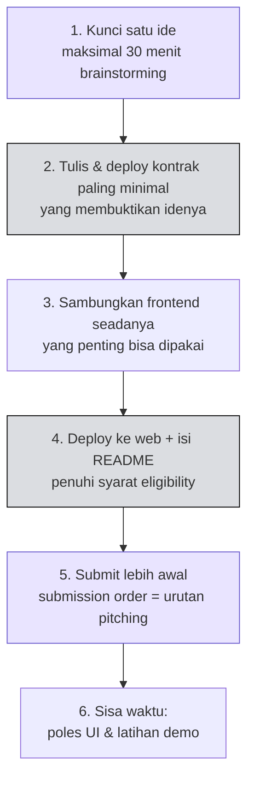

# 🔥 Apa itu Monad Blitz?

:::info Goal Halaman Ini
Di akhir halaman ini kamu akan:
- Paham perbedaan **innovation sprint** dan hackathon maraton biasa
- Tahu skala **Monad Blitz secara global**
- Punya **prioritas yang jelas**: apa yang dikejar dan apa yang boleh diabaikan hari ini
:::

---

## 💥 Sprint, Bukan Maraton

> **An innovation sprint. Not a marathon.**

Monad Blitz adalah **ledakan kreativitas satu hari** untuk membuat prototipe ide baru di atas Monad dengan cepat.

Yang membedakannya dari hackathon pada umumnya bukan durasinya saja, tapi **ekspektasinya**:

| Hackathon maraton biasa | Monad Blitz |
|---|---|
| Berhari-hari, kadang seminggu | Satu hari penuh |
| Menuntut produk yang lengkap | Menuntut ide yang berani |
| Gagal = rugi waktu berhari-hari | Gagal = pelajaran satu hari |
| Cenderung main aman | Ruang aman untuk mencoba hal nyeleneh |

Monad Blitz secara eksplisit adalah **ruang aman untuk mencoba hal-hal berani dan tidak konvensional**. Kegagalan dan proses belajar justru dirayakan.

:::tip Implikasi Praktis
Kalau kamu punya dua ide — satu yang "pasti jadi tapi biasa saja", dan satu yang "gila tapi menarik" — Blitz adalah tempat untuk memilih yang kedua. Format acara ini memang dirancang untuk itu.
:::

---

## 🌍 Jejak Global

Monad Blitz disebut sebagai **hackathon vibecoding Web3 yang paling lama berjalan**.

> **50 blitz. 14 negara. 5 benua.**

Negara-negara yang pernah menjadi tuan rumah:

| Benua | Negara |
|---|---|
| **Amerika Utara** | Amerika Serikat, Meksiko |
| **Amerika Selatan** | Brasil, Argentina, Kolombia |
| **Eropa** | Portugal, Turki |
| **Afrika** | Nigeria |
| **Asia** | India, China, Korea Selatan, Thailand, Malaysia, **Indonesia** |

Jakarta adalah bagian dari rangkaian ini. Yang kamu bangun hari ini masuk ke dalam jejak global tersebut.

---

## 🎯 Objektif Hari Ini

Deck acara memberi arahan yang sangat tegas soal prioritas. Ini penting karena waktumu cuma satu hari — salah menaruh energi berarti kalah.

### ✅ Fokus Ke Sini

| Fokus | Kenapa penting |
|---|---|
| 💡 **Mekanik baru & ide unik** | Yang dinilai adalah kebaruan, bukan kelengkapan |
| 🧪 **Mengeksplorasi batas Monad** | Blitz adalah kesempatan menguji apa yang baru mungkin di chain cepat |
| ✨ **Menyelesaikan masalah dengan cara baru** | Pendekatan berbeda lebih diingat daripada eksekusi rapi atas ide lama |

### ⛔ Jangan Habiskan Waktu di Sini

| Yang boleh diabaikan | Alasannya |
|---|---|
| 🎨 **UI/UX yang sempurna** | Cukup rapi dan bisa dipakai demo — jangan poles piksel |
| ✅ **Daftar fitur yang panjang** | Satu fitur yang mengejutkan mengalahkan sepuluh fitur biasa |
| 📊 **Slide deck yang mengilap** | Slide bahkan tidak wajib. Demo yang dinilai |

:::warning Jebakan Paling Umum di Blitz
Tim yang kalah biasanya bukan tim yang idenya jelek — tapi tim yang menghabiskan tiga jam untuk styling landing page dan akhirnya tidak sempat men-deploy kontrak. **Deploy dulu, poles belakangan.**
:::

---

## 🧠 Mindset yang Tepat

Dengan format sprint, urutan kerja yang paling aman kira-kira begini:

Perhatikan langkah 4 dan 5 ada **sebelum** memoles UI. Itu disengaja — project yang tidak memenuhi syarat eligibility tidak akan dinilai, sebagus apa pun tampilannya.

---

:::tip Lanjut
Sekarang kita masuk ke bagian yang wajib kamu baca sampai habis: [Aturan & Eligibility](./aturan-dan-eligibility).
:::
