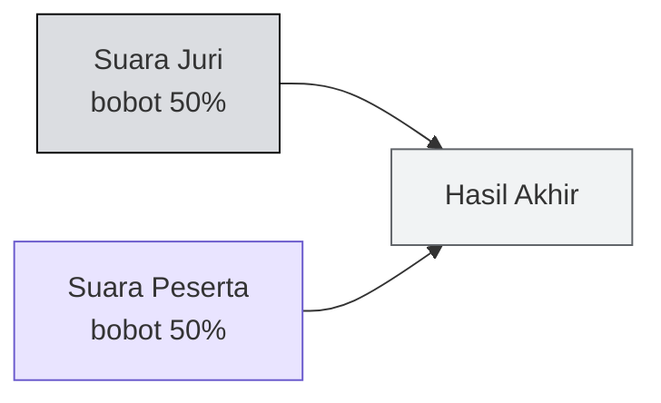

# 🏆 Demo, Penjurian & Hadiah

:::info Goal Halaman Ini
Di akhir halaman ini kamu akan:
- Tahu persis **format demo tiga menit**
- Paham **sistem voting** dan siapa yang sebenarnya menentukan pemenang
- Tahu **struktur hadiah** dan di mana mencari info track & bounty tambahan
:::

---

## ⏱️ Demo Tiga Menit

> **Three minutes. No official judges. The room decides.**

Setiap tim mendapat **tiga menit** untuk menampilkan hasil kerjanya.

### Aturan Format

| Aspek | Ketentuan |
|---|---|
| **Durasi** | 3 menit |
| **Fokus** | Demo live dan inti inovasinya |
| **Slide** | **Tidak wajib.** Cukup presentasikan demo-nya |
| **Audiens** | Semua orang di ruangan — sesama builder |
| **Urutan pitching** | Ditentukan **urutan submission** |

### Yang Harus Ditonjolkan

Deck acara menekankan dua hal:

1. **Tampilkan build yang live** — bukan mockup, bukan rencana
2. **Tunjukkan inovasi intinya** — bagian apa dari project ini yang belum pernah dilihat orang

:::tip Audiensmu Bukan Investor
Yang duduk di ruangan adalah **sesama builder**. Mereka tidak terkesan oleh proyeksi pasar atau slide *business model*. Mereka terkesan oleh sesuatu yang jalan dan bikin mereka bertanya, "kok bisa?"

Karena itu: kesankan sesama builder-mu.
:::

---

## 🗳️ Sistem Voting {#sistem-voting}

Monad Blitz **tidak memakai panel juri tertutup** sebagai satu-satunya penentu. Ruangan ikut memutuskan.

> Results are decided by a mix of judge and participant votes, **weighted 50% each**.

### Kriteria Voting

Peserta diminta memilih project yang:

- **Paling inovatif**
- **Paling menarik secara teknis**
- **Paling menginspirasi**

Perhatikan bahwa ketiganya tidak menyebut "paling lengkap" atau "paling rapi". Ini konsisten dengan [objektif hari ini](./apa-itu-monad-blitz#-objektif-hari-ini).

:::warning Konsekuensi Sistem 50/50
Karena setengah bobot ada di tangan peserta, **kamu perlu memenangkan ruangan, bukan sekadar memenangkan juri**. Demo yang membuat orang lain berkata "wah, keren" punya nilai nyata di sistem ini.

Ini juga berarti: hadir dan perhatikan demo tim lain. Kamu punya hak suara.
:::

---

## 💰 Hadiah

| Peringkat | Hadiah |
|---|---|
| 🥇 **Juara 1** | 500 USD |
| 🥈 **Juara 2** | 400 USD |
| 🥉 **Juara 3** | 300 USD |
| 🏅 **Juara 4** | 200 USD |
| 🏅 **Juara 5** | 100 USD |
| | **Total: 1.500 USD** |

### Track & Bounty Tambahan

Selain hadiah utama di atas, ada **track dan bounty** yang didaftar terpisah di **info pack** acara.

:::danger Cek Info Pack Sebelum Menentukan Scope
Deck secara khusus mengingatkan: *"Check it before you scope your build."*

Alasannya sederhana — kalau ada bounty untuk kategori tertentu (misalnya DeFi, AI agent, atau gaming), mengarahkan idemu ke sana sejak awal jauh lebih murah daripada mencoba membelokkannya di jam keempat.
:::

---

## 🎯 Strategi Menang: Ringkasan

Menggabungkan semua di atas, ini yang secara struktural memaksimalkan peluangmu:

| Langkah | Alasan |
|---|---|
| **Submit lebih awal** | Urutan submission = urutan pitching. Pitching awal saat ruangan masih segar |
| **Baca info pack dulu** | Bounty tambahan bisa mengarahkan pilihan ide |
| **Kejar satu momen "wow"** | Voting menilai inovasi, bukan kelengkapan |
| **Latih demo 3 menit** | Kehabisan waktu sebelum sampai bagian menarik adalah kesalahan mahal |
| **Siapkan data contoh** | Lihat [Tips Presentasi](../Setelah-Blitz/tips-presentasi) |

---

:::tip Lanjut
Terakhir dari bagian brief: [House Rules & Submission](./house-rules-dan-submission) — etika di venue dan cara submit.
:::
