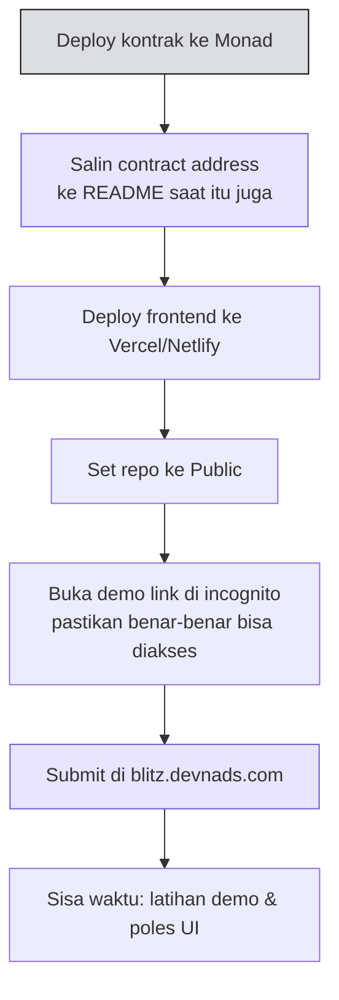

# 🏠 House Rules & Submission

:::info Goal Halaman Ini
Di akhir halaman ini kamu akan:
- Tahu **aturan venue** The Studio dan cara bersikap selama acara
- Tahu persis **cara dan tenggat submission**
:::

---

## 🏢 House Rules — The Studio

> Keep The Studio a safe, comfortable space. Leave every room as you found it — or better.

Venue acara disebut **"The Studio"**. Ada empat kelompok aturan.

### 01 · Ruang Bersama

- **Tutup pintu depan sampai rapat** setiap kali kamu masuk atau keluar
- Tinggalkan **dapur, ruangan, dan kamar mandi** dalam kondisi seperti saat kamu menemukannya
- **Dilarang makan di booth**
- Jaga **kebisingan tetap rendah** di area bersama

### 02 · Media Sosial

- **Perhatikan siapa yang masuk frame** — minta izin sebelum memposting
- Jaga agar **layar dan informasi pribadi orang lain tidak ikut terfoto**
- Sebut tempat ini **"The Studio"** — **bukan** kantor atau HQ Monad

:::warning Penamaan Venue
Ini bukan aturan sepele. Saat posting di X/Instagram/LinkedIn, tulis **"The Studio"**. Menyebutnya sebagai kantor atau HQ Monad adalah kekeliruan yang secara khusus diminta untuk dihindari.
:::

### 03 · Sampah & Daur Ulang

- **Tempat sampah hitam** tersebar di seluruh lantai
- Kalau satu tempat sampah penuh, **pakai yang lain** — jangan menumpuk sampai meluber
- **Botol dan kertas** masuk ke tempat sampah **biru dan hijau**

### 04 · Submission

- Repo **publik** dengan **README yang jelas**
- **Ter-deploy di Monad** selama Blitz berlangsung, dan **live di web**
- **Contract address dicantumkan di README**

---

## 📤 Cara Submit

Semua urusan submission berpusat di satu tempat:

> ### 🔗 [blitz.devnads.com](https://blitz.devnads.com)
> **Token. Submission. Voting.** Semuanya di satu tempat.

Situs ini punya tiga fungsi:

| Fungsi | Keterangan |
|---|---|
| **Token** | Tempat klaim token untuk keperluan hackathon |
| **Submission** | Tempat mendaftarkan project kamu |
| **Voting** | Tempat kamu memberi suara untuk project lain |

### ⏰ Tenggat

:::danger Submission Freeze — 17:45
Form submission **tertutup jam 17:45**. Tidak ada perpanjangan.

Dan ingat prinsip yang berlaku sepanjang acara:

> **SUBMISSION ORDER = PITCHING ORDER**

Semakin cepat kamu submit, semakin awal kamu pitching.
:::

### Urutan Kerja yang Disarankan

:::tip Submit Versi yang Jalan, Lalu Perbaiki
Kalau project-mu sudah memenuhi enam syarat eligibility jam 15:00, **submit saat itu juga**. Kamu tetap bisa terus melakukan commit dan memperbaiki sampai waktu demo — tapi slot pitching-mu sudah aman di urutan depan.
:::

---

## 🌐 Info Praktis Venue

| Item | Detail |
|---|---|
| **WiFi Network** | `MFS Guest` |
| **WiFi Password** | `GMONADGUEST` |

---

:::tip Lanjut
Bagian brief selesai. Sekarang masuk ke materinya: [Workshop Monad 101 — Kenapa Butuh Throughput Tinggi](../Monad-101/kenapa-butuh-throughput-tinggi).
:::
