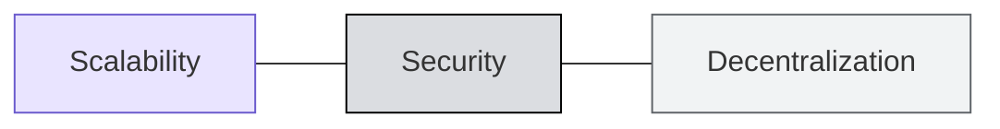

# 📈 Kenapa Butuh Blockchain Throughput Tinggi?

:::info Goal Unit Ini
Di akhir unit ini kamu akan:
- Paham bahwa **permintaan onchain terus naik** dan bisa menyebutkan buktinya
- Bisa menjelaskan **pola berulang**: setiap use case baru selalu membuat chain-nya macet
- Bisa **menghitung sendiri** kapasitas Ethereum hari ini dalam angka nyata
- Paham **skenario 231 TPS** dan kenapa itu argumen yang menohok
:::

---

## 🚀 Aktivitas Onchain Meledak, dan Terus Bertumbuh

Sumber: **a16z crypto · State of Crypto 2025**.

Beberapa indikator yang semuanya bergerak naik:

| Indikator | Yang terjadi |
|---|---|
| **Suplai stablecoin** | Naik terus, dari hampir nol di 2018 sampai melewati $300B — didominasi Tether dan USDC |
| **Pangsa volume spot DEX** | Dari ~0% di 2019 menjadi di atas 20% dari total volume spot |
| **Volume prediction market** | Meledak sejak 2024, dengan lonjakan besar di pemilu presiden AS dan awal musim NFL |
| **Pembayaran mesin-ke-mesin** | Kategori baru yang mulai tumbuh seiring maraknya AI agent |

Kesimpulannya satu kalimat:

> Setiap grafik naik. Pertanyaannya adalah **apakah chain di bawahnya sanggup mengimbangi**.

---

## 🔥 Setiap Use Case Baru Selalu Melampaui Chain-nya

Ini bukan ramalan — ini pola yang sudah berulang.

### Uji Beban dari Masa Lalu

| Peristiwa | Yang terjadi |
|---|---|
| **CryptoKitties (2017)** | Satu game NFT membuat Ethereum tersendat |
| **DeFi Summer** | Yield farming memicu lonjakan biaya gas |
| **NFT mint & airdrop** | Chain menjadi tidak bisa dipakai saat mint besar |
| **Trading memecoin** | Kemacetan terulang lagi, di berbagai chain |

Polanya jelas: **permintaan selalu melampaui kapasitas.** Setiap kali ada use case yang benar-benar populer, infrastruktur di bawahnya menyerah.

### Profil Permintaan Masa Depan

Kalau masa lalu saja sudah membuat chain kewalahan, ini yang sedang menuju ke sana:

| Kebutuhan | Tuntutannya |
|---|---|
| **Pembayaran** | Kecepatan dan biaya setara Visa |
| **HiFi DeFi** | Trading real-time, bukan trading dengan jeda belasan detik |
| **Gaming** | Setiap aksi pemain tercatat onchain |
| **AI × crypto** | Komputasi onchain dalam skala besar |

Semuanya menuntut hal yang sama: **throughput lebih tinggi, biaya lebih rendah**.

---

## 🧮 Kapasitas Ethereum Hari Ini

Mari kita hitung dengan angka konkret. Ethereum L1 memproses sekitar **5 juta gas per detik**.

### Kasus 1: Swap

| Komponen | Angka |
|---|---|
| Gas per trade Uniswap | 150.000 |
| Kapasitas blok | 5.000.000 gas/detik |
| **Maksimum Ethereum** | **2,9 juta trade per hari** |
| Nasdaq, sebagai pembanding | **77 juta trade per hari** |

Ethereum, dalam skenario terbaik di mana **seluruh kapasitas chain dipakai hanya untuk swap**, masih sekitar **26 kali lebih kecil** dari Nasdaq.

### Kasus 2: Transfer Token

| Komponen | Angka |
|---|---|
| Gas per transfer ERC-20 | 60.000 |
| Kapasitas blok | 5.000.000 gas/detik |
| **Maksimum Ethereum** | **7,2 juta transfer per hari** |
| Visa, sebagai pembanding | **700 juta transfer per hari** |

Selisihnya sekitar **100 kali lipat** — dan itu pun dengan asumsi tidak ada aktivitas lain sama sekali di chain.

:::warning Perhatikan Asumsinya
Kedua angka di atas adalah **batas teoretis maksimum**, di mana 100% kapasitas Ethereum didedikasikan untuk satu jenis transaksi saja. Kenyataannya chain harus melayani swap, transfer, NFT, dan segala hal lain secara bersamaan. Kapasitas nyata per kategori jauh lebih kecil.
:::

---

## 💡 Skenario Sederhana yang Menohok

Ini slide paling penting di bagian ini. Bayangkan portofolio aplikasi yang sangat **modest** — sama sekali tidak ambisius:

| Variabel | Nilai |
|---|---|
| Jumlah aplikasi | **10** |
| Pengguna per aplikasi | **1.000.000** |
| Transaksi per pengguna per hari | **2** |

Hitungannya:

```
10 aplikasi × 1.000.000 pengguna × 2 transaksi
= 20.000.000 transaksi per hari
÷ 86.400 detik
≈ 231 TPS
```

Hasilnya: **231 TPS.**

Sekarang bandingkan:

| | TPS |
|---|---|
| **Yang dibutuhkan skenario di atas** | **231** |
| **Ethereum L1 hari ini** | **~28** |

> Sepuluh aplikasi. Satu juta pengguna masing-masing. Hanya **dua** interaksi per pengguna per hari. **L1 paling aktif di dunia tidak sanggup mencapainya.**

:::tip Kenapa Skenario Ini Kuat
Karena angkanya sengaja dibuat **kecil**. Dua transaksi per hari itu setara membuka aplikasi sekali dan menekan satu tombol. Sepuluh aplikasi dengan sejuta pengguna adalah ukuran aplikasi konsumer biasa, bukan raksasa.

Kalau ekspektasi paling sederhana pun sudah 8 kali lipat di atas kapasitas, artinya masalahnya bukan pada ambisi — masalahnya pada fondasinya.
:::

---

## 🎯 Kesimpulan Bagian Ini

> **Bottleneck-nya bukan aplikasi baru. Bottleneck-nya adalah infrastruktur untuk aplikasi yang sudah ada sekarang.**

Ini alasan Monad dibangun, dengan tiga syarat yang harus dipenuhi sekaligus:



Bagian yang sulit bukan mencapai salah satunya — tapi mencapai ketiganya bersamaan. Banyak chain cepat mengorbankan desentralisasi dengan cara menuntut hardware kelas server. Bagaimana Monad menghindari trade-off itu, kita bahas di unit berikutnya.

---

:::tip Lanjut
Sekarang kita masuk ke jawabannya: [Apa itu Monad?](./apa-itu-monad)
:::
