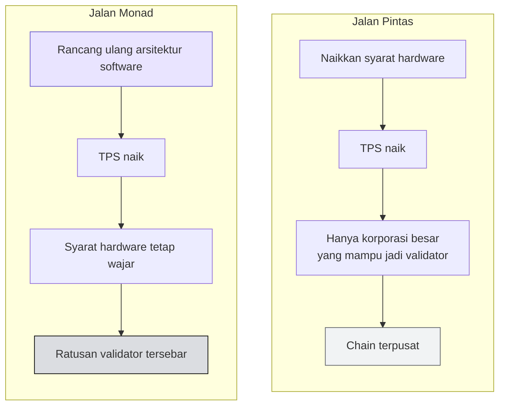

# 🟣 Apa itu Monad?

:::info Goal Unit Ini
Di akhir unit ini kamu akan:
- Paham arti **"fully EVM-compatible L1"** dan kenapa itu penting
- Hafal **angka pembanding Monad vs Ethereum**
- Paham prinsip **"raise the limits without raising the floor"**
:::

:::note Prasyarat
- ✅ [Unit 1](./kenapa-butuh-throughput-tinggi) selesai — kamu paham masalah throughput yang sedang dipecahkan
:::

---

## 📖 Definisi Singkat

> **Monad adalah Layer 1 berperforma tinggi yang sepenuhnya kompatibel dengan EVM — tanpa mengorbankan *moat* berupa developer surface Ethereum.**

Dua hal yang perlu dibedah dari kalimat itu.

### "Fully EVM-compatible"

Kompatibilitas Monad mencakup dua lapis:

| Lapis | Artinya |
|---|---|
| **Full Ethereum RPC support** | Seluruh method JSON-RPC Ethereum tersedia. Aplikasi yang bicara ke Ethereum bisa bicara ke Monad |
| **Full EVM tooling support** | Foundry, Hardhat, viem, ethers, MetaMask — semuanya jalan tanpa modifikasi |

### "Tanpa mengorbankan moat"

Ini poin strategis. Aset terbesar Ethereum bukan teknologinya, melainkan **ekosistem developer-nya**: jutaan baris Solidity yang sudah teruji, tooling yang matang, dan puluhan ribu developer yang sudah paham modelnya.

Banyak chain cepat memilih jalan lain — bahasa baru, VM baru, model akun baru. Konsekuensinya, developer harus belajar dari nol dan kode lama tidak bisa dipindahkan.

Monad memilih **mempertahankan seluruh permukaan itu** dan mengganti mesin di bawahnya.

:::tip Analogi
Bayangkan mobil dengan **dashboard, setir, dan pedal yang persis sama** seperti mobil yang sudah kamu kendarai bertahun-tahun. Kamu tidak perlu belajar menyetir ulang.

Yang diganti adalah **mesinnya** — dari 1.500cc menjadi mesin balap. Cara mengemudinya identik; yang berubah hanya seberapa cepat mobilnya bisa melaju.
:::

---

## 📊 Monad dalam Angka

> Same EVM. Two orders of magnitude more capacity.

| Properti | **Monad** | **Ethereum L1** | Selisih |
|---|---|---|---|
| **Throughput** | 500 juta gas/detik | 5 juta gas/detik | **100×** |
| **Block time** | 0,3 detik | 12 detik | **40×** lebih cepat |
| **Finality** | 0,6 detik | ~13 menit | **~1.300×** lebih cepat |
| **Sustained TPS** | 10.000 | ~28 | **~357×** |
| **Validator aktif** | 200 | ~27.000 per blok | — |

*Sumber: monad.xyz · etherscan.io/nodetracker · gmonads.com*

### Membaca Angka Ini dengan Benar

**Throughput 500M gas/detik.** Pakai hitungan dari [unit sebelumnya](./kenapa-butuh-throughput-tinggi#-kapasitas-ethereum-hari-ini): dengan 60.000 gas per transfer ERC-20, 500 juta gas/detik berarti ruang untuk sekitar **8.300 transfer per detik** — melampaui skala Visa.

**Finality 0,6 detik** adalah angka yang paling mengubah cara membangun aplikasi. Di Ethereum, kamu harus mendesain UI dengan asumsi transaksi butuh waktu lama: spinner, notifikasi "pending", state optimistis yang bisa gagal. Pada 600 milidetik, transaksi selesai **lebih cepat dari kebanyakan panggilan API biasa**.

:::warning Beda Block Time dan Finality
Keduanya sering tertukar.

- **Block time (0,3 detik)** — seberapa sering blok baru dibuat
- **Finality (0,6 detik)** — sejak kapan transaksi dijamin tidak akan dibatalkan

Finality adalah angka yang benar-benar penting untuk aplikasi. Blok cepat tapi finality lambat tetap berarti kamu tidak boleh menganggap transaksi sudah pasti.
:::

---

## 🔭 Melihatnya Secara Langsung

> ### 🔗 [gmonads.com](https://gmonads.com)

Tampilan **real-time** validator yang sedang mengusulkan dan memfinalkan blok di Monad mainnet. Yang bisa kamu lihat langsung dari browser:

- **Block time** yang sedang berjalan
- **Rotasi leader** antar validator
- **Active set** validator saat ini

:::tip Bahan Demo
Membuka gmonads.com berdampingan dengan aplikasimu saat demo adalah cara murah untuk membuat klaim kecepatan terasa nyata bagi audiens.
:::

---

## ⚖️ Naikkan Plafon, Jangan Naikkan Lantai

Ini prinsip desain yang membedakan Monad dari kebanyakan chain berperforma tinggi.

> **Performa datang dari arsitektur ulang, bukan dari superkomputer. Validator berjalan di hardware komoditas.**

### Sisi 1 · Dorong Batasnya

| Pendekatan | Penjelasan |
|---|---|
| **Maksimalkan hardware komoditas** | Peras performa dari perangkat biasa, bukan menuntut perangkat mahal |
| **Arsitektur software baru dari nol** | Bukan menambal klien yang sudah ada |
| **Optimasi level rendah** | Melakukan hal-hal yang dilewati chain lain |

### Sisi 2 · Jaga Desentralisasi

| Prinsip | Penjelasan |
|---|---|
| **Siapa pun bisa menjalankan node** | Kebutuhan RAM dan bandwidth tetap wajar |
| **Tersebar secara geografis** | Validator tidak terpusat di satu wilayah |
| **Ratusan validator, bukan puluhan** | Jumlah validator aktif: 200 |

### Kenapa Ini Penting

Cara termudah membuat blockchain cepat adalah **menaikkan syarat hardware**. Minta setiap validator memakai server dengan RAM 1TB dan koneksi 10 Gbps, dan angka TPS langsung melonjak.

Masalahnya: yang mampu menjalankan validator hanya perusahaan besar. Jumlah validator menyusut, dan chain-nya jadi terpusat — persis hal yang seharusnya dihindari blockchain.

Monad menolak jalan pintas itu. **Plafon dinaikkan (kapasitas), lantai tetap rendah (syarat menjadi validator).**

---

:::tip Lanjut
Pertanyaan berikutnya yang wajar: *bagaimana caranya?* Jawabannya ada di [Arsitektur Monad](./arsitektur-monad) — enam primitif yang membuat semua angka di atas mungkin.
:::
