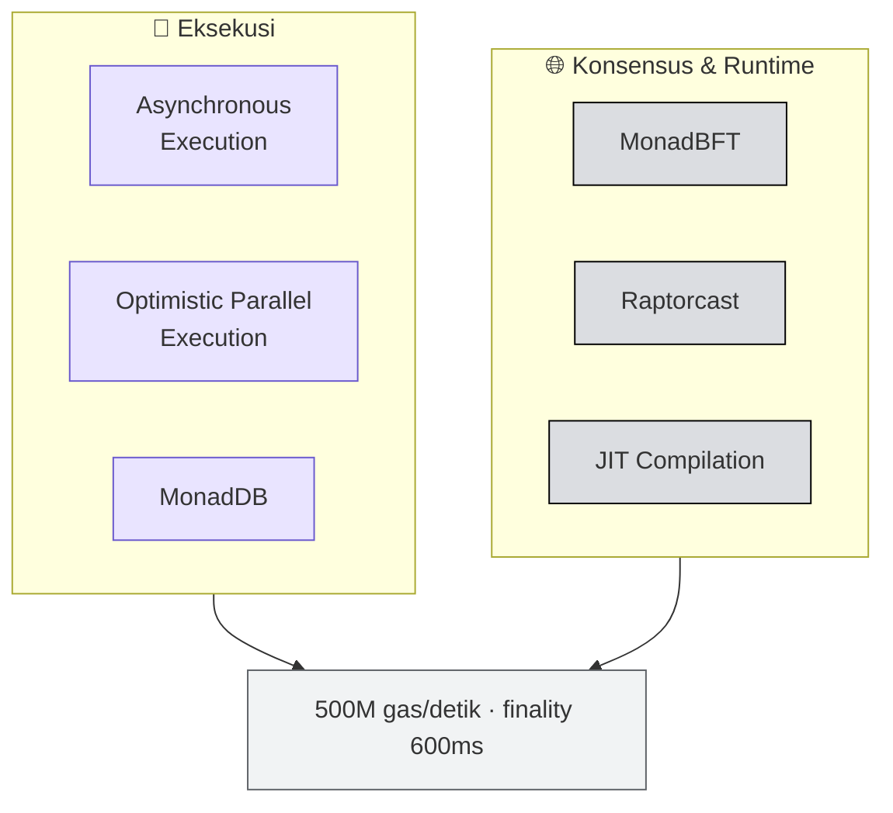
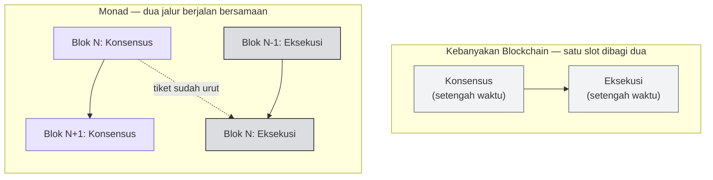
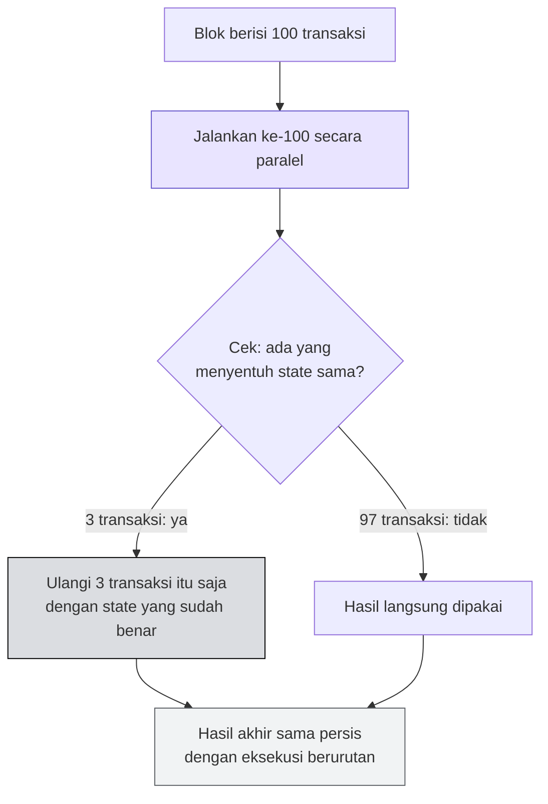

# ⚙️ Arsitektur Monad — Enam Primitif

:::info Goal Unit Ini
Di akhir unit ini kamu akan:
- Bisa menyebutkan **enam primitif arsitektur Monad** dan fungsi masing-masing
- Bisa menjelaskan **asynchronous execution** dengan analogi restoran
- Bisa menjelaskan **parallel execution** dengan analogi teller bank
- Paham kenapa semua ini **tidak menuntut perubahan pada smart contract-mu**
:::

:::note Prasyarat
- ✅ [Unit 2](./apa-itu-monad) selesai — kamu sudah tahu angka-angka Monad
:::

---

## 🧩 Peta Enam Primitif

Monad mengelompokkan inovasinya menjadi dua kelompok: **eksekusi** dan **konsensus + runtime**.

:::danger Poin Paling Penting di Seluruh Unit Ini
> **No contract changes required. Deploy your existing Solidity unchanged.**

Keenam primitif ini bekerja **di bawah permukaan kontrak**. Kamu tidak perlu menandai transaksi mana yang boleh paralel, tidak perlu anotasi khusus, tidak perlu bahasa baru. Solidity yang sudah kamu tulis, di-deploy apa adanya.
:::

---

## 🔧 Kelompok 1 · Eksekusi

### 1. Asynchronous Execution

> **Konsensus tidak menunggu eksekusi. Masing-masing mendapat satu blok penuh untuk bekerja.**

### 2. Optimistic Parallel Execution

> **Jalankan transaksi secara bersamaan; ulangi hanya yang bertabrakan.**

### 3. MonadDB

> **Database yang dirancang khusus untuk state blockchain, sehingga operasi baca berhenti menjadi bottleneck.**

MonadDB layak diberi perhatian khusus. Di banyak chain, hambatan terbesar bukan kecepatan menjalankan kode, melainkan **kecepatan membaca state dari disk**. Setiap kali kontrak membaca sebuah variabel penyimpanan, chain harus mencarinya di database. Struktur database umum tidak dirancang untuk pola akses seperti ini, jadi operasi baca menumpuk dan memperlambat semuanya.

MonadDB dibangun khusus untuk pola tersebut.

---

## 🌐 Kelompok 2 · Konsensus & Runtime

### 4. MonadBFT

> **Validator mencapai kesepakatan dalam satu ronde, sehingga blok final dalam 600ms.**

Banyak protokol BFT membutuhkan beberapa ronde komunikasi sebelum sebuah blok dianggap final. Setiap ronde berarti satu perjalanan pesan bolak-balik antar validator di seluruh dunia. MonadBFT memangkasnya menjadi satu ronde.

### 5. Raptorcast

> **Blok dipecah menjadi potongan-potongan dan disebarkan ke jaringan secara paralel.**

Ketika sebuah validator menjadi leader dan harus mengirim blok ke 199 validator lain, mengirim blok utuh satu per satu akan menghabiskan bandwidth leader tersebut. Raptorcast memecah blok menjadi potongan-potongan yang menyebar paralel antar node — mirip cara kerja BitTorrent.

Ini bagian penting dari janji **"hardware komoditas"**: tanpa penyebaran yang efisien, leader membutuhkan koneksi kelas data center.

### 6. JIT Compilation

> **Bytecode kontrak dikompilasi menjadi kode native satu kali, lalu dijalankan dari cache.**

EVM standar menafsirkan bytecode opcode demi opcode setiap kali kontrak dipanggil — seperti menerjemahkan buku kalimat per kalimat, berulang kali, setiap kali dibaca. JIT (*Just-In-Time*) menerjemahkannya sekali menjadi kode mesin native, menyimpannya, lalu memakai versi tersimpan itu untuk pemanggilan berikutnya.

---

## 🍽️ Analogi 1 · Asynchronous Execution

> **Restoran yang bagian depannya tidak pernah menunggu dapur.**

### Kebanyakan Blockchain: Satu Orang Mengerjakan Dua Pekerjaan

Pelayan menerima pesanan, berjalan ke dapur, memasaknya, menyajikannya, **baru** menerima pesanan berikutnya.

Akibatnya: semua orang di antrean menunggu hidangan yang paling lama dimasak.

### Monad: Dua Stasiun, Keduanya Selalu Sibuk

Bagian depan terus menerima pesanan sementara dapur memasak pesanan sebelumnya. Keduanya bekerja penuh, dan tidak ada pesanan yang hilang — karena tiketnya sudah disepakati dan sudah berurutan.

### Terjemahan ke Blockchain

| Restoran | Blockchain |
|---|---|
| **Menerima pesanan** | **Konsensus** — validator menyepakati transaksi apa saja yang masuk, dan dalam urutan seperti apa |
| **Memasak** | **Eksekusi** — benar-benar menjalankan transaksi tersebut dan memperbarui saldo |

Tiga poin kuncinya:

1. **Menerima pesanan = konsensus.** Validator menyepakati transaksi apa saja, dan urutannya bagaimana.
2. **Memasak = eksekusi.** Menjalankan transaksi tersebut dan memperbarui saldo.
3. **Memisahkan keduanya memberi masing-masing satu blok penuh** alih-alih sepotong waktu. Blok tetap 300ms, tapi pekerjaan yang selesai per blok jauh lebih banyak.

:::tip Kenapa Aman
Pertanyaan yang wajar: kalau eksekusi tertinggal di belakang konsensus, apakah hasilnya bisa berbeda?

Tidak. **Urutan transaksi sudah dikunci** saat konsensus. Dapur memasak sesuai tiket yang urutannya sudah disepakati. Yang berubah hanya *kapan* masakannya selesai, bukan *masakan apa* yang keluar.
:::

---

## 🏦 Analogi 2 · Optimistic Parallel Execution

> **Sepuluh teller bank pada satu buku besar, dan pengulangan hanya terjadi kalau dua orang menyentuh rekening yang sama.**

### Kebanyakan Blockchain: Satu Teller untuk Seluruh Bank

Nasabah dilayani ketat satu per satu — untuk berjaga-jaga kalau ada dua orang yang menyentuh rekening yang sama.

Aman, tapi lambat. Padahal hampir setiap pasang nasabah sebenarnya **tidak saling berhubungan**.

### Monad: Semua Loket Dibuka, Secara Optimistis

Layani semua orang sekaligus, dengan **asumsi** rekening mereka tidak saling tumpang tindih. Setelah itu baru periksa berkasnya: kalau ternyata ada dua orang yang menyentuh rekening yang sama, **hanya transaksi itu** yang diulang dengan saldo yang sudah dikoreksi.

### Tiga Poin Kuncinya

1. **Optimistis = asumsikan tidak ada tumpang tindih, verifikasi belakangan.** Sesekali salah jauh lebih murah daripada membuat semua orang menunggu.
2. **Sebagian besar transaksi tidak saling kenal** — wallet berbeda, aplikasi berbeda, tidak ada irisan.
3. **Pekerjaan yang diulang tetap mengikuti urutan yang sudah disepakati**, jadi hasil akhirnya identik dengan melayani satu per satu.

:::warning Determinisme Tetap Terjaga
Poin nomor 3 adalah jaminan yang paling penting. Eksekusi paralel **tidak mengubah hasil**. Kalau urutan yang disepakati adalah A → B → C, maka hasil akhirnya sama persis seperti menjalankan A, lalu B, lalu C satu per satu.

Paralelisme hanyalah optimasi cara pengerjaan, bukan perubahan aturan main. Karena itulah kontrak Solidity-mu tidak perlu diubah sedikit pun.
:::

---

## 🧾 Ringkasan

| Primitif | Kelompok | Masalah yang dipecahkan |
|---|---|---|
| **Asynchronous Execution** | Eksekusi | Konsensus dan eksekusi saling menunggu dalam satu slot waktu |
| **Optimistic Parallel Execution** | Eksekusi | Transaksi independen dipaksa antre satu per satu |
| **MonadDB** | Eksekusi | Pembacaan state jadi hambatan utama |
| **MonadBFT** | Konsensus | Finality butuh banyak ronde komunikasi |
| **Raptorcast** | Konsensus | Penyebaran blok membebani bandwidth leader |
| **JIT Compilation** | Runtime | Bytecode ditafsirkan ulang setiap kali dipanggil |

Dan sekali lagi, hal yang paling relevan buatmu hari ini:

> **Tidak ada perubahan kontrak yang dibutuhkan. Deploy Solidity yang sudah ada, apa adanya.**

---

:::tip Lanjut
Sekarang bagian yang paling praktis: [Monad untuk Developer](./monad-untuk-developer) — apa yang sama, apa yang baru, dan apa yang jadi mungkin.
:::
