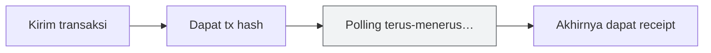
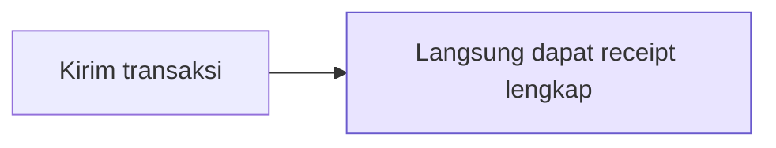
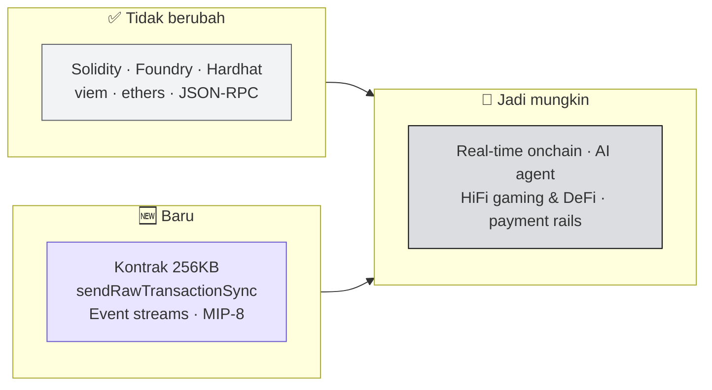

# 👨‍💻 Monad untuk Developer

:::info Goal Unit Ini
Di akhir unit ini kamu akan:
- Tahu **empat kemampuan baru** yang tidak ada di Ethereum
- Tahu persis **apa yang sama** sehingga tidak perlu dipelajari ulang
- Punya gambaran **kategori aplikasi** yang baru masuk akal di finality 600ms
:::

:::note Prasyarat
- ✅ [Unit 3](./arsitektur-monad) selesai — kamu paham kenapa Monad cepat
:::

---

## 🆕 Empat Hal Baru di Monad

### 01 · Kontrak 256KB

> **Sepuluh kali lebih besar dari batas Ethereum.**

Ethereum membatasi ukuran bytecode kontrak di sekitar 24KB (EIP-170). Batas ini adalah alasan lahirnya banyak pola rumit: diamond pattern, proxy berlapis, memecah logika ke beberapa kontrak library.

Monad menaikkannya ke **256KB** — lebih dari sepuluh kali lipat.

**Artinya buatmu:** kamu bisa membangun aplikasi yang lebih kompleks **tanpa memecahnya ke banyak proxy**.

:::tip Relevansi untuk Blitz
Kalau idemu butuh logika yang banyak, kamu tidak perlu membuang waktu berjam-jam menata arsitektur proxy hanya agar muat. Tulis saja dalam satu kontrak.
:::

### 02 · `eth_sendRawTransactionSync`

> **Mengembalikan receipt transaksi lengkap secara sinkron.**

Ini kemungkinan besar **fitur paling langsung terasa** untuk sebuah demo hackathon.

Di Ethereum, alurnya selalu dua langkah:



Karena itu setiap dApp punya pola yang sama: kirim, tampilkan spinner, polling `eth_getTransactionReceipt` berulang kali, baru perbarui UI.

Di Monad, `eth_sendRawTransactionSync` **mengembalikan receipt lengkap dalam satu panggilan**.



**Artinya buatmu:** tidak perlu lagi pola konfirmasi asinkron. **UI terasa instan.**

:::warning Ini Bahan Demo yang Kuat
Perbedaan antara "klik → spinner 12 detik → berhasil" dan "klik → langsung berhasil" adalah hal yang **langsung terlihat oleh penonton** tanpa perlu kamu jelaskan.

Kalau kamu hanya sempat memanfaatkan satu fitur khas Monad hari ini, jadikan ini pilihannya.
:::

### 03 · Execution Event Streams

> **Streaming event langsung dari node untuk aplikasi berthroughput tertinggi.**

Alur normal untuk membaca event blockchain melibatkan perantara: kontrak memancarkan event → indexer menangkapnya → aplikasi bertanya ke indexer. Setiap lapisan menambah jeda.

Monad memungkinkan **streaming event eksekusi langsung dari node**, sehingga kamu bisa **melewati perjalanan bolak-balik ke indexer**.

**Artinya buatmu:** untuk aplikasi real-time (orderbook live, game, dashboard), data bisa sampai lebih cepat.

### 04 · MIP-8 (Akan Datang)

> **Mengurangi biaya akses cold slot.**

Dalam EVM, membaca storage slot yang belum tersentuh dalam transaksi ("cold slot") jauh lebih mahal daripada membaca slot yang sudah tersentuh ("warm").

MIP-8 menurunkan biaya tersebut. **Gas turun untuk setiap kontrak yang mengakses state secara lazy.**

:::note Status
MIP-8 ditandai sebagai **upcoming** di deck. Jangan bergantung padanya untuk project hari ini — tapi catat, karena ini mengubah kalkulasi biaya untuk kontrak yang banyak membaca state.
:::

---

## 🔁 Yang Sama Persis dengan Ethereum

> **Stack yang sudah kamu punya, jalan tanpa perubahan.**

| Komponen | Status di Monad |
|---|---|
| **Bahasa Solidity** | Sama, compiler yang sama |
| **Foundry, Hardhat, viem, ethers** | Jalan semua |
| **Model EVM** | Sama: account, gas, tx ordering |
| **JSON-RPC & WebSocket** | Permukaan yang sama |

Praktisnya: kalau kamu sudah pernah men-deploy kontrak ke Sepolia atau testnet EVM mana pun, kamu **sudah tahu cara men-deploy ke Monad**. Yang berubah hanya RPC URL dan chain ID.

```bash
# Alur yang sudah kamu kenal, tetap berlaku
forge create src/MyContract.sol:MyContract \
  --rpc-url https://testnet-rpc.monad.xyz \
  --private-key $PRIVATE_KEY \
  --broadcast
```

:::tip Hemat Waktu di Blitz
Ini alasan Monad cocok untuk hackathon satu hari: **kurva belajarnya nyaris nol** untuk siapa pun yang sudah pernah menyentuh EVM. Waktumu habis untuk membangun ide, bukan mempelajari chain.

Konfigurasi network lengkap ada di [Referensi & Network Info](../Setelah-Blitz/referensi-dan-network-info).
:::

---

## 🚀 Yang Dibuka oleh Finality 600ms

Bagian ini penting untuk **memilih ide** hari ini. Kategori berikut adalah aplikasi yang sebelumnya tidak masuk akal di L1, dan kini menjadi mungkin:

| Kategori | Kenapa baru mungkin sekarang |
|---|---|
| **Aplikasi real-time yang sepenuhnya onchain** | Tidak perlu lagi memindahkan logika ke server demi kecepatan |
| **AI agent dengan state onchain** | Agent bisa membaca dan menulis state secepat loop pengambilan keputusannya |
| **Gaming & DeFi frekuensi tinggi** | Setiap aksi bisa jadi transaksi, tanpa membuat permainan terasa lambat |
| **Rel pembayaran yang terasa seperti Web2** | Konfirmasi di bawah satu detik setara pengalaman aplikasi pembayaran biasa |
| **ZK & privacy yang berat komputasi** | Ruang gas 500M/detik memuat pekerjaan yang sebelumnya terlalu mahal |

:::tip Cara Memakai Tabel Ini untuk Memilih Ide
Ide terbaik di Blitz biasanya adalah ide yang **hanya bisa jalan di chain cepat**.

Uji idemu dengan satu pertanyaan: *"Kalau ini dibangun di Ethereum L1, apakah tetap masuk akal?"*

- Kalau **ya** — idemu bagus, tapi tidak menunjukkan apa pun tentang Monad
- Kalau **tidak** — kamu sedang menyentuh sesuatu yang menarik, dan itu persis yang dicari [kriteria voting](../Hackathon-Brief/demo-penjurian-dan-hadiah#sistem-voting)
:::

---

## 🧾 Ringkasan



---

:::tip Lanjut
Sekarang alat-alatnya: [Tooling & Framework](./tooling-dan-framework).
:::
