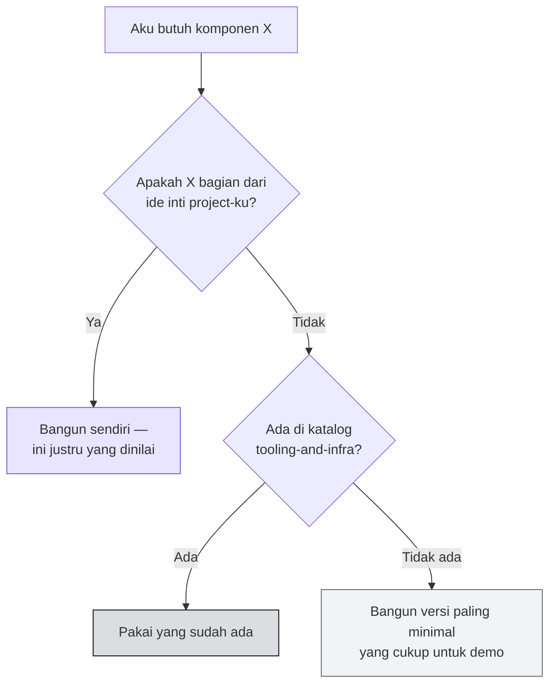

# 🧱 Ekosistem Tools & Infra

:::info Goal Unit Ini
Di akhir unit ini kamu akan:
- Tahu **kategori infra** apa saja yang sudah tersedia di Monad
- Kenal **nama-nama penyedia** di tiap kategori
- Punya kebiasaan **mengecek katalog sebelum membangun sendiri**
:::

---

## 🚫 Jangan Bangun Tools & Infra dari Nol

> **Don't build tools and infra from scratch.**
>
> Katalog lengkap: **[docs.monad.xyz/tooling-and-infra](https://docs.monad.xyz/tooling-and-infra)**

Ini pesan yang sangat relevan untuk hackathon satu hari. Setiap jam yang kamu habiskan menulis indexer sendiri adalah satu jam yang tidak dipakai membangun bagian yang membuat project-mu menarik.

:::danger Perangkap Klasik Hackathon
Tim yang menghabiskan pagi hari untuk membangun sistem pembacaan event sendiri hampir selalu kalah dari tim yang memakai Envio atau Goldsky dan memakai sisa waktunya untuk fitur.

**Yang dinilai adalah idemu, bukan infrastrukturmu.**
:::

---

## 🔍 Indexer

Untuk membaca dan melakukan query terhadap data onchain.

| Penyedia | Catatan |
|---|---|
| **Envio** | Indexer berperforma tinggi |
| **Goldsky** | Subgraph & data pipeline |
| **Allium** | Data blockchain terkurasi |
| **Moralis** | API Web3 serbaguna |

:::tip Kapan Kamu Butuh Ini
Kalau aplikasimu perlu menampilkan riwayat — daftar transaksi, leaderboard, feed aktivitas — kamu butuh indexer. Membaca langsung dari RPC dengan `getLogs` bisa dipakai untuk prototipe, tapi akan lambat begitu datanya bertambah.

Alternatifnya, ingat bahwa Monad punya [execution event streams](./monad-untuk-developer#03--execution-event-streams) langsung dari node.
:::

---

## 🌉 Bridge & Swap

Untuk memindahkan aset masuk dan keluar Monad, serta menukar token.

| Penyedia | Catatan |
|---|---|
| **Across** | Bridge intent-based |
| **Chainlink CCIP** | Protokol interoperabilitas lintas chain |
| **Wormhole** | Messaging lintas chain |
| **Relay** | Bridging & swap cepat |
| **Trails** | Routing lintas chain |

---

## 🔮 Oracle, Wallet, RPC

| Kategori | Penyedia |
|---|---|
| **Oracle** | Chainlink, Pyth, RedStone |
| **RPC provider** | Alchemy, QuickNode |
| **Wallet** | MetaMask |

:::note Oracle untuk Project Hackathon
Kalau idemu butuh harga aset — prediction market, DeFi, game dengan hadiah — pakai oracle yang sudah ada. Menuliskan harga secara hardcode akan langsung terlihat oleh juri yang paham.
:::

---

## 🔐 Account Abstraction

Untuk membuat pengalaman pengguna terasa seperti aplikasi biasa: login tanpa seed phrase, transaksi tanpa gas, wallet tertanam di aplikasi.

| Penyedia | Catatan |
|---|---|
| **Privy** | Embedded wallet & login sosial |
| **Para** | Wallet infrastructure |
| **Reown** | Connection & wallet toolkit |
| **Turnkey / wallet infra lainnya** | Manajemen key |

Salah satu penyedia di kategori ini ditandai **FREE** pada deck acara.

:::tip Kemenangan Cepat untuk Demo
Meminta juri memasang MetaMask dan mengklaim token faucet **di tengah demo tiga menit** adalah cara pasti kehabisan waktu.

Embedded wallet dengan login sosial membuat penonton bisa mencoba aplikasimu dalam hitungan detik. Ini salah satu peningkatan pengalaman termurah yang bisa kamu lakukan hari ini.
:::

---

## 🗺️ Cara Memakai Katalog Ini Hari Ini

Sebelum menulis kode untuk sesuatu yang terdengar seperti "infrastruktur", berhenti sebentar dan tanyakan:

> Katalog lengkap: **[docs.monad.xyz/tooling-and-infra](https://docs.monad.xyz/tooling-and-infra)**

---

:::tip Lanjut
Materi Monad 101 selesai. Sekarang bagian yang menentukan hasil akhirmu: [Tips Presentasi](../Setelah-Blitz/tips-presentasi).
:::
