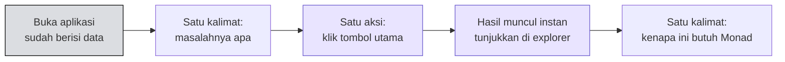

# 🎤 Tips Presentasi

:::info Goal Halaman Ini
Di akhir halaman ini kamu akan:
- Tahu **proporsi slide dan demo** yang benar
- Tahu cara menghindari **UI hasil vibe-coding** yang terlihat generik
- Punya **rencana pementasan demo** supaya tiga menitmu tidak terbuang
:::

:::danger Bagian Ini Ditandai "Very, Very Important"
Deck acara menandai bagian ini sebagai **BONUS · VERY, VERY IMPORTANT**.

Alasannya masuk akal: dua tim dengan kualitas kode yang sama bisa berbeda jauh hasilnya hanya karena cara mempresentasikan. Dan karena [setengah bobot penilaian ada di tangan peserta lain](../Hackathon-Brief/demo-penjurian-dan-hadiah#sistem-voting), presentasi bukan hiasan — ia bagian dari skornya.
:::

---

## 📉 Tip 01 · Sedikit Slide, Banyak Demo

> **Fewer slides. More demo.**
>
> Pakai slide untuk menyatakan masalahnya dalam satu tarikan napas, lalu langsung ke demo live. Ruangan datang untuk melihat hasil buatanmu, bukan deck-mu.

### Pembagian Waktu yang Disarankan

| Bagian | Durasi | Isi |
|---|---|---|
| **Masalah** | ~20 detik | Satu kalimat. Masalah apa, untuk siapa |
| **Demo live** | ~2 menit 20 detik | Tunjukkan aplikasinya bekerja |
| **Penutup** | ~20 detik | Bagian mana yang memanfaatkan Monad, dan apa langkah berikutnya |

### Kesalahan yang Sering Terjadi

| ❌ Jangan | ✅ Lakukan |
|---|---|
| Slide "tentang tim kami" | Langsung ke masalahnya |
| Slide arsitektur berisi 12 kotak | Cukup sebutkan lisan sambil demo berjalan |
| Ukuran pasar dan proyeksi TAM | Ruangan ini berisi builder, bukan investor |
| Membaca slide keras-keras | Bicara sambil menunjukkan aplikasi yang jalan |

:::tip Ingat
Slide **tidak wajib** di Monad Blitz. Kalau kamu ragu apakah butuh slide, jawabannya kemungkinan besar tidak.
:::

---

## 🎨 Tip 02 · Jangan Kirim UI Hasil Vibe-Coding

> **Don't ship vibe-coded UI.** Berikan brand kit ke LLM: tipografi, warna, komponen.
>
> **Desain yang sungguhan mengalahkan gumpalan Tailwind default.**

Ini nasihat yang tajam, dan penting untuk dipahami dengan benar.

### Masalahnya

Kalau kamu meminta AI membuat frontend tanpa arahan, hasilnya hampir selalu seragam: latar gradien ungu, kartu dengan `rounded-lg shadow-md`, font Inter, tombol biru. **Semua orang di ruangan akan mengirim UI yang mirip**, karena semua memakai asisten yang sama tanpa arahan.

### Solusinya: Beri Brand Kit

Sebelum meminta AI membangun frontend, tentukan dulu tiga hal:

| Elemen | Contoh keputusan |
|---|---|
| **Tipografi** | Font apa untuk judul, font apa untuk isi |
| **Warna** | 2–3 warna utama + warna netral. Bukan gradien default |
| **Komponen** | Bagaimana bentuk tombol, kartu, dan input |

Lalu masukkan ke dalam prompt-mu:

```text
Bangun UI-nya dengan sistem desain berikut, patuhi secara ketat:

TIPOGRAFI
- Judul: Space Grotesk, bold, tracking rapat
- Isi: Inter, regular

WARNA
- Latar: #0E0E12
- Permukaan: #17171F
- Aksen: #836EF9 (ungu Monad)
- Teks: #F5F5F7 primer, #A0A0AB sekunder

KOMPONEN
- Tombol: sudut tajam (radius 4px), tanpa shadow, border 1px
- Kartu: border tipis, tanpa drop shadow
- Spasi: kelipatan 8px

Jangan pakai gradien. Jangan pakai emoji sebagai ikon.
```

:::tip Cara Termurah Terlihat Berbeda
Menentukan satu **warna aksen yang tidak biasa** dan satu **font judul yang khas** sudah cukup untuk membuat aplikasimu terlihat berbeda dari sepuluh submission lain — dan itu hanya butuh dua menit di awal.

Perhatikan bahwa deck menyuruh *jangan menghabiskan waktu untuk UI/UX yang sempurna* — tapi juga *jangan mengirim UI vibe-coded*. Keduanya tidak bertentangan: maksudnya **buat keputusan desain di awal (murah)**, bukan **memoles piksel di akhir (mahal)**.
:::

---

## 🎬 Tip 03 · Pentaskan Demomu

> **Pre-fill your forms. Stage your demo.**
>
> Juri melihat keajaibannya. Bukan proses mengetiknya.
>
> **Lebih baik lagi: sediakan contoh yang sudah dibuat sebelumnya.**

### Masalahnya

Demo tiga menit yang dimulai dengan mengetik alamat wallet, menunggu faucet, mengisi form dari nol, lalu menunggu konfirmasi — sudah menghabiskan setengah waktumu **sebelum sampai ke bagian yang menarik**.

### Yang Harus Dilakukan

| Persiapan | Caranya |
|---|---|
| **Form terisi otomatis** | Isi nilai default di state React, atau tambahkan query param `?demo=1` |
| **Data contoh sudah ada** | Buat 3–5 entri contoh sebelum naik panggung, supaya aplikasi tidak terlihat kosong |
| **Wallet sudah terhubung & terisi** | Sambungkan wallet dan pastikan saldo cukup sebelum giliranmu |
| **Tab sudah dibuka** | Buka semua tab yang dibutuhkan sebelumnya — termasuk explorer |
| **Punya rencana cadangan** | Rekam video 30 detik. Kalau WiFi bermasalah, kamu tetap punya sesuatu |

### Alur Demo yang Sudah Dipentaskan



:::warning Latih Sekali dengan Timer
Menjalankan demo satu kali dengan stopwatch adalah **investasi lima menit** yang mencegah kesalahan paling umum di hackathon: waktu habis tepat sebelum bagian terbaiknya.
:::

---

## 🧾 Checklist Sebelum Naik Panggung

- [ ] Aplikasi terbuka di tab, sudah berisi data contoh
- [ ] Wallet terhubung, saldo MON mencukupi
- [ ] Explorer terbuka di tab terpisah, siap menampilkan transaksi
- [ ] Form penting sudah terisi otomatis
- [ ] Sudah latihan dengan timer, total di bawah 3 menit
- [ ] Kalimat pembuka sudah disiapkan (masalah, satu kalimat)
- [ ] Kalimat penutup sudah disiapkan (kenapa Monad, satu kalimat)
- [ ] Video cadangan 30 detik sudah direkam
- [ ] Notifikasi laptop dimatikan (jangan sampai chat pribadi muncul di layar proyektor)

---

:::tip Lanjut
Setelah demo dan pengumuman pemenang, perjalanannya belum selesai: [Peluang Setelah Blitz](./peluang-setelah-blitz).
:::
