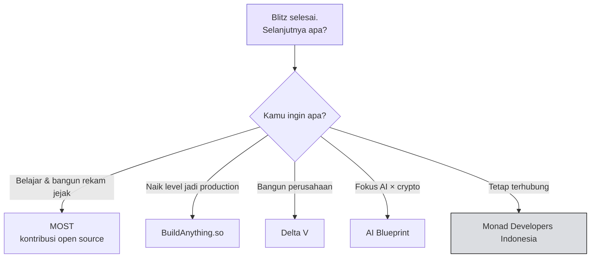

# 🚀 Peluang Setelah Blitz

:::info Goal Halaman Ini
Di akhir halaman ini kamu akan:
- Tahu **lima program lanjutan** untuk builder Monad
- Tahu **jalur mana yang cocok** untuk posisimu sekarang
- Sudah bergabung dengan **komunitas builder lokal**
:::

Blitz berakhir sore ini, tapi project yang kamu mulai hari ini tidak harus ikut berakhir. Ada lima jalur resmi untuk melanjutkan.

---

## 🧑‍💻 MOST — Monad Open Source Track

> **Contribute to open source, earn AI credits for it.**

Berkontribusi ke proyek open source di ekosistem Monad, dan dapatkan **kredit AI** sebagai imbalannya.

**Cocok untuk kamu kalau:** kamu suka menulis kode tapi belum punya ide produk sendiri. Berkontribusi ke repo yang sudah ada adalah cara tercepat mengenal ekosistem dari dalam — sekaligus membangun rekam jejak yang terlihat publik.

---

## 📚 BuildAnything.so

> ### 🔗 [BuildAnything.so](https://buildanything.so)
> **Berkembang dari vibe coder menjadi pengirim aplikasi production-ready** — lengkap dengan security, auth, dan best practice yang sudah tertanam.

**Cocok untuk kamu kalau:** kamu bisa membuat sesuatu jalan dengan bantuan AI, tapi belum yakin apakah hasilnya aman dan layak dipakai orang sungguhan.

:::tip Jurang Setelah Hackathon
Ada jarak besar antara "demo yang jalan di panggung" dan "aplikasi yang aman dipakai pengguna nyata": penanganan auth, validasi input, manajemen key, rate limiting, penanganan error.

Kalau project Blitz-mu ingin dilanjutkan menjadi sesuatu yang sungguhan, ini jurang yang harus diseberangi lebih dulu.
:::

---

## 🏛️ Delta V — Komunitas Founder

> **Komunitas khusus anggota untuk founder serius yang membangun di Monad.**
>
> `PEER SUPPORT · ADVISOR INTROS · DISTRIBUTION`

Tiga hal yang ditawarkan:

| Manfaat | Artinya |
|---|---|
| **Peer support** | Sesama founder yang sedang menghadapi masalah serupa |
| **Advisor intros** | Perkenalan ke advisor yang relevan |
| **Distribution** | Bantuan agar produkmu sampai ke pengguna |

**Cocok untuk kamu kalau:** kamu sudah serius ingin menjadikan ini perusahaan, bukan sekadar project sampingan.

---

## 🤖 AI Blueprint — AI Builders Program

> **Sumber daya, infrastruktur, dan dukungan untuk membangun, meluncurkan, dan menskalakan aplikasi AI di Monad.**
>
> `BEST-IN-CLASS AI & INFRA PARTNERS`

**Cocok untuk kamu kalau:** project-mu ada di persimpangan AI dan crypto — AI agent, agentic payment, inference onchain.

:::note Kaitannya dengan Materi Sebelumnya
Program ini nyambung langsung dengan primitif yang dibahas di [Tooling & Framework](../Monad-101/tooling-dan-framework): **x402** untuk pembayaran agent, **ERC-8004** untuk identitas agent, dan **Agent Hub** untuk skill protokol.

Kalau kamu memakai salah satunya hari ini, kamu sudah punya bahan untuk mendaftar.
:::

---

## 💬 Monad Developers Indonesia

> **Grup builder lokal.** Tempat bertanya soal shipping, info meetup, dan peluang — setelah Blitz berakhir.
>
> `SCAN TO JOIN` — QR code tersedia di venue

**Cocok untuk kamu:** semua orang. Ini yang paling penting dari kelima jalur ini, karena paling murah dan paling dekat.

:::tip Lakukan Ini Sebelum Pulang
Bergabung ke grup Telegram **sebelum meninggalkan venue**. Momentum komunitas paling kuat di hari acara, dan grup lokal adalah tempat kamu menemukan rekan tim untuk hackathon berikutnya.
:::

---

## 🧭 Memilih Jalur

---

## 🌐 Portal Developer

> ### 🔗 [developers.monad.xyz](https://developers.monad.xyz)
> Satu tempat untuk semua hal yang perlu diketahui developer Monad.
>
> `DOCS · EVENTS · DISCORD`

---

## 🙌 Penutup

> **Time to build.**
>
> All the best, Jakarta. We're here if you need any help.

| | |
|---|---|
| **DOCS** | [developers.monad.xyz](https://developers.monad.xyz) |
| **SOURCE** | [github.com/monad-developers](https://github.com/monad-developers) |
| **FOLLOW** | [@monad](https://x.com/monad) · [@monad_dev](https://x.com/monad_dev) · [@geeky_kartikey](https://x.com/geeky_kartikey) · [@verestraa](https://x.com/verestraa) |

---

:::tip Lanjut
Butuh konfigurasi network, daftar link lengkap, atau arti sebuah istilah? Semuanya ada di [Referensi & Network Info](./referensi-dan-network-info).
:::
