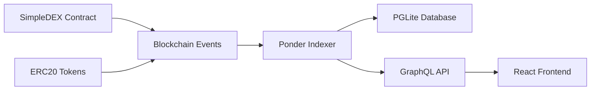

# Sesi 6: Blockchain Indexer Integration & Zero Knowledge Proofs

## Informasi Umum Sesi

**Tanggal**: Hari 6  
**Durasi Total**: 5.5 jam (09:30 – 15:00)  
**Tema Pembelajaran**: Advanced Blockchain Infrastructure & Privacy Technology  

Sesi ini fokus pada dua aspek penting dalam ekosistem blockchain modern: **Data Indexing** untuk efficient querying blockchain events, dan **Zero Knowledge Proofs** untuk privacy-preserving applications. Peserta akan mengintegrasikan Ponder indexer dengan SimpleDEX yang sudah dibangun, lalu membuat aplikasi ZK proof untuk verifikasi umur menggunakan data KTP Indonesia.

---

## Jadwal Harian Detail

| Waktu            | Aktivitas                                             | Tujuan                                                 | Materi & Fokus Utama                                       |
|------------------|-------------------------------------------------------|--------------------------------------------------------|------------------------------------------------------------|
| 09:30 – 12:00    | **Blockchain Indexer** — Ponder Integration          | Efficient blockchain data querying                     | Ponder setup, GraphQL APIs, React Query integration        |
| 13:30 – 15:00    | **Zero Knowledge Proofs** — Age Verification         | Privacy-preserving identity verification               | Circom circuits, KTP data processing, ZK proof generation  |

---

## Part 1: Blockchain Indexer dengan Ponder (09:30 – 12:00)

### Mengapa Indexer Diperlukan?

**🔍 Problem Statement**:
Blockchain networks menyimpan data dalam bentuk sequential blocks, making direct querying untuk specific events sangat inefficient. Untuk mendapatkan historical data seperti "semua swap events untuk user tertentu" or "total volume trading per hari", kita harus:

1. **Scan seluruh blockchain** dari genesis block
2. **Filter events** yang relevan
3. **Process dan aggregate** data manually
4. **Re-sync** setiap kali butuh updated data

**⚡ Solution: Indexer**
Indexer like Ponder constantly monitor blockchain, extract events, dan menyimpan data dalam structured database yang mudah di-query.



### Overview Ponder Architecture

**🏗️ Ponder Components**:

```typescript
// Ponder architecture overview
const ponderStack = {
  indexer: "Real-time blockchain event processor",
  database: "PGLite - embedded PostgreSQL",
  api: "Auto-generated GraphQL API",
  sync: "Automatic re-org handling & backfill"
};
```

**Key Benefits**:
- ⚡ **Real-time indexing** dengan automatic reorg handling
- 🗄️ **Structured queries** dengan GraphQL
- 📊 **Aggregated analytics** untuk dashboard metrics
- 🔄 **Automatic backfill** untuk historical data
- 🚀 **Type-safe** dengan TypeScript integration

### Setting Up Ponder Project

#### 1. Installation & Project Setup

```bash
# Create new Ponder project
npx create-ponder@latest simple-dex-indexer
cd simple-dex-indexer

# Install additional dependencies for frontend later
npm install @ponder/core @ponder/ui
npm install graphql @apollo/client
npm install @tanstack/react-query
```

#### 2. Configuration

**`abis/DexAbi.ts`**:
```typescript
export const ERC20_ABI = [
    {
        "constant": true,
        "inputs": [],
        "name": "name",
        "outputs": [
            {
                "name": "",
                "type": "string"
            }
        ],
        "payable": false,
        "stateMutability": "view",
        "type": "function"
    },
    {
        "constant": false,
        "inputs": [
            {
                "name": "_spender",
                "type": "address"
            },
            {
                "name": "_value",
                "type": "uint256"
            }
        ],
        "name": "approve",
        "outputs": [
            {
                "name": "",
                "type": "bool"
            }
        ],
        "payable": false,
        "stateMutability": "nonpayable",
        "type": "function"
    },
    {
        "constant": true,
        "inputs": [],
        "name": "totalSupply",
        "outputs": [
            {
                "name": "",
                "type": "uint256"
            }
        ],
        "payable": false,
        "stateMutability": "view",
        "type": "function"
    },
    {
        "constant": false,
        "inputs": [
            {
                "name": "_from",
                "type": "address"
            },
            {
                "name": "_to",
                "type": "address"
            },
            {
                "name": "_value",
                "type": "uint256"
            }
        ],
        "name": "transferFrom",
        "outputs": [
            {
                "name": "",
                "type": "bool"
            }
        ],
        "payable": false,
        "stateMutability": "nonpayable",
        "type": "function"
    },
    {
        "constant": true,
        "inputs": [],
        "name": "decimals",
        "outputs": [
            {
                "name": "",
                "type": "uint8"
            }
        ],
        "payable": false,
        "stateMutability": "view",
        "type": "function"
    },
    {
        "constant": true,
        "inputs": [
            {
                "name": "_owner",
                "type": "address"
            }
        ],
        "name": "balanceOf",
        "outputs": [
            {
                "name": "balance",
                "type": "uint256"
            }
        ],
        "payable": false,
        "stateMutability": "view",
        "type": "function"
    },
    {
        "constant": true,
        "inputs": [],
        "name": "symbol",
        "outputs": [
            {
                "name": "",
                "type": "string"
            }
        ],
        "payable": false,
        "stateMutability": "view",
        "type": "function"
    },
    {
        "constant": false,
        "inputs": [
            {
                "name": "_to",
                "type": "address"
            },
            {
                "name": "_value",
                "type": "uint256"
            }
        ],
        "name": "transfer",
        "outputs": [
            {
                "name": "",
                "type": "bool"
            }
        ],
        "payable": false,
        "stateMutability": "nonpayable",
        "type": "function"
    },
    {
        "constant": true,
        "inputs": [
            {
                "name": "_owner",
                "type": "address"
            },
            {
                "name": "_spender",
                "type": "address"
            }
        ],
        "name": "allowance",
        "outputs": [
            {
                "name": "",
                "type": "uint256"
            }
        ],
        "payable": false,
        "stateMutability": "view",
        "type": "function"
    },
    {
        "payable": true,
        "stateMutability": "payable",
        "type": "fallback"
    },
    {
        "anonymous": false,
        "inputs": [
            {
                "indexed": true,
                "name": "owner",
                "type": "address"
            },
            {
                "indexed": true,
                "name": "spender",
                "type": "address"
            },
            {
                "indexed": false,
                "name": "value",
                "type": "uint256"
            }
        ],
        "name": "Approval",
        "type": "event"
    },
    {
        "anonymous": false,
        "inputs": [
            {
                "indexed": true,
                "name": "from",
                "type": "address"
            },
            {
                "indexed": true,
                "name": "to",
                "type": "address"
            },
            {
                "indexed": false,
                "name": "value",
                "type": "uint256"
            }
        ],
        "name": "Transfer",
        "type": "event"
    }
] as const;


export const ExampleContractAbi = [] as const;

export const SIMPLE_DEX_ABI = [
    {
        "inputs": [
            {
                "internalType": "address",
                "name": "_tokenA",
                "type": "address"
            },
            {
                "internalType": "address",
                "name": "_tokenB",
                "type": "address"
            }
        ],
        "stateMutability": "nonpayable",
        "type": "constructor"
    },
    {
        "inputs": [
            {
                "internalType": "address",
                "name": "spender",
                "type": "address"
            },
            {
                "internalType": "uint256",
                "name": "allowance",
                "type": "uint256"
            },
            {
                "internalType": "uint256",
                "name": "needed",
                "type": "uint256"
            }
        ],
        "name": "ERC20InsufficientAllowance",
        "type": "error"
    },
    {
        "inputs": [
            {
                "internalType": "address",
                "name": "sender",
                "type": "address"
            },
            {
                "internalType": "uint256",
                "name": "balance",
                "type": "uint256"
            },
            {
                "internalType": "uint256",
                "name": "needed",
                "type": "uint256"
            }
        ],
        "name": "ERC20InsufficientBalance",
        "type": "error"
    },
    {
        "inputs": [
            {
                "internalType": "address",
                "name": "approver",
                "type": "address"
            }
        ],
        "name": "ERC20InvalidApprover",
        "type": "error"
    },
    {
        "inputs": [
            {
                "internalType": "address",
                "name": "receiver",
                "type": "address"
            }
        ],
        "name": "ERC20InvalidReceiver",
        "type": "error"
    },
    {
        "inputs": [
            {
                "internalType": "address",
                "name": "sender",
                "type": "address"
            }
        ],
        "name": "ERC20InvalidSender",
        "type": "error"
    },
    {
        "inputs": [
            {
                "internalType": "address",
                "name": "spender",
                "type": "address"
            }
        ],
        "name": "ERC20InvalidSpender",
        "type": "error"
    },
    {
        "inputs": [
            {
                "internalType": "address",
                "name": "owner",
                "type": "address"
            }
        ],
        "name": "OwnableInvalidOwner",
        "type": "error"
    },
    {
        "inputs": [
            {
                "internalType": "address",
                "name": "account",
                "type": "address"
            }
        ],
        "name": "OwnableUnauthorizedAccount",
        "type": "error"
    },
    {
        "inputs": [],
        "name": "ReentrancyGuardReentrantCall",
        "type": "error"
    },
    {
        "anonymous": false,
        "inputs": [
            {
                "indexed": true,
                "internalType": "address",
                "name": "owner",
                "type": "address"
            },
            {
                "indexed": true,
                "internalType": "address",
                "name": "spender",
                "type": "address"
            },
            {
                "indexed": false,
                "internalType": "uint256",
                "name": "value",
                "type": "uint256"
            }
        ],
        "name": "Approval",
        "type": "event"
    },
    {
        "anonymous": false,
        "inputs": [
            {
                "indexed": true,
                "internalType": "address",
                "name": "provider",
                "type": "address"
            },
            {
                "indexed": false,
                "internalType": "uint256",
                "name": "amountA",
                "type": "uint256"
            },
            {
                "indexed": false,
                "internalType": "uint256",
                "name": "amountB",
                "type": "uint256"
            },
            {
                "indexed": false,
                "internalType": "uint256",
                "name": "liquidity",
                "type": "uint256"
            }
        ],
        "name": "LiquidityAdded",
        "type": "event"
    },
    {
        "anonymous": false,
        "inputs": [
            {
                "indexed": true,
                "internalType": "address",
                "name": "provider",
                "type": "address"
            },
            {
                "indexed": false,
                "internalType": "uint256",
                "name": "amountA",
                "type": "uint256"
            },
            {
                "indexed": false,
                "internalType": "uint256",
                "name": "amountB",
                "type": "uint256"
            },
            {
                "indexed": false,
                "internalType": "uint256",
                "name": "liquidity",
                "type": "uint256"
            }
        ],
        "name": "LiquidityRemoved",
        "type": "event"
    },
    {
        "anonymous": false,
        "inputs": [
            {
                "indexed": true,
                "internalType": "address",
                "name": "previousOwner",
                "type": "address"
            },
            {
                "indexed": true,
                "internalType": "address",
                "name": "newOwner",
                "type": "address"
            }
        ],
        "name": "OwnershipTransferred",
        "type": "event"
    },
    {
        "anonymous": false,
        "inputs": [
            {
                "indexed": true,
                "internalType": "address",
                "name": "user",
                "type": "address"
            },
            {
                "indexed": false,
                "internalType": "uint256",
                "name": "amountAIn",
                "type": "uint256"
            },
            {
                "indexed": false,
                "internalType": "uint256",
                "name": "amountBIn",
                "type": "uint256"
            },
            {
                "indexed": false,
                "internalType": "uint256",
                "name": "amountAOut",
                "type": "uint256"
            },
            {
                "indexed": false,
                "internalType": "uint256",
                "name": "amountBOut",
                "type": "uint256"
            }
        ],
        "name": "Swap",
        "type": "event"
    },
    {
        "anonymous": false,
        "inputs": [
            {
                "indexed": true,
                "internalType": "address",
                "name": "from",
                "type": "address"
            },
            {
                "indexed": true,
                "internalType": "address",
                "name": "to",
                "type": "address"
            },
            {
                "indexed": false,
                "internalType": "uint256",
                "name": "value",
                "type": "uint256"
            }
        ],
        "name": "Transfer",
        "type": "event"
    },
    {
        "inputs": [],
        "name": "FEE_DENOMINATOR",
        "outputs": [
            {
                "internalType": "uint256",
                "name": "",
                "type": "uint256"
            }
        ],
        "stateMutability": "view",
        "type": "function"
    },
    {
        "inputs": [],
        "name": "FEE_PERCENT",
        "outputs": [
            {
                "internalType": "uint256",
                "name": "",
                "type": "uint256"
            }
        ],
        "stateMutability": "view",
        "type": "function"
    },
    {
        "inputs": [],
        "name": "MINIMUM_LIQUIDITY",
        "outputs": [
            {
                "internalType": "uint256",
                "name": "",
                "type": "uint256"
            }
        ],
        "stateMutability": "view",
        "type": "function"
    },
    {
        "inputs": [
            {
                "internalType": "uint256",
                "name": "amountA",
                "type": "uint256"
            },
            {
                "internalType": "uint256",
                "name": "amountB",
                "type": "uint256"
            }
        ],
        "name": "addLiquidity",
        "outputs": [
            {
                "internalType": "uint256",
                "name": "liquidity",
                "type": "uint256"
            }
        ],
        "stateMutability": "nonpayable",
        "type": "function"
    },
    {
        "inputs": [
            {
                "internalType": "address",
                "name": "owner",
                "type": "address"
            },
            {
                "internalType": "address",
                "name": "spender",
                "type": "address"
            }
        ],
        "name": "allowance",
        "outputs": [
            {
                "internalType": "uint256",
                "name": "",
                "type": "uint256"
            }
        ],
        "stateMutability": "view",
        "type": "function"
    },
    {
        "inputs": [
            {
                "internalType": "address",
                "name": "spender",
                "type": "address"
            },
            {
                "internalType": "uint256",
                "name": "value",
                "type": "uint256"
            }
        ],
        "name": "approve",
        "outputs": [
            {
                "internalType": "bool",
                "name": "",
                "type": "bool"
            }
        ],
        "stateMutability": "nonpayable",
        "type": "function"
    },
    {
        "inputs": [
            {
                "internalType": "address",
                "name": "account",
                "type": "address"
            }
        ],
        "name": "balanceOf",
        "outputs": [
            {
                "internalType": "uint256",
                "name": "",
                "type": "uint256"
            }
        ],
        "stateMutability": "view",
        "type": "function"
    },
    {
        "inputs": [],
        "name": "decimals",
        "outputs": [
            {
                "internalType": "uint8",
                "name": "",
                "type": "uint8"
            }
        ],
        "stateMutability": "view",
        "type": "function"
    },
    {
        "inputs": [
            {
                "internalType": "uint256",
                "name": "amountIn",
                "type": "uint256"
            },
            {
                "internalType": "uint256",
                "name": "reserveIn",
                "type": "uint256"
            },
            {
                "internalType": "uint256",
                "name": "reserveOut",
                "type": "uint256"
            }
        ],
        "name": "getAmountOut",
        "outputs": [
            {
                "internalType": "uint256",
                "name": "amountOut",
                "type": "uint256"
            }
        ],
        "stateMutability": "pure",
        "type": "function"
    },
    {
        "inputs": [],
        "name": "getPoolInfo",
        "outputs": [
            {
                "internalType": "uint256",
                "name": "_reserveA",
                "type": "uint256"
            },
            {
                "internalType": "uint256",
                "name": "_reserveB",
                "type": "uint256"
            },
            {
                "internalType": "uint256",
                "name": "_totalLiquidity",
                "type": "uint256"
            },
            {
                "internalType": "uint256",
                "name": "_price",
                "type": "uint256"
            }
        ],
        "stateMutability": "view",
        "type": "function"
    },
    {
        "inputs": [],
        "name": "getPrice",
        "outputs": [
            {
                "internalType": "uint256",
                "name": "",
                "type": "uint256"
            }
        ],
        "stateMutability": "view",
        "type": "function"
    },
    {
        "inputs": [],
        "name": "name",
        "outputs": [
            {
                "internalType": "string",
                "name": "",
                "type": "string"
            }
        ],
        "stateMutability": "view",
        "type": "function"
    },
    {
        "inputs": [],
        "name": "owner",
        "outputs": [
            {
                "internalType": "address",
                "name": "",
                "type": "address"
            }
        ],
        "stateMutability": "view",
        "type": "function"
    },
    {
        "inputs": [
            {
                "internalType": "uint256",
                "name": "liquidity",
                "type": "uint256"
            }
        ],
        "name": "removeLiquidity",
        "outputs": [
            {
                "internalType": "uint256",
                "name": "amountA",
                "type": "uint256"
            },
            {
                "internalType": "uint256",
                "name": "amountB",
                "type": "uint256"
            }
        ],
        "stateMutability": "nonpayable",
        "type": "function"
    },
    {
        "inputs": [],
        "name": "renounceOwnership",
        "outputs": [],
        "stateMutability": "nonpayable",
        "type": "function"
    },
    {
        "inputs": [],
        "name": "reserveA",
        "outputs": [
            {
                "internalType": "uint256",
                "name": "",
                "type": "uint256"
            }
        ],
        "stateMutability": "view",
        "type": "function"
    },
    {
        "inputs": [],
        "name": "reserveB",
        "outputs": [
            {
                "internalType": "uint256",
                "name": "",
                "type": "uint256"
            }
        ],
        "stateMutability": "view",
        "type": "function"
    },
    {
        "inputs": [
            {
                "internalType": "uint256",
                "name": "amountAIn",
                "type": "uint256"
            },
            {
                "internalType": "uint256",
                "name": "minAmountBOut",
                "type": "uint256"
            }
        ],
        "name": "swapAforB",
        "outputs": [],
        "stateMutability": "nonpayable",
        "type": "function"
    },
    {
        "inputs": [
            {
                "internalType": "uint256",
                "name": "amountBIn",
                "type": "uint256"
            },
            {
                "internalType": "uint256",
                "name": "minAmountAOut",
                "type": "uint256"
            }
        ],
        "name": "swapBforA",
        "outputs": [],
        "stateMutability": "nonpayable",
        "type": "function"
    },
    {
        "inputs": [],
        "name": "symbol",
        "outputs": [
            {
                "internalType": "string",
                "name": "",
                "type": "string"
            }
        ],
        "stateMutability": "view",
        "type": "function"
    },
    {
        "inputs": [],
        "name": "tokenA",
        "outputs": [
            {
                "internalType": "contract IERC20",
                "name": "",
                "type": "address"
            }
        ],
        "stateMutability": "view",
        "type": "function"
    },
    {
        "inputs": [],
        "name": "tokenB",
        "outputs": [
            {
                "internalType": "contract IERC20",
                "name": "",
                "type": "address"
            }
        ],
        "stateMutability": "view",
        "type": "function"
    },
    {
        "inputs": [],
        "name": "totalSupply",
        "outputs": [
            {
                "internalType": "uint256",
                "name": "",
                "type": "uint256"
            }
        ],
        "stateMutability": "view",
        "type": "function"
    },
    {
        "inputs": [
            {
                "internalType": "address",
                "name": "to",
                "type": "address"
            },
            {
                "internalType": "uint256",
                "name": "value",
                "type": "uint256"
            }
        ],
        "name": "transfer",
        "outputs": [
            {
                "internalType": "bool",
                "name": "",
                "type": "bool"
            }
        ],
        "stateMutability": "nonpayable",
        "type": "function"
    },
    {
        "inputs": [
            {
                "internalType": "address",
                "name": "from",
                "type": "address"
            },
            {
                "internalType": "address",
                "name": "to",
                "type": "address"
            },
            {
                "internalType": "uint256",
                "name": "value",
                "type": "uint256"
            }
        ],
        "name": "transferFrom",
        "outputs": [
            {
                "internalType": "bool",
                "name": "",
                "type": "bool"
            }
        ],
        "stateMutability": "nonpayable",
        "type": "function"
    },
    {
        "inputs": [
            {
                "internalType": "address",
                "name": "newOwner",
                "type": "address"
            }
        ],
        "name": "transferOwnership",
        "outputs": [],
        "stateMutability": "nonpayable",
        "type": "function"
    }
] as const;
```

**`ponder.config.ts`**:
```typescript
import { createConfig } from "ponder";
import { http } from "viem";
import { SIMPLE_DEX_ABI } from "./abis/DexAbi";
import { ERC20_ABI } from "./abis/DexAbi";


export default createConfig({
  chains: {
    monadTestnet: {
      id: 10143,
      rpc: http("https://testnet-rpc.monad.xyz"),
    },
  },
  contracts: {
    SimpleDEX: {
      chain: "monadTestnet",
      address: "0x70bDD0f7e01DEe803147ead041dE23a531A71CBf",
      abi: SIMPLE_DEX_ABI,
      startBlock: 1000000, // Block ketika contract di-deploy
    },
    CampusCoin: {
      chain: "monadTestnet", 
      address: "0xEBAa841c5f97Ff097e61eea151dFA03640A6CC78",
      abi: ERC20_ABI,
      startBlock: 1000000,
    },
    MockUSDC: {
      chain: "monadTestnet",
      address: "0x786Ca7D3a2E53f0d5F7bB6848E03b60Dae9a3719", 
      abi: ERC20_ABI,
      startBlock: 1000000,
    },
  },
  database: {
    kind: "pglite",
  },
});

```

#### 3. Schema Definition

**`ponder.schema.ts`**:
```typescript
import { onchainTable, onchainEnum, primaryKey, index } from "ponder";

// Define enum for liquidity event types
export const liquidityEventType = onchainEnum("liquidity_event_type", ["ADD", "REMOVE"]);

// Swap Events
export const swaps = onchainTable(
  "swaps",
  (t) => ({
    id: t.text().primaryKey(),
    user: t.hex().notNull(),
    tokenIn: t.text().notNull(),
    tokenOut: t.text().notNull(),
    amountIn: t.bigint().notNull(),
    amountOut: t.bigint().notNull(),
    priceImpact: t.real(),
    gasUsed: t.bigint().notNull(),
    blockNumber: t.bigint().notNull(),
    timestamp: t.bigint().notNull(), // Use bigint for Unix timestamps
    transactionHash: t.hex().notNull(),
  }),
  (table) => ({
    userIdx: index().on(table.user),
    timestampIdx: index().on(table.timestamp),
    blockIdx: index().on(table.blockNumber),
  })
);

// Liquidity Events
export const liquidityEvents = onchainTable(
  "liquidity_events",
  (t) => ({
    id: t.text().primaryKey(),
    type: liquidityEventType("type").notNull(),
    provider: t.hex().notNull(),
    amountA: t.bigint().notNull(),
    amountB: t.bigint().notNull(),
    liquidity: t.bigint().notNull(),
    shareOfPool: t.real(),
    blockNumber: t.bigint().notNull(),
    timestamp: t.bigint().notNull(),
    transactionHash: t.hex().notNull(),
  }),
  (table) => ({
    providerIdx: index().on(table.provider),
    typeIdx: index().on(table.type),
    timestampIdx: index().on(table.timestamp),
  })
);

// Token Transfer Events
export const transfers = onchainTable(
  "transfers",
  (t) => ({
    id: t.text().primaryKey(),
    token: t.hex().notNull(),
    from: t.hex().notNull(),
    to: t.hex().notNull(),
    amount: t.bigint().notNull(),
    blockNumber: t.bigint().notNull(),
    timestamp: t.bigint().notNull(),
    transactionHash: t.hex().notNull(),
  }),
  (table) => ({
    tokenIdx: index().on(table.token),
    fromIdx: index().on(table.from),
    toIdx: index().on(table.to),
    timestampIdx: index().on(table.timestamp),
  })
);

// Daily Volume Statistics
export const dailyVolumes = onchainTable("daily_volumes", (t) => ({
  id: t.text().primaryKey(), // YYYY-MM-DD format
  date: t.text().notNull(),
  volumeUSD: t.real().notNull().default(0),
  transactionCount: t.integer().notNull().default(0),
  uniqueUsers: t.integer().notNull().default(0),
  avgGasPrice: t.bigint(),
}));

// Pool Statistics
export const poolStats = onchainTable("pool_stats", (t) => ({
  id: t.text().primaryKey(), // "latest" for current stats
  reserveA: t.bigint().notNull(),
  reserveB: t.bigint().notNull(),
  totalLiquidity: t.bigint().notNull(),
  price: t.bigint().notNull(),
  tvlUSD: t.real(),
  volume24h: t.real(),
  lastUpdated: t.bigint().notNull(),
}));

// User Statistics
export const userStats = onchainTable(
  "user_stats",
  (t) => ({
    id: t.hex().primaryKey(), // user address
    totalSwaps: t.integer().notNull().default(0),
    totalVolumeUSD: t.real().notNull().default(0),
    liquidityProvided: t.bigint().notNull().default(0n),
    feesEarned: t.real().notNull().default(0),
    firstSeen: t.bigint().notNull(),
    lastActivity: t.bigint().notNull(),
  }),
  (table) => ({
    lastActivityIdx: index().on(table.lastActivity),
    totalVolumeIdx: index().on(table.totalVolumeUSD),
  })
);
```

### Event Handlers Implementation

#### 1. Swap Event Handler

**`src/SimpleDEX.ts`**:
```typescript
import { ponder } from "ponder:registry";
import { swaps, liquidityEvents, transfers, dailyVolumes, poolStats, userStats } from "ponder:schema";

// Swap event handler
ponder.on("SimpleDEX:Swap", async ({ event, context }) => {
  const { client } = context;
  const { user, amountAIn, amountBIn, amountAOut, amountBOut } = event.args;

  // Determine swap direction and amounts
  const isAtoB = amountAIn > 0n;
  const tokenIn = isAtoB ? "CampusCoin" : "MockUSDC";
  const tokenOut = isAtoB ? "MockUSDC" : "CampusCoin";
  const amountIn = isAtoB ? amountAIn : amountBIn;
  const amountOut = isAtoB ? amountBOut : amountAOut;

  // Calculate price impact
  const priceImpact = calculatePriceImpact(amountIn, amountOut, tokenIn);

  // Get transaction details
  const transaction = await client.getTransaction({
    hash: event.transaction.hash,
  });

  const receipt = await client.getTransactionReceipt({
    hash: event.transaction.hash,
  });

  // Save swap event
  await context.db
    .insert(swaps)
    .values({
      id: `${event.transaction.hash}-${event.log.logIndex}`,
      user: user,
      tokenIn: tokenIn,
      tokenOut: tokenOut,
      amountIn: amountIn,
      amountOut: amountOut,
      priceImpact: priceImpact,
      gasUsed: receipt.gasUsed,
      blockNumber: event.block.number,
      timestamp: event.block.timestamp,
      transactionHash: event.transaction.hash,
    });

  // Update daily volume statistics
  await updateDailyVolume(context, event, amountIn, tokenIn);

  // Update user statistics
  await updateUserStats(context, user, amountIn, tokenIn);

  // Update pool statistics
  await updatePoolStats(context, event);
});

// Liquidity Added event handler (matches ABI: LiquidityAdded)
ponder.on("SimpleDEX:LiquidityAdded", async ({ event, context }) => {
  const { provider, amountA, amountB, liquidity } = event.args;

  // Calculate share of pool (simplified)
  const shareOfPool = calculatePoolShare(liquidity, amountA, amountB);

  // Save liquidity event
  await context.db
    .insert(liquidityEvents)
    .values({
      id: `${event.transaction.hash}-${event.log.logIndex}`,
      type: "ADD",
      provider: provider,
      amountA: amountA,
      amountB: amountB,
      liquidity: liquidity,
      shareOfPool: shareOfPool,
      blockNumber: event.block.number,
      timestamp: event.block.timestamp,
      transactionHash: event.transaction.hash,
    });

  // Update user stats for liquidity provision
  await updateUserLiquidityStats(context, provider, liquidity, "ADD");
});

// Liquidity Removed event handler (matches ABI: LiquidityRemoved)
ponder.on("SimpleDEX:LiquidityRemoved", async ({ event, context }) => {
  const { provider, amountA, amountB, liquidity } = event.args;

  // Calculate share of pool (simplified)
  const shareOfPool = calculatePoolShare(liquidity, amountA, amountB);

  // Save liquidity event
  await context.db
    .insert(liquidityEvents)
    .values({
      id: `${event.transaction.hash}-${event.log.logIndex}`,
      type: "REMOVE",
      provider: provider,
      amountA: amountA,
      amountB: amountB,
      liquidity: liquidity,
      shareOfPool: shareOfPool,
      blockNumber: event.block.number,
      timestamp: event.block.timestamp,
      transactionHash: event.transaction.hash,
    });

  // Update user stats for liquidity removal
  await updateUserLiquidityStats(context, provider, liquidity, "REMOVE");
});

// LP Token Transfer event handler (for SimpleDEX LP tokens)
ponder.on("SimpleDEX:Transfer", async ({ event, context }) => {
  const { from, to, value } = event.args;

  // Only track meaningful transfers (not minting/burning to zero address)
  if (from !== "0x0000000000000000000000000000000000000000" && 
      to !== "0x0000000000000000000000000000000000000000") {
    await context.db
      .insert(transfers)
      .values({
        id: `${event.transaction.hash}-${event.log.logIndex}`,
        token: event.log.address, // This will be the SimpleDEX contract address (LP token)
        from: from,
        to: to,
        amount: value,
        blockNumber: event.block.number,
        timestamp: event.block.timestamp,
        transactionHash: event.transaction.hash,
      });
  }
});

// Token Transfer event handlers (for individual ERC20 tokens like CAMP/USDC)
// Note: Replace "CAMP" and "USDC" with your actual contract names from ponder.config.ts
ponder.on("CampusCoin:Transfer", async ({ event, context }) => {
  const { from, to, value } = event.args;

  await context.db
    .insert(transfers)
    .values({
      id: `${event.transaction.hash}-${event.log.logIndex}-${event.log.address}`,
      token: event.log.address,
      from: from,
      to: to,
      amount: value,
      blockNumber: event.block.number,
      timestamp: event.block.timestamp,
      transactionHash: event.transaction.hash,
    });
});

ponder.on("MockUSDC:Transfer", async ({ event, context }) => {
  const { from, to, value } = event.args;

  await context.db
    .insert(transfers)
    .values({
      id: `${event.transaction.hash}-${event.log.logIndex}-${event.log.address}`,
      token: event.log.address,
      from: from,
      to: to,
      amount: value,
      blockNumber: event.block.number,
      timestamp: event.block.timestamp,
      transactionHash: event.transaction.hash,
    });
});

// Helper function to calculate price impact
function calculatePriceImpact(
  amountIn: bigint, 
  amountOut: bigint, 
  tokenIn: string
): number {
  // Simplified price impact calculation
  // In real implementation, you'd get pool reserves
  const ratio = Number(amountOut) / Number(amountIn);
  
  if (tokenIn === "CampusCoin") {
    // CampusCoin -> MockUSDC, expect ratio around current price
    const expectedRatio = 2.0; // Assume 1 CAMP = 2 USDC
    return Math.abs((ratio - expectedRatio) / expectedRatio) * 100;
  } else {
    // MockUSDC -> CampusCoin
    const expectedRatio = 0.5; // 1 USDC = 0.5 CAMP
    return Math.abs((ratio - expectedRatio) / expectedRatio) * 100;
  }
}

// Helper function to calculate pool share
function calculatePoolShare(
  liquidity: bigint,
  amountA: bigint,
  amountB: bigint
): number {
  // Simplified calculation - in reality you'd need total pool liquidity
  // This is just a placeholder
  return 0.1; // 0.1% share as example
}

// Update daily volume statistics
async function updateDailyVolume(
  context: any,
  event: any,
  amountIn: bigint,
  tokenIn: string
) {
  const date = new Date(Number(event.block.timestamp) * 1000)
    .toISOString()
    .split('T')[0]; // YYYY-MM-DD format

  // Calculate volume in USD
  const volumeUSD = calculateVolumeUSD(amountIn, tokenIn);

  try {
    // Try to find existing daily volume record
    const existing = await context.db.find(dailyVolumes, { id: date });

    if (existing) {
      // Update existing record
      await context.db
        .update(dailyVolumes, { id: date })
        .set({
          volumeUSD: existing.volumeUSD + volumeUSD,
          transactionCount: existing.transactionCount + 1,
          uniqueUsers: existing.uniqueUsers + 1, // Note: This isn't accurate
        });
    } else {
      // Create new record
      await context.db
        .insert(dailyVolumes)
        .values({
          id: date,
          date: date,
          volumeUSD: volumeUSD,
          transactionCount: 1,
          uniqueUsers: 1,
          avgGasPrice: event.transaction.gasPrice || 0n,
        });
    }
  } catch (error) {
    console.error("Error updating daily volume:", error);
  }
}

// Calculate volume in USD
function calculateVolumeUSD(amountIn: bigint, tokenIn: string): number {
  if (tokenIn === "MockUSDC") {
    // MockUSDC is 1:1 with USD, but has 6 decimals
    return Number(amountIn) / 1e6;
  } else {
    // CampusCoin, assume price of $2
    const campAmount = Number(amountIn) / 1e18;
    return campAmount * 2.0;
  }
}

// Update user statistics
async function updateUserStats(
  context: any,
  user: string,
  amountIn: bigint,
  tokenIn: string
) {
  const volumeUSD = calculateVolumeUSD(amountIn, tokenIn);
  const currentTime = BigInt(Math.floor(Date.now() / 1000));

  try {
    const existing = await context.db.find(userStats, { id: user as `0x${string}` });

    if (existing) {
      await context.db
        .update(userStats, { id: user as `0x${string}` })
        .set({
          totalSwaps: existing.totalSwaps + 1,
          totalVolumeUSD: existing.totalVolumeUSD + volumeUSD,
          lastActivity: currentTime,
        });
    } else {
      await context.db
        .insert(userStats)
        .values({
          id: user as `0x${string}`,
          totalSwaps: 1,
          totalVolumeUSD: volumeUSD,
          liquidityProvided: 0n,
          feesEarned: 0,
          firstSeen: currentTime,
          lastActivity: currentTime,
        });
    }
  } catch (error) {
    console.error("Error updating user stats:", error);
  }
}

// Update user liquidity statistics
async function updateUserLiquidityStats(
  context: any,
  provider: string,
  liquidity: bigint,
  type: "ADD" | "REMOVE"
) {
  const currentTime = BigInt(Math.floor(Date.now() / 1000));

  try {
    const existing = await context.db.find(userStats, { id: provider as `0x${string}` });

    if (existing) {
      const liquidityChange = type === "ADD" ? liquidity : -liquidity;
      await context.db
        .update(userStats, { id: provider as `0x${string}` })
        .set({
          liquidityProvided: existing.liquidityProvided + liquidityChange,
          lastActivity: currentTime,
        });
    } else {
      await context.db
        .insert(userStats)
        .values({
          id: provider as `0x${string}`,
          totalSwaps: 0,
          totalVolumeUSD: 0,
          liquidityProvided: type === "ADD" ? liquidity : 0n,
          feesEarned: 0,
          firstSeen: currentTime,
          lastActivity: currentTime,
        });
    }
  } catch (error) {
    console.error("Error updating user liquidity stats:", error);
  }
}

// Update pool statistics
async function updatePoolStats(context: any, event: any) {
  const currentTime = event.block.timestamp;

  try {
    // Check if pool stats record exists
    const existing = await context.db.find(poolStats, { id: "latest" });

    if (existing) {
      await context.db
        .update(poolStats, { id: "latest" })
        .set({
          lastUpdated: currentTime,
          // In real implementation, you'd query contract state here
          // You could call getPoolInfo() function from your contract
        });
    } else {
      await context.db
        .insert(poolStats)
        .values({
          id: "latest",
          reserveA: 1000000000000000000000n, // Placeholder values
          reserveB: 2000000000n,
          totalLiquidity: 44721359549995793928n,
          price: 2000000n,
          tvlUSD: 4000.0,
          volume24h: 0,
          lastUpdated: currentTime,
        });
    }
  } catch (error) {
    console.error("Error updating pool stats:", error);
  }
}
```

#### 2. Liquidity Event Handlers

```typescript
// Liquidity Added event handler
ponder.on("SimpleDEX:LiquidityAdded", async ({ event, context }) => {
  const { provider, amountA, amountB, liquidity } = event.args;

  // Calculate share of pool (simplified)
  const shareOfPool = calculatePoolShare(liquidity);

  await context.db.LiquidityEvent.create({
    id: `${event.transaction.hash}-${event.log.logIndex}`,
    data: {
      type: "ADD",
      provider: provider,
      amountA: amountA,
      amountB: amountB,
      liquidity: liquidity,
      shareOfPool: shareOfPool,
      blockNumber: event.block.number,
      timestamp: Number(event.block.timestamp),
      transactionHash: event.transaction.hash,
    },
  });

  // Update user stats for liquidity provision
  await updateUserLiquidityStats(context, provider, liquidity, "ADD");
});

// Liquidity Removed event handler
ponder.on("SimpleDEX:LiquidityRemoved", async ({ event, context }) => {
  const { provider, amountA, amountB, liquidity } = event.args;

  const shareOfPool = calculatePoolShare(liquidity);

  await context.db.LiquidityEvent.create({
    id: `${event.transaction.hash}-${event.log.logIndex}`,
    data: {
      type: "REMOVE", 
      provider: provider,
      amountA: amountA,
      amountB: amountB,
      liquidity: liquidity,
      shareOfPool: shareOfPool,
      blockNumber: event.block.number,
      timestamp: Number(event.block.timestamp),
      transactionHash: event.transaction.hash,
    },
  });

  await updateUserLiquidityStats(context, provider, liquidity, "REMOVE");
});

function calculatePoolShare(liquidity: bigint): number {
  // Simplified calculation - in reality you'd need total liquidity
  return Number(liquidity) / 1e20; // Rough estimate
}

async function updateUserLiquidityStats(
  context: any,
  provider: string,
  liquidity: bigint,
  type: "ADD" | "REMOVE"
) {
  const existing = await context.db.UserStats.findUnique({
    id: provider as `0x${string}`,
  });

  const liquidityChange = type === "ADD" ? liquidity : -liquidity;
  const currentTime = Math.floor(Date.now() / 1000);

  if (existing) {
    await context.db.UserStats.update({
      id: provider as `0x${string}`,
      data: {
        liquidityProvided: existing.liquidityProvided + liquidityChange,
        lastActivity: currentTime,
      },
    });
  } else {
    await context.db.UserStats.create({
      id: provider as `0x${string}`,
      data: {
        totalSwaps: 0,
        totalVolumeUSD: 0,
        liquidityProvided: liquidityChange,
        feesEarned: 0,
        firstSeen: currentTime,
        lastActivity: currentTime,
      },
    });
  }
}
```

#### 3. ERC20 Transfer Handlers

```typescript
// CAMP Transfer handler
ponder.on("CampusCoin:Transfer", async ({ event, context }) => {
  const { from, to, value } = event.args;

  await context.db.Transfer.create({
    id: `${event.transaction.hash}-${event.log.logIndex}`,
    data: {
      token: context.contracts.CampusCoin.address,
      from: from,
      to: to,
      amount: value,
      blockNumber: event.block.number,
      timestamp: Number(event.block.timestamp),
      transactionHash: event.transaction.hash,
    },
  });
});

// USDC Transfer handler
ponder.on("MockUSDC:Transfer", async ({ event, context }) => {
  const { from, to, value } = event.args;

  await context.db.Transfer.create({
    id: `${event.transaction.hash}-${event.log.logIndex}`,
    data: {
      token: context.contracts.MockUSDC.address,
      from: from,
      to: to,
      amount: value,
      blockNumber: event.block.number,
      timestamp: Number(event.block.timestamp),
      transactionHash: event.transaction.hash,
    },
  });
});
```

### GraphQL API Generation

Ponder automatically generates GraphQL API berdasarkan schema. Berikut contoh queries yang tersedia:

#### 1. Query Examples

**Get Recent Swaps**:
```graphql
query GetRecentSwaps($limit: Int = 10) {
  swaps(
    orderBy: { timestamp: desc }
    limit: $limit
  ) {
    id
    user
    tokenIn
    tokenOut
    amountIn
    amountOut
    priceImpact
    timestamp
    transactionHash
  }
}
```

**Get User Trading History**:
```graphql
query GetUserSwaps($userAddress: String!) {
  swaps(
    where: { user: { equals: $userAddress } }
    orderBy: { timestamp: desc }
  ) {
    id
    tokenIn
    tokenOut
    amountIn
    amountOut
    priceImpact
    timestamp
  }
}
```

**Get Daily Volume Stats**:
```graphql
query GetDailyVolume($days: Int = 30) {
  dailyVolumes(
    orderBy: { date: desc }
    limit: $days
  ) {
    date
    volumeUSD
    transactionCount
    uniqueUsers
  }
}
```

**Get Pool Statistics**:
```graphql
query GetPoolStats {
  poolStats(id: "latest") {
    reserveA
    reserveB
    totalLiquidity
    price
    tvlUSD
    volume24h
    lastUpdated
  }
}
```

**Get Top Traders**:
```graphql
query GetTopTraders($limit: Int = 10) {
  userStats(
    orderBy: { totalVolumeUSD: desc }
    limit: $limit
  ) {
    id
    totalSwaps
    totalVolumeUSD
    liquidityProvided
    feesEarned
  }
}
```

### Frontend Integration dengan React Query

#### 1. Setup GraphQL Client

**`src/lib/graphql.ts`**:
```typescript
import { createClient, cacheExchange, fetchExchange } from '@urql/core';

export const graphqlClient = createClient({
  url: 'http://localhost:42069/graphql', // Default Ponder GraphQL endpoint
  exchanges: [cacheExchange, fetchExchange],
});

// GraphQL queries
export const GET_RECENT_SWAPS = `
  query GetRecentSwaps($limit: Int = 10) {
    swaps(
      orderBy: { timestamp: desc }
      limit: $limit
    ) {
      id
      user
      tokenIn
      tokenOut
      amountIn
      amountOut
      priceImpact
      timestamp
      transactionHash
    }
  }
`;

export const GET_USER_STATS = `
  query GetUserStats($userAddress: String!) {
    userStats(id: $userAddress) {
      totalSwaps
      totalVolumeUSD
      liquidityProvided
      feesEarned
      firstSeen
      lastActivity
    }
  }
`;

export const GET_DAILY_VOLUME = `
  query GetDailyVolume($days: Int = 7) {
    dailyVolumes(
      orderBy: { date: desc }
      limit: $days
    ) {
      date
      volumeUSD
      transactionCount
      uniqueUsers
    }
  }
`;

export const GET_POOL_STATS = `
  query GetPoolStats {
    poolStats(id: "latest") {
      reserveA
      reserveB
      totalLiquidity
      price
      tvlUSD
      volume24h
      lastUpdated
    }
  }
`;
```

#### 2. Custom Hooks dengan React Query

**`src/hooks/useIndexerData.ts`**:
```typescript
import { useQuery } from '@tanstack/react-query';
import { graphqlClient, GET_RECENT_SWAPS, GET_USER_STATS, GET_DAILY_VOLUME, GET_POOL_STATS } from '../lib/graphql';

// Hook untuk recent swaps
export const useRecentSwaps = (limit = 10) => {
  return useQuery({
    queryKey: ['recent-swaps', limit],
    queryFn: async () => {
      const result = await graphqlClient.query(GET_RECENT_SWAPS, { limit }).toPromise();
      return result.data?.swaps || [];
    },
    refetchInterval: 5000, // Refetch every 5 seconds
  });
};

// Hook untuk user statistics
export const useUserStats = (userAddress?: string) => {
  return useQuery({
    queryKey: ['user-stats', userAddress],
    queryFn: async () => {
      if (!userAddress) return null;
      const result = await graphqlClient.query(GET_USER_STATS, { userAddress }).toPromise();
      return result.data?.userStats;
    },
    enabled: !!userAddress,
    refetchInterval: 10000,
  });
};

// Hook untuk daily volume
export const useDailyVolume = (days = 7) => {
  return useQuery({
    queryKey: ['daily-volume', days],
    queryFn: async () => {
      const result = await graphqlClient.query(GET_DAILY_VOLUME, { days }).toPromise();
      return result.data?.dailyVolumes || [];
    },
    refetchInterval: 30000, // Refetch every 30 seconds
  });
};

// Hook untuk pool statistics
export const usePoolStats = () => {
  return useQuery({
    queryKey: ['pool-stats'],
    queryFn: async () => {
      const result = await graphqlClient.query(GET_POOL_STATS).toPromise();
      return result.data?.poolStats;
    },
    refetchInterval: 15000,
  });
};

// Hook untuk aggregated analytics
export const useAnalytics = () => {
  const recentSwaps = useRecentSwaps(50);
  const dailyVolume = useDailyVolume(30);
  const poolStats = usePoolStats();

  return {
    recentSwaps: recentSwaps.data || [],
    dailyVolume: dailyVolume.data || [],
    poolStats: poolStats.data,
    isLoading: recentSwaps.isLoading || dailyVolume.isLoading || poolStats.isLoading,
    error: recentSwaps.error || dailyVolume.error || poolStats.error,
  };
};
```

#### 3. Enhanced Transaction History Component

**Update `src/components/TransactionHistory.tsx`**:
```typescript
"use client"

import { useState, useMemo } from "react"
import { ArrowUpDown, Plus, Minus, ExternalLink, Filter, Search, TrendingUp, Users, DollarSign } from "lucide-react"
import { useAccount } from "wagmi"
import { useRecentSwaps, useUserStats, useDailyVolume } from "../hooks/useIndexerData"
import { formatTokenAmount, formatTime, formatAddress, formatNumber, formatUSD } from "../utils/formatters"
import { LineChart, Line, XAxis, YAxis, CartesianGrid, Tooltip, ResponsiveContainer, BarChart, Bar } from "recharts"

const EnhancedTransactionHistory = () => {
  const { address } = useAccount()
  const [filter, setFilter] = useState<'all' | 'swap' | 'add_liquidity' | 'remove_liquidity'>('all')
  const [searchTerm, setSearchTerm] = useState("")
  const [showAnalytics, setShowAnalytics] = useState(true)

  // Fetch data from indexer
  const { data: recentSwaps, isLoading: swapsLoading, error: swapsError } = useRecentSwaps(100)
  const { data: userStats, isLoading: userLoading } = useUserStats(address)
  const { data: dailyVolume, isLoading: volumeLoading } = useDailyVolume(7)

  // Process data for filtering
  const filteredTransactions = useMemo(() => {
    if (!recentSwaps) return []
    
    return recentSwaps.filter((tx: any) => {
      const matchesSearch = !searchTerm || 
        tx.user.toLowerCase().includes(searchTerm.toLowerCase()) ||
        tx.transactionHash.toLowerCase().includes(searchTerm.toLowerCase())
      
      return matchesSearch
    })
  }, [recentSwaps, searchTerm])

  // Calculate metrics
  const metrics = useMemo(() => {
    if (!recentSwaps || !dailyVolume) return null

    const total24hVolume = dailyVolume[0]?.volumeUSD || 0
    const total24hTxs = dailyVolume[0]?.transactionCount || 0
    const uniqueUsers = new Set(recentSwaps.map((swap: any) => swap.user)).size

    return {
      volume24h: total24hVolume,
      transactions24h: total24hTxs,
      uniqueUsers,
      avgTradeSize: total24hTxs > 0 ? total24hVolume / total24hTxs : 0
    }
  }, [recentSwaps, dailyVolume])

  const getTransactionIcon = (tokenIn: string) => {
    return <ArrowUpDown className="w-3 h-3 sm:w-4 sm:h-4" style={{ color: "#836EF9" }} />
  }

  const getTransactionDescription = (tx: any) => {
    const amountInFormatted = tx.tokenIn === 'CAMP' 
      ? (Number(tx.amountIn) / 1e18).toFixed(4)
      : (Number(tx.amountIn) / 1e6).toFixed(2)
    
    const amountOutFormatted = tx.tokenOut === 'CAMP'
      ? (Number(tx.amountOut) / 1e18).toFixed(4) 
      : (Number(tx.amountOut) / 1e6).toFixed(2)

    return `${amountInFormatted} ${tx.tokenIn} → ${amountOutFormatted} ${tx.tokenOut}`
  }

  if (swapsLoading) {
    return (
      <div className="w-full max-w-6xl mx-auto px-4 sm:px-0">
        <div className="glass rounded-2xl p-4 sm:p-6 lg:p-8 border border-white/10 shadow-2xl">
          <div className="text-center py-12">
            <div className="spinner w-8 h-8 mx-auto mb-4"></div>
            <div className="text-lg font-semibold mb-2" style={{ color: "#FBFAF9" }}>
              Loading indexed data...
            </div>
            <div style={{ color: "rgba(251, 250, 249, 0.7)" }}>
              Fetching from Ponder indexer
            </div>
          </div>
        </div>
      </div>
    )
  }

  if (swapsError) {
    return (
      <div className="w-full max-w-6xl mx-auto px-4 sm:px-0">
        <div className="glass rounded-2xl p-4 sm:p-6 lg:p-8 border border-white/10 shadow-2xl">
          <div className="text-center py-12">
            <div className="text-red-500 text-6xl mb-4">⚠️</div>
            <div className="text-lg font-semibold mb-2" style={{ color: "#FBFAF9" }}>
              Indexer Connection Error
            </div>
            <div style={{ color: "rgba(251, 250, 249, 0.7)" }}>
              Could not connect to Ponder GraphQL endpoint
            </div>
          </div>
        </div>
      </div>
    )
  }

  return (
    <div className="w-full max-w-6xl mx-auto px-4 sm:px-0 space-y-8">
      {/* Analytics Dashboard */}
      {showAnalytics && metrics && (
        <div className="glass rounded-2xl p-6 border border-white/10 shadow-2xl">
          <div className="flex items-center justify-between mb-6">
            <h3 className="text-xl font-bold" style={{ color: "#FBFAF9" }}>
              📊 Real-time Analytics
            </h3>
            <div className="text-sm" style={{ color: "rgba(251, 250, 249, 0.7)" }}>
              Powered by Ponder Indexer
            </div>
          </div>

          {/* Metrics Cards */}
          <div className="grid grid-cols-2 lg:grid-cols-4 gap-4 mb-6">
            <div className="p-4 rounded-xl border" style={{
              backgroundColor: "rgba(131, 110, 249, 0.1)",
              borderColor: "rgba(131, 110, 249, 0.3)"
            }}>
              <DollarSign className="w-5 h-5 mb-2" style={{ color: "#836EF9" }} />
              <div className="text-lg font-bold" style={{ color: "#FBFAF9" }}>
                {formatUSD(metrics.volume24h)}
              </div>
              <div className="text-xs" style={{ color: "rgba(251, 250, 249, 0.7)" }}>
                24h Volume
              </div>
            </div>

            <div className="p-4 rounded-xl border" style={{
              backgroundColor: "rgba(16, 185, 129, 0.1)",
              borderColor: "rgba(16, 185, 129, 0.3)"
            }}>
              <TrendingUp className="w-5 h-5 mb-2" style={{ color: "#10B981" }} />
              <div className="text-lg font-bold" style={{ color: "#FBFAF9" }}>
                {metrics.transactions24h}
              </div>
              <div className="text-xs" style={{ color: "rgba(251, 250, 249, 0.7)" }}>
                24h Transactions
              </div>
            </div>

            <div className="p-4 rounded-xl border" style={{
              backgroundColor: "rgba(160, 5, 93, 0.1)",
              borderColor: "rgba(160, 5, 93, 0.3)"
            }}>
              <Users className="w-5 h-5 mb-2" style={{ color: "#A0055D" }} />
              <div className="text-lg font-bold" style={{ color: "#FBFAF9" }}>
                {metrics.uniqueUsers}
              </div>
              <div className="text-xs" style={{ color: "rgba(251, 250, 249, 0.7)" }}>
                Unique Users
              </div>
            </div>

            <div className="p-4 rounded-xl border" style={{
              backgroundColor: "rgba(245, 158, 11, 0.1)",
              borderColor: "rgba(245, 158, 11, 0.3)"
            }}>
              <ArrowUpDown className="w-5 h-5 mb-2" style={{ color: "#F59E0B" }} />
              <div className="text-lg font-bold" style={{ color: "#FBFAF9" }}>
                {formatUSD(metrics.avgTradeSize)}
              </div>
              <div className="text-xs" style={{ color: "rgba(251, 250, 249, 0.7)" }}>
                Avg Trade Size
              </div>
            </div>
          </div>

          {/* Volume Chart */}
          {!volumeLoading && dailyVolume && (
            <div className="h-64">
              <h4 className="text-lg font-semibold mb-4" style={{ color: "#FBFAF9" }}>
                7-Day Volume Trend
              </h4>
              <ResponsiveContainer width="100%" height="100%">
                <BarChart data={[...dailyVolume].reverse()}>
                  <CartesianGrid strokeDasharray="3 3" stroke="rgba(251, 250, 249, 0.1)" />
                  <XAxis 
                    dataKey="date" 
                    stroke="rgba(251, 250, 249, 0.5)"
                    fontSize={10}
                  />
                  <YAxis 
                    stroke="rgba(251, 250, 249, 0.5)"
                    fontSize={10}
                  />
                  <Tooltip 
                    contentStyle={{
                      backgroundColor: "rgba(14, 16, 15, 0.9)",
                      border: "1px solid rgba(251, 250, 249, 0.2)",
                      borderRadius: "8px",
                      color: "#FBFAF9"
                    }}
                  />
                  <Bar dataKey="volumeUSD" fill="#836EF9" />
                </BarChart>
              </ResponsiveContainer>
            </div>
          )}
        </div>
      )}

      {/* User Stats */}
      {address && userStats && (
        <div className="glass rounded-2xl p-6 border border-white/10 shadow-2xl">
          <h3 className="text-xl font-bold mb-4" style={{ color: "#FBFAF9" }}>
            👤 Your Trading Statistics
          </h3>
          <div className="grid grid-cols-2 lg:grid-cols-4 gap-4">
            <div className="text-center">
              <div className="text-2xl font-bold mb-1" style={{ color: "#836EF9" }}>
                {userStats.totalSwaps}
              </div>
              <div className="text-sm" style={{ color: "rgba(251, 250, 249, 0.7)" }}>
                Total Swaps
              </div>
            </div>
            <div className="text-center">
              <div className="text-2xl font-bold mb-1" style={{ color: "#10B981" }}>
                {formatUSD(userStats.totalVolumeUSD)}
              </div>
              <div className="text-sm" style={{ color: "rgba(251, 250, 249, 0.7)" }}>
                Total Volume
              </div>
            </div>
            <div className="text-center">
              <div className="text-2xl font-bold mb-1" style={{ color: "#A0055D" }}>
                {formatNumber(Number(userStats.liquidityProvided) / 1e18, 2)}
              </div>
              <div className="text-sm" style={{ color: "rgba(251, 250, 249, 0.7)" }}>
                LP Tokens
              </div>
            </div>
            <div className="text-center">
              <div className="text-2xl font-bold mb-1" style={{ color: "#F59E0B" }}>
                {formatUSD(userStats.feesEarned)}
              </div>
              <div className="text-sm" style={{ color: "rgba(251, 250, 249, 0.7)" }}>
                Fees Earned
              </div>
            </div>
          </div>
        </div>
      )}

      {/* Transaction History */}
      <div className="glass rounded-2xl p-4 sm:p-6 lg:p-8 border border-white/10 shadow-2xl">
        {/* Header */}
        <div className="flex flex-col lg:flex-row lg:items-center lg:justify-between mb-4 sm:mb-6 space-y-4 lg:space-y-0">
          <div className="flex items-center gap-3">
            <h2 className="text-xl sm:text-2xl font-bold" style={{ color: "#FBFAF9" }}>
              Transaction History
            </h2>
            <div className="px-2 py-1 rounded text-xs font-medium" style={{
              backgroundColor: "rgba(16, 185, 129, 0.2)",
              color: "#10B981"
            }}>
              Live Indexer Data
            </div>
          </div>
          
          <div className="flex flex-col sm:flex-row sm:items-center gap-3">
            {/* Search */}
            <div className="relative">
              <input
                type="text"
                placeholder="Search address or hash..."
                value={searchTerm}
                onChange={(e) => setSearchTerm(e.target.value)}
                className="pl-10 pr-4 py-2 rounded-lg border input-primary text-sm w-full sm:w-64"
                style={{ 
                  backgroundColor: "rgba(14, 16, 15, 0.5)",
                  borderColor: "rgba(251, 250, 249, 0.2)",
                  color: "#FBFAF9"
                }}
              />
              <Search className="absolute left-3 top-1/2 transform -translate-y-1/2 w-4 h-4" 
                style={{ color: "rgba(251, 250, 249, 0.7)" }} />
            </div>
          </div>
        </div>

        {/* Transaction List */}
        <div className="space-y-3 sm:space-y-4">
          {filteredTransactions.length === 0 ? (
            <div className="text-center py-12">
              <div className="text-6xl mb-4">📊</div>
              <h3 className="text-lg sm:text-xl font-semibold mb-2" style={{ color: "#FBFAF9" }}>
                No transactions found
              </h3>
              <p className="text-sm sm:text-base" style={{ color: "rgba(251, 250, 249, 0.7)" }}>
                {recentSwaps?.length === 0 
                  ? "No transactions have been indexed yet!" 
                  : "Try adjusting your search terms."}
              </p>
            </div>
          ) : (
            filteredTransactions.map((tx: any) => (
              <div
                key={tx.id}
                className="flex flex-col sm:flex-row sm:items-center sm:justify-between p-3 sm:p-4 rounded-xl border hover:bg-white/5 transition-all duration-200 card-hover space-y-3 sm:space-y-0"
                style={{
                  backgroundColor: "rgba(14, 16, 15, 0.3)",
                  borderColor: "rgba(251, 250, 249, 0.1)"
                }}
              >
                {/* Transaction Info */}
                <div className="flex items-center gap-3 sm:gap-4 flex-1">
                  <div className="flex-shrink-0 w-8 h-8 sm:w-10 sm:h-10 rounded-xl flex items-center justify-center border"
                    style={{
                      backgroundColor: "rgba(131, 110, 249, 0.1)",
                      borderColor: "rgba(131, 110, 249, 0.3)"
                    }}
                  >
                    {getTransactionIcon(tx.tokenIn)}
                  </div>

                  <div className="flex-1 min-w-0">
                    <div className="flex items-center gap-2 mb-1 flex-wrap">
                      <span className="font-semibold text-sm sm:text-base" style={{ color: "#FBFAF9" }}>
                        Swap
                      </span>
                      {tx.user.toLowerCase() === address?.toLowerCase() && (
                        <span className="text-xs px-2 py-1 rounded-full border whitespace-nowrap" style={{
                          backgroundColor: "rgba(16, 185, 129, 0.1)",
                          borderColor: "rgba(16, 185, 129, 0.3)",
                          color: "#10B981"
                        }}>
                          You
                        </span>
                      )}
                      {tx.priceImpact > 3 && (
                        <span className="text-xs px-2 py-1 rounded-full border whitespace-nowrap" style={{
                          backgroundColor: "rgba(245, 158, 11, 0.1)",
                          borderColor: "rgba(245, 158, 11, 0.3)",
                          color: "#F59E0B"
                        }}>
                          High Impact
                        </span>
                      )}
                    </div>
                    <div className="text-xs sm:text-sm mb-1" style={{ color: "rgba(251, 250, 249, 0.7)" }}>
                      {getTransactionDescription(tx)}
                    </div>
                    <div className="text-xs" style={{ color: "rgba(251, 250, 249, 0.5)" }}>
                      {formatTime(tx.timestamp * 1000)} • {formatAddress(tx.user)}
                    </div>
                  </div>
                </div>

                {/* Transaction Details */}
                <div className="flex items-center justify-between sm:justify-end gap-4">
                  {/* Price Impact */}
                  <div className="text-right">
                    <div className="text-xs sm:text-sm font-medium" style={{ 
                      color: tx.priceImpact > 3 ? "#F59E0B" : "#10B981"
                    }}>
                      {tx.priceImpact.toFixed(2)}% Impact
                    </div>
                    <div className="text-xs" style={{ color: "rgba(251, 250, 249, 0.5)" }}>
                      Gas: {formatNumber(Number(tx.gasUsed))}
                    </div>
                  </div>

                  {/* External Link */}
                  <a
                    href={`https://testnet.monadexplorer.com/tx/${tx.transactionHash}`}
                    target="_blank"
                    rel="noopener noreferrer"
                    className="p-2 rounded-lg hover:bg-white/10 transition-colors"
                    style={{ color: "rgba(251, 250, 249, 0.7)" }}
                  >
                    <ExternalLink className="w-3 h-3 sm:w-4 sm:h-4" />
                  </a>
                </div>
              </div>
            ))
          )}
        </div>

        {/* Indexer Status */}
        <div className="flex flex-col sm:flex-row sm:items-center sm:justify-center sm:space-x-2 text-xs sm:text-sm text-center space-y-1 sm:space-y-0 mt-6 pt-6 border-t border-white/10">
          <div className="flex items-center justify-center space-x-2">
            <div className="w-2 h-2 rounded-full animate-pulse" style={{ backgroundColor: "#10B981" }}></div>
            <span style={{ color: "rgba(251, 250, 249, 0.7)" }}>
              🔗 Indexed by Ponder
            </span>
          </div>
          <span className="hidden sm:inline" style={{ color: "rgba(251, 250, 249, 0.5)" }}>•</span>
          <span style={{ color: "rgba(251, 250, 249, 0.7)" }}>
            Real-time GraphQL API
          </span>
          <span className="hidden sm:inline" style={{ color: "rgba(251, 250, 249, 0.5)" }}>•</span>
          <span style={{ color: "rgba(251, 250, 249, 0.7)" }}>
            {filteredTransactions.length} transactions indexed
          </span>
        </div>
      </div>
    </div>
  )
}

export default EnhancedTransactionHistory
```

#### 4. Running the Indexer

```bash
# Start Ponder indexer
npm run dev

# This will:
# 1. Start indexing from specified start block
# 2. Process all historical events
# 3. Start GraphQL server on localhost:42069
# 4. Continue real-time indexing of new blocks
```

### Benefits dari Ponder Integration

**📈 Performance Improvements**:
- **Query Speed**: Instant hasil instead of scanning blockchain
- **Data Aggregation**: Pre-calculated statistics dan metrics
- **Real-time Updates**: Live data dengan minimal latency
- **Efficient Pagination**: Handle large datasets dengan cursor-based pagination

**🎯 Enhanced User Experience**:
- **Rich Analytics**: Volume charts, user stats, pool metrics
- **Advanced Filtering**: By user, token, time period, transaction type
- **Search Functionality**: Find specific transactions instantly
- **Historical Data**: Access complete transaction history

**🔧 Developer Benefits**:
- **Type Safety**: Auto-generated TypeScript types
- **GraphQL API**: Flexible, efficient data fetching
- **Schema Evolution**: Easy database migrations
- **Testing**: Built-in support untuk integration tests

---

## Part 2: Zero Knowledge Proofs - Age Verification (13:30 – 15:00)

### Pengantar Zero Knowledge Proofs

**🤔 Apa itu Zero Knowledge Proof?**

Zero Knowledge Proof (ZKP) adalah metode kriptografi yang memungkinkan seseorang membuktikan bahwa mereka mengetahui suatu informasi tanpa mengungkapkan informasi tersebut.

**🎭 Analogi Sederhana: "Gua Ali Baba"**

Bayangkan ada gua dengan pintu rahasia yang hanya bisa dibuka dengan kata sandi. Alice ingin membuktikan kepada Bob bahwa dia tahu kata sandinya, tapi tidak mau memberitahu kata sandinya.

```
     Entrance
        |
    +---+---+
    |       |
  Path A   Path B
    |       |
    +---+---+
        |
   Secret Door
   (needs password)
```

**Proses Proof:**
1. Alice masuk gua, pilih salah satu jalur (A atau B) secara random
2. Bob tunggu di luar, lalu minta Alice keluar lewat jalur tertentu
3. Jika Alice tahu kata sandi, dia bisa keluar dari jalur manapun
4. Ulangi beberapa kali untuk memastikan Alice tidak sedang menebak

**🔬 Dalam Konteks Digital:**
Sama seperti gua Ali Baba, dalam dunia digital kita bisa membuktikan pengetahuan tentang data pribadi (umur, identitas, kredibilitas) tanpa mengungkapkan data aslinya.

### Properties ZKP

**✅ Completeness**: Jika statement benar, honest verifier akan terkonvinsi oleh honest prover  
**✅ Soundness**: Jika statement salah, dishonest prover tidak bisa menipu honest verifier  
**✅ Zero-Knowledge**: Verifier tidak mendapat informasi tambahan selain "statement ini benar"

### Use Cases ZKP dalam Dunia Nyata

**🏦 Financial Privacy**:
```
Traditional: "Saya punya saldo $10,000"
ZK Version: "Saya punya saldo > $5,000" (tanpa reveal jumlah exact)
```

**🆔 Identity Verification**:
```
Traditional: Show KTP dengan semua data personal
ZK Version: "Umur saya > 18 tahun" (tanpa reveal tanggal lahir, nama, alamat)
```

**🎓 Educational Credentials**:
```
Traditional: Show ijazah dengan nilai
ZK Version: "IPK saya > 3.5" (tanpa reveal nilai exact atau universitas)
```

**🗳️ Voting Systems**:
```
Traditional: Anonymous voting (tapi masih bisa di-trace)
ZK Version: Prove "saya eligible voter" tanpa reveal identity
```

### Implementasi: KTP Age Verification

Kita akan membuat sistem yang memungkinkan seseorang membuktikan bahwa umurnya > 18 tahun berdasarkan data KTP Indonesia, tanpa mengungkapkan informasi personal lainnya.

#### 1. Setup Development Environment

```bash
# Create new React project
npm create vite@latest zk-age-verification -- --template react-ts
cd zk-age-verification

# Install ZK dependencies
npm install circomlib
npm install snarkjs
npm install @noir-lang/noir_wasm @noir-lang/backend_barretenberg

# Install UI dependencies  
npm install @rainbow-me/rainbowkit wagmi viem
npm install @tanstack/react-query
npm install react-hot-toast
npm install lucide-react

# Install build tools
npm install -g circom
```

#### 2. KTP Data Structure

**`src/types/ktp.ts`**:
```typescript
// Format KTP Indonesia
export interface KTPData {
  nik: string;           // 16 digit NIK
  nama: string;          // Nama lengkap
  tempatLahir: string;   // Tempat lahir
  tanggalLahir: string;  // DD-MM-YYYY
  jenisKelamin: string;  // L/P
  alamat: string;        // Alamat lengkap
  rt: string;            // RT
  rw: string;            // RW
  kelurahan: string;     // Kelurahan/Desa
  kecamatan: string;     // Kecamatan
  agama: string;         // Agama
  statusPerkawinan: string; // Status perkawinan
  pekerjaan: string;     // Pekerjaan
  kewarganegaraan: string; // WNI/WNA
  berlakuHingga: string; // Berlaku hingga
}

// Data untuk ZK proof (only what we need)
export interface KTPProofInput {
  birthDay: number;    // 1-31
  birthMonth: number;  // 1-12
  birthYear: number;   // e.g., 1995
  currentYear: number; // e.g., 2024
  salt: bigint;        // Random salt untuk privacy
}

// ZK proof output
export interface AgeProofOutput {
  proof: {
    pi_a: [string, string];
    pi_b: [[string, string], [string, string]];
    pi_c: [string, string];
  };
  publicSignals: string[];
}
```

#### 3. Circom Circuit untuk Age Verification

**`circuits/ageVerification.circom`**:
```circom
pragma circom 2.0.0;

// Circuit untuk membuktikan umur >= 18 tahun
template AgeVerification() {
    // Private inputs (tidak akan di-reveal)
    signal private input birthDay;    // 1-31
    signal private input birthMonth;  // 1-12  
    signal private input birthYear;   // e.g., 1995
    signal private input salt;        // Random salt
    
    // Public inputs (akan di-reveal)
    signal input currentYear;  // e.g., 2024
    signal input currentMonth; // e.g., 12
    signal input currentDay;   // e.g., 15
    
    // Public output
    signal output isAdult;     // 1 if age >= 18, 0 otherwise
    signal output commitment;  // Hash commitment untuk privacy
    
    // Components untuk kalkulasi
    component lt1 = LessThan(8);  // For year comparison
    component lt2 = LessThan(8);  // For month comparison  
    component lt3 = LessThan(8);  // For day comparison
    
    // Hash component untuk commitment
    component hasher = Poseidon(4);
    hasher.inputs[0] <== birthDay;
    hasher.inputs[1] <== birthMonth;
    hasher.inputs[2] <== birthYear;
    hasher.inputs[3] <== salt;
    commitment <== hasher.out;
    
    // Calculate age in years
    signal yearDiff;
    yearDiff <== currentYear - birthYear;
    
    // Check if birthday has passed this year
    signal monthCheck;
    signal dayCheck;
    signal birthdayPassed;
    
    // Month comparison: currentMonth >= birthMonth
    lt1.in[0] <== birthMonth - 1;
    lt1.in[1] <== currentMonth;
    monthCheck <== lt1.out;
    
    // Day comparison: if same month, currentDay >= birthDay
    lt2.in[0] <== birthDay - 1;
    lt2.in[1] <== currentDay;
    dayCheck <== lt2.out;
    
    // Birthday passed if (month > birth_month) OR (month == birth_month AND day >= birth_day)
    signal sameMonth;
    sameMonth <== IsEqual()([currentMonth, birthMonth]);
    birthdayPassed <== monthCheck + sameMonth * dayCheck - monthCheck * sameMonth;
    
    // Actual age calculation
    signal actualAge;
    actualAge <== yearDiff - 1 + birthdayPassed;
    
    // Check if age >= 18
    lt3.in[0] <== 17;
    lt3.in[1] <== actualAge;
    isAdult <== lt3.out;
    
    // Constraints untuk memastikan input valid
    // Birth day: 1-31
    component dayRange = Range(8);
    dayRange.in <== birthDay;
    dayRange.min <== 1;
    dayRange.max <== 31;
    
    // Birth month: 1-12
    component monthRange = Range(8);
    monthRange.in <== birthMonth;
    monthRange.min <== 1;
    monthRange.max <== 12;
    
    // Birth year: reasonable range (1900-2010)
    component yearRange = Range(16);
    yearRange.in <== birthYear;
    yearRange.min <== 1900;
    yearRange.max <== 2010;
}

// Helper template untuk range checking
template Range(n) {
    signal input in;
    signal input min;
    signal input max;
    
    component lt1 = LessThan(n);
    component lt2 = LessThan(n);
    
    lt1.in[0] <== min - 1;
    lt1.in[1] <== in;
    lt1.out === 1;
    
    lt2.in[0] <== in;
    lt2.in[1] <== max + 1;
    lt2.out === 1;
}

// Helper template untuk equality check
template IsEqual() {
    signal input in[2];
    signal output out;
    
    component eq = IsZero();
    eq.in <== in[1] - in[0];
    out <== eq.out;
}

// Main component
component main = AgeVerification();
```

#### 4. Circuit Compilation dan Setup

**`scripts/compile-circuit.sh`**:
```bash
#!/bin/bash

# Create circuits directory
mkdir -p circuits/build

# Compile circuit
echo "Compiling circuit..."
circom circuits/ageVerification.circom --r1cs --wasm --sym -o circuits/build/

# Generate powers of tau (ceremony setup)
echo "Generating powers of tau..."
snarkjs powersoftau new bn128 14 circuits/build/pot14_0000.ptau -v

# Contribute to ceremony
snarkjs powersoftau contribute circuits/build/pot14_0000.ptau circuits/build/pot14_0001.ptau --name="First contribution" -v

# Phase 2 setup
echo "Phase 2 setup..."
snarkjs powersoftau prepare phase2 circuits/build/pot14_0001.ptau circuits/build/pot14_final.ptau -v

# Generate zkey
snarkjs groth16 setup circuits/build/ageVerification.r1cs circuits/build/pot14_final.ptau circuits/build/ageVerification_0000.zkey

# Contribute to phase 2
snarkjs zkey contribute circuits/build/ageVerification_0000.zkey circuits/build/ageVerification_0001.zkey --name="First phase2 contribution" -v

# Export verification key
snarkjs zkey export verificationkey circuits/build/ageVerification_0001.zkey circuits/build/verification_key.json

echo "Circuit compilation complete!"
```

#### 5. ZK Proof Generation Library

**`src/lib/zkProof.ts`**:
```typescript
import { type KTPProofInput, type AgeProofOutput } from '../types/ktp';

// eslint-disable-next-line @typescript-eslint/ban-ts-comment
// @ts-ignore
const snarkjs = window.snarkjs;

export class ZKProofGenerator {
  private wasmPath: string;
  private zkeyPath: string;
  
  constructor() {
    this.wasmPath = '/circuits/ageVerification.wasm';
    this.zkeyPath = '/circuits/ageVerification_0001.zkey';
  }

  // Parse tanggal lahir dari format DD-MM-YYYY
  static parseBirthDate(tanggalLahir: string): {
    day: number;
    month: number; 
    year: number;
  } {
    const [day, month, year] = tanggalLahir.split('-').map(Number);
    return { day, month, year };
  }

  // Generate random salt untuk privacy
  static generateSalt(): bigint {
    const randomBytes = new Uint8Array(32);
    crypto.getRandomValues(randomBytes);
    
    let salt = 0n;
    for (let i = 0; i < randomBytes.length; i++) {
      salt = salt * 256n + BigInt(randomBytes[i]);
    }
    
    return salt;
  }

  // Generate ZK proof untuk age verification
  async generateAgeProof(input: KTPProofInput): Promise<AgeProofOutput> {
    try {
      console.log('Generating ZK proof...');
      console.log('Input:', input);

      // Prepare circuit inputs
      const circuitInputs = {
        birthDay: input.birthDay,
        birthMonth: input.birthMonth,
        birthYear: input.birthYear,
        currentYear: input.currentYear,
        currentMonth: new Date().getMonth() + 1,
        currentDay: new Date().getDate(),
        salt: input.salt.toString()
      };

      console.log('Circuit inputs:', circuitInputs);

      // Calculate witness
      const { witness } = await snarkjs.groth16.fullProve(
        circuitInputs,
        this.wasmPath,
        this.zkeyPath
      );

      console.log('Witness calculated');

      // Generate proof
      const proof = await snarkjs.groth16.prove(
        this.zkeyPath,
        witness
      );

      console.log('Proof generated:', proof);

      return {
        proof: {
          pi_a: [proof.pi_a[0], proof.pi_a[1]],
          pi_b: [[proof.pi_b[0][1], proof.pi_b[0][0]], [proof.pi_b[1][1], proof.pi_b[1][0]]],
          pi_c: [proof.pi_c[0], proof.pi_c[1]]
        },
        publicSignals: proof.publicSignals
      };

    } catch (error: unknown) {
      console.error('Error generating ZK proof:', error);
      const errorMsg = (error instanceof Error) ? error.message : String(error);
      throw new Error(`Failed to generate proof: ${errorMsg}`);
    }
  }

  // Verify ZK proof
  async verifyAgeProof(proof: AgeProofOutput): Promise<boolean> {
    try {
      console.log('Verifying ZK proof...');

      // Load verification key
      const vKeyResponse = await fetch('/circuits/verification_key.json');
      const vKey = await vKeyResponse.json();

      // Verify proof
      const isValid = await snarkjs.groth16.verify(
        vKey,
        proof.publicSignals,
        proof.proof
      );

      console.log('Proof verification result:', isValid);
      return isValid;

    } catch (error) {
      console.error('Error verifying proof:', error);
      return false;
    }
  }

  // Calculate age dari tanggal lahir
  static calculateAge(birthDate: string): number {
    const { day, month, year } = ZKProofGenerator.parseBirthDate(birthDate);
    const today = new Date();
    const birth = new Date(year, month - 1, day);
    
    let age = today.getFullYear() - birth.getFullYear();
    const monthDiff = today.getMonth() - birth.getMonth();
    
    if (monthDiff < 0 || (monthDiff === 0 && today.getDate() < birth.getDate())) {
      age--;
    }
    
    return age;
  }

  // Create commitment hash untuk privacy
  static async createCommitment(
    birthDay: number,
    birthMonth: number, 
    birthYear: number,
    salt: bigint
  ): Promise<string> {
    // Using Poseidon hash (dalam real implementation)
    // Untuk demo, kita gunakan simple hash
    const message = `${birthDay}-${birthMonth}-${birthYear}-${salt.toString()}`;
    const encoder = new TextEncoder();
    const data = encoder.encode(message);
    const hashBuffer = await crypto.subtle.digest('SHA-256', data);
    const hashArray = Array.from(new Uint8Array(hashBuffer));
    return hashArray.map(b => b.toString(16).padStart(2, '0')).join('');
  }
}

// Utility functions untuk formatting
export const formatKTPDate = (dateString: string): string => {
  const [day, month, year] = dateString.split('-');
  const months = [
    'Januari', 'Februari', 'Maret', 'April', 'Mei', 'Juni',
    'Juli', 'Agustus', 'September', 'Oktober', 'November', 'Desember'
  ];
  return `${day} ${months[parseInt(month) - 1]} ${year}`;
};

export const maskKTPData = (data: string, visibleChars: number = 4): string => {
  if (data.length <= visibleChars) return data;
  const masked = '*'.repeat(data.length - visibleChars);
  return data.slice(0, visibleChars) + masked;
};
```

#### 6. Smart Contract untuk Verification

**`contracts/AgeVerifier.sol`**:
```solidity
// SPDX-License-Identifier: MIT
pragma solidity ^0.8.26;

import "./verifier.sol"; // Generated dari circom

/**
 * @title AgeVerifier
 * @dev Smart contract untuk verifikasi umur menggunakan ZK proofs
 */
contract AgeVerifier {
    // Generated verifier contract
    Groth16Verifier public immutable verifier;
    
    // Verified commitments untuk prevent replay attacks
    mapping(uint256 => bool) public usedCommitments;
    
    // Verified addresses
    mapping(address => bool) public verifiedAdults;
    mapping(address => uint256) public verificationTimestamp;
    
    // Events
    event AgeVerified(
        address indexed user,
        uint256 commitment,
        uint256 timestamp
    );
    
    event VerificationRevoked(
        address indexed user,
        uint256 timestamp
    );
    
    constructor(address _verifier) {
        verifier = Groth16Verifier(_verifier);
    }
    
    /**
     * @dev Verify age proof dan mark address as verified adult
     * @param proof ZK proof components
     * @param commitment Privacy commitment
     */
    function verifyAge(
        uint[2] memory _pA,
        uint[2][2] memory _pB,
        uint[2] memory _pC,
        uint[1] memory _publicSignals
    ) external {
        // Check commitment belum pernah digunakan
        uint256 commitment = _publicSignals[0];
        require(!usedCommitments[commitment], "Commitment already used");
        
        // Verify ZK proof
        bool isValid = verifier.verifyProof(_pA, _pB, _pC, _publicSignals);
        require(isValid, "Invalid age proof");
        
        // Mark commitment as used
        usedCommitments[commitment] = true;
        
        // Mark user as verified adult
        verifiedAdults[msg.sender] = true;
        verificationTimestamp[msg.sender] = block.timestamp;
        
        emit AgeVerified(msg.sender, commitment, block.timestamp);
    }
    
    /**
     * @dev Check if address adalah verified adult
     */
    function isVerifiedAdult(address user) external view returns (bool) {
        return verifiedAdults[user];
    }
    
    /**
     * @dev Get verification timestamp
     */
    function getVerificationTime(address user) external view returns (uint256) {
        return verificationTimestamp[user];
    }
    
    /**
     * @dev Revoke verification (for testing purposes)
     */
    function revokeVerification() external {
        require(verifiedAdults[msg.sender], "Not verified");
        
        verifiedAdults[msg.sender] = false;
        verificationTimestamp[msg.sender] = 0;
        
        emit VerificationRevoked(msg.sender, block.timestamp);
    }
    
    /**
     * @dev Batch check multiple addresses
     */
    function batchCheckVerification(address[] calldata users) 
        external 
        view 
        returns (bool[] memory results) 
    {
        results = new bool[](users.length);
        for (uint i = 0; i < users.length; i++) {
            results[i] = verifiedAdults[users[i]];
        }
    }
}
```

#### 7. Frontend Components

**`src/components/KTPInputForm.tsx`**:
```typescript
"use client"

import { useState } from "react"
import { FileText, Eye, EyeOff, Shield, AlertCircle } from "lucide-react"
import type { KTPData } from "../types/ktp"
import { maskKTPData } from "../lib/zkProof"

interface KTPInputFormProps {
  onSubmit: (ktpData: KTPData) => void;
  isLoading?: boolean;
}

const KTPInputForm = ({ onSubmit, isLoading = false }: KTPInputFormProps) => {
  const [ktpData, setKTPData] = useState<KTPData>({
    nik: '',
    nama: '',
    tempatLahir: '',
    tanggalLahir: '',
    jenisKelamin: '',
    alamat: '',
    rt: '',
    rw: '',
    kelurahan: '',
    kecamatan: '',
    agama: '',
    statusPerkawinan: '',
    pekerjaan: '',
    kewarganegaraan: 'WNI',
    berlakuHingga: 'SEUMUR HIDUP'
  })

  const [showFullData, setShowFullData] = useState(false)
  const [errors, setErrors] = useState<Record<string, string>>({})

  // Sample KTP data untuk demo
  const sampleKTP: KTPData = {
    nik: '3171012501950001',
    nama: 'BUDI SANTOSO',
    tempatLahir: 'JAKARTA',
    tanggalLahir: '25-01-1995',
    jenisKelamin: 'LAKI-LAKI',
    alamat: 'JL. SUDIRMAN NO. 123',
    rt: '001',
    rw: '002',
    kelurahan: 'MENTENG',
    kecamatan: 'MENTENG',
    agama: 'ISLAM',
    statusPerkawinan: 'BELUM KAWIN',
    pekerjaan: 'SOFTWARE ENGINEER',
    kewarganegaraan: 'WNI',
    berlakuHingga: 'SEUMUR HIDUP'
  }

  const validateKTP = (): boolean => {
    const newErrors: Record<string, string> = {}

    // Validate NIK (16 digits)
    if (!ktpData.nik || ktpData.nik.length !== 16) {
      newErrors.nik = 'NIK harus 16 digit'
    }

    // Validate tanggal lahir format DD-MM-YYYY
    const dateRegex = /^(\d{2})-(\d{2})-(\d{4})$/
    if (!ktpData.tanggalLahir || !dateRegex.test(ktpData.tanggalLahir)) {
      newErrors.tanggalLahir = 'Format tanggal: DD-MM-YYYY'
    } else {
      const [day, month, year] = ktpData.tanggalLahir.split('-').map(Number)
      if (day < 1 || day > 31 || month < 1 || month > 12 || year < 1900 || year > 2010) {
        newErrors.tanggalLahir = 'Tanggal lahir tidak valid'
      }
    }

    // Required fields
    const requiredFields = ['nama', 'tempatLahir', 'jenisKelamin']
    requiredFields.forEach(field => {
      if (!ktpData[field as keyof KTPData]) {
        newErrors[field] = 'Field ini wajib diisi'
      }
    })

    setErrors(newErrors)
    return Object.keys(newErrors).length === 0
  }

  const handleSubmit = (e: React.FormEvent) => {
    e.preventDefault()
    if (validateKTP()) {
      onSubmit(ktpData)
    }
  }

  const loadSampleData = () => {
    setKTPData(sampleKTP)
    setErrors({})
  }

  const displayValue = (value: string, field: string) => {
    if (!showFullData && ['nik', 'nama', 'alamat'].includes(field)) {
      return maskKTPData(value, 4)
    }
    return value
  }

  return (
    <div className="w-full max-w-2xl mx-auto">
      <div className="glass rounded-2xl p-6 border border-white/10 shadow-2xl">
        {/* Header */}
        <div className="flex items-center gap-3 mb-6">
          <div className="p-3 rounded-xl border" style={{
            backgroundColor: "rgba(131, 110, 249, 0.1)",
            borderColor: "rgba(131, 110, 249, 0.3)"
          }}>
            <FileText className="w-6 h-6" style={{ color: "#836EF9" }} />
          </div>
          <div>
            <h2 className="text-xl font-bold" style={{ color: "#FBFAF9" }}>
              Input Data KTP Indonesia
            </h2>
            <p className="text-sm" style={{ color: "rgba(251, 250, 249, 0.7)" }}>
              Data akan digunakan untuk generate ZK proof umur {'>'}= 18 tahun
            </p>
          </div>
        </div>

        {/* Privacy Notice */}
        <div className="flex items-start gap-3 p-4 rounded-xl border mb-6" style={{
          backgroundColor: "rgba(16, 185, 129, 0.1)",
          borderColor: "rgba(16, 185, 129, 0.3)"
        }}>
          <Shield className="w-5 h-5 mt-0.5 flex-shrink-0" style={{ color: "#10B981" }} />
          <div>
            <h3 className="font-semibold mb-1" style={{ color: "#10B981" }}>
              🔒 Privacy Guarantee
            </h3>
            <p className="text-sm" style={{ color: "rgba(251, 250, 249, 0.8)" }}>
              Data KTP tidak akan disimpan atau dibagikan. Hanya proof matematis "umur {'>'}= 18" yang akan di-generate tanpa mengungkapkan informasi personal.
            </p>
          </div>
        </div>

        {/* Sample Data Button */}
        <div className="flex justify-between items-center mb-4">
          <button
            onClick={loadSampleData}
            className="px-4 py-2 rounded-lg border font-medium transition-all duration-200 hover:bg-white/10"
            style={{
              backgroundColor: "rgba(245, 158, 11, 0.1)",
              borderColor: "rgba(245, 158, 11, 0.3)",
              color: "#F59E0B"
            }}
          >
            📝 Load Sample KTP Data
          </button>

          <button
            onClick={() => setShowFullData(!showFullData)}
            className="flex items-center gap-2 px-3 py-2 rounded-lg border transition-all duration-200 hover:bg-white/10"
            style={{
              backgroundColor: "rgba(14, 16, 15, 0.3)",
              borderColor: "rgba(251, 250, 249, 0.2)",
              color: "rgba(251, 250, 249, 0.7)"
            }}
          >
            {showFullData ? (
              <>
                <EyeOff className="w-4 h-4" />
                <span className="text-sm">Hide Data</span>
              </>
            ) : (
              <>
                <Eye className="w-4 h-4" />
                <span className="text-sm">Show Full Data</span>
              </>
            )}
          </button>
        </div>

        {/* KTP Form */}
        <form onSubmit={handleSubmit} className="space-y-4">
          {/* NIK */}
          <div>
            <label className="block text-sm font-medium mb-2" style={{ color: "#FBFAF9" }}>
              NIK (16 digit) *
            </label>
            <input
              type="text"
              value={displayValue(ktpData.nik, 'nik')}
              onChange={(e) => setKTPData({ ...ktpData, nik: e.target.value })}
              placeholder="3171012501950001"
              maxLength={16}
              className="w-full px-4 py-3 rounded-lg border input-primary"
              style={{
                backgroundColor: "rgba(14, 16, 15, 0.5)",
                borderColor: errors.nik ? "#EF4444" : "rgba(251, 250, 249, 0.2)",
                color: "#FBFAF9"
              }}
            />
            {errors.nik && (
              <p className="text-sm mt-1 flex items-center gap-1" style={{ color: "#EF4444" }}>
                <AlertCircle className="w-3 h-3" />
                {errors.nik}
              </p>
            )}
          </div>

          {/* Nama */}
          <div>
            <label className="block text-sm font-medium mb-2" style={{ color: "#FBFAF9" }}>
              Nama Lengkap *
            </label>
            <input
              type="text"
              value={displayValue(ktpData.nama, 'nama')}
              onChange={(e) => setKTPData({ ...ktpData, nama: e.target.value.toUpperCase() })}
              placeholder="NAMA LENGKAP"
              className="w-full px-4 py-3 rounded-lg border input-primary"
              style={{
                backgroundColor: "rgba(14, 16, 15, 0.5)",
                borderColor: errors.nama ? "#EF4444" : "rgba(251, 250, 249, 0.2)",
                color: "#FBFAF9"
              }}
            />
            {errors.nama && (
              <p className="text-sm mt-1 flex items-center gap-1" style={{ color: "#EF4444" }}>
                <AlertCircle className="w-3 h-3" />
                {errors.nama}
              </p>
            )}
          </div>

          {/* Tempat & Tanggal Lahir */}
          <div className="grid grid-cols-1 md:grid-cols-2 gap-4">
            <div>
              <label className="block text-sm font-medium mb-2" style={{ color: "#FBFAF9" }}>
                Tempat Lahir *
              </label>
              <input
                type="text"
                value={ktpData.tempatLahir}
                onChange={(e) => setKTPData({ ...ktpData, tempatLahir: e.target.value.toUpperCase() })}
                placeholder="JAKARTA"
                className="w-full px-4 py-3 rounded-lg border input-primary"
                style={{
                  backgroundColor: "rgba(14, 16, 15, 0.5)",
                  borderColor: errors.tempatLahir ? "#EF4444" : "rgba(251, 250, 249, 0.2)",
                  color: "#FBFAF9"
                }}
              />
            </div>

            <div>
              <label className="block text-sm font-medium mb-2" style={{ color: "#FBFAF9" }}>
                Tanggal Lahir (DD-MM-YYYY) *
              </label>
              <input
                type="text"
                value={ktpData.tanggalLahir}
                onChange={(e) => setKTPData({ ...ktpData, tanggalLahir: e.target.value })}
                placeholder="25-01-1995"
                className="w-full px-4 py-3 rounded-lg border input-primary"
                style={{
                  backgroundColor: "rgba(14, 16, 15, 0.5)",
                  borderColor: errors.tanggalLahir ? "#EF4444" : "rgba(251, 250, 249, 0.2)",
                  color: "#FBFAF9"
                }}
              />
              {errors.tanggalLahir && (
                <p className="text-sm mt-1 flex items-center gap-1" style={{ color: "#EF4444" }}>
                  <AlertCircle className="w-3 h-3" />
                  {errors.tanggalLahir}
                </p>
              )}
            </div>
          </div>

          {/* Jenis Kelamin */}
          <div>
            <label className="block text-sm font-medium mb-2" style={{ color: "#FBFAF9" }}>
              Jenis Kelamin *
            </label>
            <select
              value={ktpData.jenisKelamin}
              onChange={(e) => setKTPData({ ...ktpData, jenisKelamin: e.target.value })}
              className="w-full px-4 py-3 rounded-lg border input-primary"
              style={{
                backgroundColor: "rgba(14, 16, 15, 0.5)",
                borderColor: errors.jenisKelamin ? "#EF4444" : "rgba(251, 250, 249, 0.2)",
                color: "#FBFAF9"
              }}
            >
              <option value="">Pilih Jenis Kelamin</option>
              <option value="LAKI-LAKI">LAKI-LAKI</option>
              <option value="PEREMPUAN">PEREMPUAN</option>
            </select>
          </div>

          {/* Alamat */}
          <div>
            <label className="block text-sm font-medium mb-2" style={{ color: "#FBFAF9" }}>
              Alamat
            </label>
            <textarea
              value={displayValue(ktpData.alamat, 'alamat')}
              onChange={(e) => setKTPData({ ...ktpData, alamat: e.target.value.toUpperCase() })}
              placeholder="ALAMAT LENGKAP"
              rows={3}
              className="w-full px-4 py-3 rounded-lg border input-primary resize-none"
              style={{
                backgroundColor: "rgba(14, 16, 15, 0.5)",
                borderColor: "rgba(251, 250, 249, 0.2)",
                color: "#FBFAF9"
              }}
            />
          </div>

          {/* Submit Button */}
          <button
            type="submit"
            disabled={isLoading}
            className="w-full py-4 rounded-xl font-bold text-lg transition-all duration-300 disabled:opacity-50 disabled:cursor-not-allowed btn-primary"
            style={{
              background: isLoading 
                ? "rgba(131, 110, 249, 0.3)" 
                : "linear-gradient(135deg, #836EF9 0%, #A0055D 100%)",
              color: "#FBFAF9"
            }}
          >
            {isLoading ? (
              <div className="flex items-center justify-center gap-2">
                <div className="spinner w-5 h-5"></div>
                <span>Generating ZK Proof...</span>
              </div>
            ) : (
              <div className="flex items-center justify-center gap-2">
                <Shield className="w-5 h-5" />
                <span>Generate Age Proof</span>
              </div>
            )}
          </button>
        </form>

        {/* Info */}
        <div className="mt-6 text-center text-sm" style={{ color: "rgba(251, 250, 249, 0.6)" }}>
          🔐 Zero-knowledge proof akan membuktikan umur {'>'}= 18 tanpa mengungkapkan data personal
        </div>
      </div>
    </div>
  )
}

export default KTPInputForm
```

**`src/components/ZKProofDisplay.tsx`**:
```typescript
"use client"

import { useState } from "react"
import { CheckCircle, Copy, ExternalLink, Eye, EyeOff, AlertTriangle } from "lucide-react"
import type { AgeProofOutput } from "../types/ktp"

interface ZKProofDisplayProps {
  proof: AgeProofOutput;
  isAdult: boolean;
  commitment: string;
  onVerifyOnChain: () => void;
  isVerifying?: boolean;
  verificationTx?: string;
}

const ZKProofDisplay = ({ 
  proof, 
  isAdult, 
  commitment, 
  onVerifyOnChain, 
  isVerifying = false,
  verificationTx 
}: ZKProofDisplayProps) => {
  const [showFullProof, setShowFullProof] = useState(false)
  const [copiedField, setCopiedField] = useState<string | null>(null)

  const copyToClipboard = async (text: string, field: string) => {
    try {
      await navigator.clipboard.writeText(text)
      setCopiedField(field)
      setTimeout(() => setCopiedField(null), 2000)
    } catch (error) {
      console.error('Failed to copy:', error)
    }
  }

  const truncateProof = (proofArray: string[], maxLength = 20) => {
    return proofArray.map(item => 
      item.length > maxLength ? `${item.slice(0, maxLength)}...` : item
    )
  }

  return (
    <div className="w-full max-w-4xl mx-auto space-y-6">
      {/* Proof Result */}
      <div className="glass rounded-2xl p-6 border border-white/10 shadow-2xl">
        <div className="text-center mb-6">
          <div className={`inline-flex items-center justify-center w-16 h-16 rounded-full mb-4 ${
            isAdult ? 'glow-success' : ''
          }`} style={{
            backgroundColor: isAdult ? "rgba(16, 185, 129, 0.2)" : "rgba(239, 68, 68, 0.2)",
            border: `2px solid ${isAdult ? "#10B981" : "#EF4444"}`
          }}>
            {isAdult ? (
              <CheckCircle className="w-8 h-8" style={{ color: "#10B981" }} />
            ) : (
              <AlertTriangle className="w-8 h-8" style={{ color: "#EF4444" }} />
            )}
          </div>

          <h2 className="text-2xl font-bold mb-2" style={{ color: "#FBFAF9" }}>
            {isAdult ? "✅ Age Verification Successful" : "❌ Age Verification Failed"}
          </h2>
          
          <p className="text-lg" style={{ 
            color: isAdult ? "#10B981" : "#EF4444"
          }}>
            {isAdult 
              ? "Zero-knowledge proof confirms: Age ≥ 18 years"
              : "Zero-knowledge proof result: Age < 18 years"
            }
          </p>

          <div className="mt-4 text-sm" style={{ color: "rgba(251, 250, 249, 0.7)" }}>
            🔐 No personal information was revealed during this verification
          </div>
        </div>

        {/* Proof Details */}
        <div className="space-y-4">
          {/* Commitment Hash */}
          <div className="p-4 rounded-xl border" style={{
            backgroundColor: "rgba(131, 110, 249, 0.1)",
            borderColor: "rgba(131, 110, 249, 0.3)"
          }}>
            <div className="flex items-center justify-between mb-2">
              <span className="font-semibold" style={{ color: "#FBFAF9" }}>
                Privacy Commitment
              </span>
              <button
                onClick={() => copyToClipboard(commitment, 'commitment')}
                className="p-1 rounded hover:bg-white/10 transition-colors"
                style={{ color: "rgba(251, 250, 249, 0.7)" }}
              >
                {copiedField === 'commitment' ? (
                  <CheckCircle className="w-4 h-4" style={{ color: "#10B981" }} />
                ) : (
                  <Copy className="w-4 h-4" />
                )}
              </button>
            </div>
            <div className="font-mono text-sm break-all" style={{ color: "#836EF9" }}>
              {commitment}
            </div>
            <div className="text-xs mt-2" style={{ color: "rgba(251, 250, 249, 0.6)" }}>
              Cryptographic commitment untuk prevent replay attacks
            </div>
          </div>

          {/* ZK Proof Data */}
          <div className="p-4 rounded-xl border" style={{
            backgroundColor: "rgba(14, 16, 15, 0.3)",
            borderColor: "rgba(251, 250, 249, 0.1)"
          }}>
            <div className="flex items-center justify-between mb-4">
              <span className="font-semibold" style={{ color: "#FBFAF9" }}>
                Zero-Knowledge Proof
              </span>
              <button
                onClick={() => setShowFullProof(!showFullProof)}
                className="flex items-center gap-2 px-3 py-1 rounded-lg border transition-all duration-200 hover:bg-white/10"
                style={{
                  backgroundColor: "rgba(14, 16, 15, 0.3)",
                  borderColor: "rgba(251, 250, 249, 0.2)",
                  color: "rgba(251, 250, 249, 0.7)"
                }}
              >
                {showFullProof ? (
                  <>
                    <EyeOff className="w-4 h-4" />
                    <span className="text-sm">Hide Full Proof</span>
                  </>
                ) : (
                  <>
                    <Eye className="w-4 h-4" />
                    <span className="text-sm">Show Full Proof</span>
                  </>
                )}
              </button>
            </div>

            <div className="space-y-3">
              {/* Proof Components */}
              <div>
                <div className="text-sm font-medium mb-2" style={{ color: "rgba(251, 250, 249, 0.8)" }}>
                  Proof π_a:
                </div>
                <div className="font-mono text-xs break-all p-2 rounded border" style={{
                  backgroundColor: "rgba(14, 16, 15, 0.5)",
                  borderColor: "rgba(251, 250, 249, 0.1)",
                  color: "#A0055D"
                }}>
                  {showFullProof 
                    ? `[${proof.proof.pi_a.join(', ')}]`
                    : `[${truncateProof(proof.proof.pi_a).join(', ')}]`
                  }
                </div>
              </div>

              <div>
                <div className="text-sm font-medium mb-2" style={{ color: "rgba(251, 250, 249, 0.8)" }}>
                  Proof π_b:
                </div>
                <div className="font-mono text-xs break-all p-2 rounded border" style={{
                  backgroundColor: "rgba(14, 16, 15, 0.5)",
                  borderColor: "rgba(251, 250, 249, 0.1)",
                  color: "#A0055D"
                }}>
                  {showFullProof 
                    ? `[[${proof.proof.pi_b[0].join(', ')}], [${proof.proof.pi_b[1].join(', ')}]]`
                    : `[[${truncateProof(proof.proof.pi_b[0]).join(', ')}], [${truncateProof(proof.proof.pi_b[1]).join(', ')}]]`
                  }
                </div>
              </div>

              <div>
                <div className="text-sm font-medium mb-2" style={{ color: "rgba(251, 250, 249, 0.8)" }}>
                  Proof π_c:
                </div>
                <div className="font-mono text-xs break-all p-2 rounded border" style={{
                  backgroundColor: "rgba(14, 16, 15, 0.5)",
                  borderColor: "rgba(251, 250, 249, 0.1)",
                  color: "#A0055D"
                }}>
                  {showFullProof 
                    ? `[${proof.proof.pi_c.join(', ')}]`
                    : `[${truncateProof(proof.proof.pi_c).join(', ')}]`
                  }
                </div>
              </div>

              <div>
                <div className="text-sm font-medium mb-2" style={{ color: "rgba(251, 250, 249, 0.8)" }}>
                  Public Signals:
                </div>
                <div className="font-mono text-xs break-all p-2 rounded border" style={{
                  backgroundColor: "rgba(14, 16, 15, 0.5)",
                  borderColor: "rgba(251, 250, 249, 0.1)",
                  color: "#10B981"
                }}>
                  [{proof.publicSignals.join(', ')}]
                </div>
              </div>
            </div>

            <div className="mt-4 text-xs" style={{ color: "rgba(251, 250, 249, 0.6)" }}>
              📊 Groth16 zero-knowledge proof that can be verified on-chain
            </div>
          </div>
        </div>

        {/* On-chain Verification */}
        {isAdult && (
          <div className="mt-6">
            <button
              onClick={onVerifyOnChain}
              disabled={isVerifying}
              className="w-full py-4 rounded-xl font-bold text-lg transition-all duration-300 disabled:opacity-50 disabled:cursor-not-allowed btn-primary"
              style={{
                background: isVerifying 
                  ? "rgba(131, 110, 249, 0.3)" 
                  : "linear-gradient(135deg, #10B981 0%, #059669 100%)",
                color: "#FBFAF9"
              }}
            >
              {isVerifying ? (
                <div className="flex items-center justify-center gap-2">
                  <div className="spinner w-5 h-5"></div>
                  <span>Verifying On-Chain...</span>
                </div>
              ) : (
                <div className="flex items-center justify-center gap-2">
                  <CheckCircle className="w-5 h-5" />
                  <span>Verify on Monad Blockchain</span>
                </div>
              )}
            </button>

            {verificationTx && (
              <div className="mt-4 p-4 rounded-xl border" style={{
                backgroundColor: "rgba(16, 185, 129, 0.1)",
                borderColor: "rgba(16, 185, 129, 0.3)"
              }}>
                <div className="flex items-center justify-between">
                  <span className="font-semibold" style={{ color: "#10B981" }}>
                    ✅ Verified on Blockchain
                  </span>
                  <a
                    href={`https://testnet.monadexplorer.com/tx/${verificationTx}`}
                    target="_blank"
                    rel="noopener noreferrer"
                    className="p-1 rounded hover:bg-white/10 transition-colors"
                    style={{ color: "#10B981" }}
                  >
                    <ExternalLink className="w-4 h-4" />
                  </a>
                </div>
                <div className="text-sm mt-2 font-mono break-all" style={{ color: "rgba(251, 250, 249, 0.8)" }}>
                  TX: {verificationTx}
                </div>
              </div>
            )}
          </div>
        )}

        {/* Technical Details */}
        <div className="mt-6 pt-6 border-t border-white/10">
          <h3 className="font-semibold mb-4" style={{ color: "#FBFAF9" }}>
            📋 Technical Summary
          </h3>
          
          <div className="grid grid-cols-1 md:grid-cols-2 gap-4">
            <div className="space-y-3">
              <div className="flex justify-between">
                <span style={{ color: "rgba(251, 250, 249, 0.7)" }}>Proof System:</span>
                <span style={{ color: "#FBFAF9" }}>Groth16</span>
              </div>
              <div className="flex justify-between">
                <span style={{ color: "rgba(251, 250, 249, 0.7)" }}>Circuit:</span>
                <span style={{ color: "#FBFAF9" }}>Age Verification</span>
              </div>
              <div className="flex justify-between">
                <span style={{ color: "rgba(251, 250, 249, 0.7)" }}>Curve:</span>
                <span style={{ color: "#FBFAF9" }}>BN128</span>
              </div>
            </div>
            
            <div className="space-y-3">
              <div className="flex justify-between">
                <span style={{ color: "rgba(251, 250, 249, 0.7)" }}>Proof Size:</span>
                <span style={{ color: "#FBFAF9" }}>~256 bytes</span>
              </div>
              <div className="flex justify-between">
                <span style={{ color: "rgba(251, 250, 249, 0.7)" }}>Verification:</span>
                <span style={{ color: "#FBFAF9" }}>Constant time</span>
              </div>
              <div className="flex justify-between">
                <span style={{ color: "rgba(251, 250, 249, 0.7)" }}>Gas Cost:</span>
                <span style={{ color: "#FBFAF9" }}>~150k gas</span>
              </div>
            </div>
          </div>
        </div>
      </div>

      {/* Privacy Guarantee */}
      <div className="glass rounded-2xl p-6 border border-white/10 shadow-2xl">
        <h3 className="font-semibold mb-4 flex items-center gap-2" style={{ color: "#FBFAF9" }}>
          🔒 Privacy Guarantees
        </h3>
        
        <div className="grid grid-cols-1 md:grid-cols-2 gap-6">
          <div>
            <h4 className="font-medium mb-3" style={{ color: "#10B981" }}>
              ✅ What is Proven
            </h4>
            <ul className="space-y-2 text-sm" style={{ color: "rgba(251, 250, 249, 0.8)" }}>
              <li>• Age is greater than or equal to 18 years</li>
              <li>• Proof came from valid KTP data</li>
              <li>• Prover knows the birth date</li>
              <li>• Commitment prevents replay attacks</li>
            </ul>
          </div>
          
          <div>
            <h4 className="font-medium mb-3" style={{ color: "#EF4444" }}>
              ❌ What is NOT Revealed
            </h4>
            <ul className="space-y-2 text-sm" style={{ color: "rgba(251, 250, 249, 0.8)" }}>
              <li>• Exact birth date or age</li>
              <li>• Name, NIK, or other personal data</li>
              <li>• Address or location information</li>
              <li>• Any identifying information</li>
            </ul>
          </div>
        </div>

        <div className="mt-6 p-4 rounded-xl border" style={{
          backgroundColor: "rgba(131, 110, 249, 0.1)",
          borderColor: "rgba(131, 110, 249, 0.3)"
        }}>
          <p className="text-sm" style={{ color: "rgba(251, 250, 249, 0.8)" }}>
            <strong style={{ color: "#836EF9" }}>Zero-Knowledge Property:</strong> This proof is mathematically guaranteed to reveal nothing beyond the fact that your age ≥ 18. Even with quantum computers, no additional information can be extracted from this proof.
          </p>
        </div>
      </div>
    </div>
  )
}

export default ZKProofDisplay
```

### 8. Config Chain Component

**`src/config/chains.ts`**:
```typescript
import type { Chain } from 'wagmi/chains'

export const monadTestnet: Chain = {
  id: 10143,
  name: 'Monad Testnet',
  nativeCurrency: {
    decimals: 18,
    name: 'MON',
    symbol: 'MON',
  },
  rpcUrls: {
    default: {
      http: ['https://testnet-rpc.monad.xyz/'],
    },
    public: {
      http: ['https://testnet-rpc.monad.xyz/'],
    },
  },
  blockExplorers: {
    default: {
      name: 'MonadScan',
      url: 'https://testnet.monadexplorer.com',
    },
  },
  testnet: true,
}
```

### 9. Header Component

**`src/components/Header.tsx`**:
```typescript
import { ConnectButton } from "@rainbow-me/rainbowkit"

const Header = () => {
  return (
    <header className="glass-dark sticky top-0 z-50 py-4 border-b border-white/10">
      <div className="container mx-auto px-6 flex justify-between items-center">
        <div className="flex items-center space-x-4">
          <div className="relative">
            <div className="flex items-center space-x-1 p-2 rounded-xl bg-gradient-to-r from-purple-500/20 to-pink-500/20 border border-white/10">
              <div className="w-8 h-8 rounded-full bg-gradient-to-r from-purple-500 to-pink-500 flex items-center justify-center text-white font-bold">
                🆔
              </div>
            </div>
          </div>
          <div>
            <h1 className="text-2xl font-bold text-gradient-monad font-inter">ZK Age Verify</h1>
            <p className="text-xs font-medium" style={{ color: "rgba(251, 250, 249, 0.7)" }}>
              Privacy-First Age Verification on Monad
            </p>
          </div>
        </div>

        <div className="flex items-center space-x-4">
          <div className="hidden md:flex items-center space-x-6 text-sm" style={{ color: "rgba(251, 250, 249, 0.8)" }}>
            <div className="flex items-center space-x-2">
              <div className="w-2 h-2 rounded-full animate-pulse" style={{ backgroundColor: "#10B981" }}></div>
              <span>Zero-Knowledge</span>
            </div>
            <div className="flex items-center space-x-2">
              <span>🔒 Privacy-First</span>
            </div>
          </div>
          <ConnectButton />
        </div>
      </div>
    </header>
  )
}

export default Header
```

### 10. Constants Configuration

**`src/constants/index.ts`**:
```typescript
// Contract addresses (update dengan alamat yang sudah deployed)
export const AGE_VERIFIER_ADDRESS = "0x0000000000000000000000000000000000000000" as const

// ABI untuk Age Verifier Contract
export const AGE_VERIFIER_ABI = [
  {
    "inputs": [
      {
        "internalType": "address",
        "name": "_verifier",
        "type": "address"
      }
    ],
    "stateMutability": "nonpayable",
    "type": "constructor"
  },
  {
    "anonymous": false,
    "inputs": [
      {
        "indexed": true,
        "internalType": "address",
        "name": "user",
        "type": "address"
      },
      {
        "indexed": false,
        "internalType": "uint256",
        "name": "commitment",
        "type": "uint256"
      },
      {
        "indexed": false,
        "internalType": "uint256",
        "name": "timestamp",
        "type": "uint256"
      }
    ],
    "name": "AgeVerified",
    "type": "event"
  },
  {
    "anonymous": false,
    "inputs": [
      {
        "indexed": true,
        "internalType": "address",
        "name": "user",
        "type": "address"
      },
      {
        "indexed": false,
        "internalType": "uint256",
        "name": "timestamp",
        "type": "uint256"
      }
    ],
    "name": "VerificationRevoked",
    "type": "event"
  },
  {
    "inputs": [
      {
        "internalType": "address[]",
        "name": "users",
        "type": "address[]"
      }
    ],
    "name": "batchCheckVerification",
    "outputs": [
      {
        "internalType": "bool[]",
        "name": "results",
        "type": "bool[]"
      }
    ],
    "stateMutability": "view",
    "type": "function"
  },
  {
    "inputs": [
      {
        "internalType": "address",
        "name": "user",
        "type": "address"
      }
    ],
    "name": "getVerificationTime",
    "outputs": [
      {
        "internalType": "uint256",
        "name": "",
        "type": "uint256"
      }
    ],
    "stateMutability": "view",
    "type": "function"
  },
  {
    "inputs": [
      {
        "internalType": "address",
        "name": "user",
        "type": "address"
      }
    ],
    "name": "isVerifiedAdult",
    "outputs": [
      {
        "internalType": "bool",
        "name": "",
        "type": "bool"
      }
    ],
    "stateMutability": "view",
    "type": "function"
  },
  {
    "inputs": [],
    "name": "revokeVerification",
    "outputs": [],
    "stateMutability": "nonpayable",
    "type": "function"
  },
  {
    "inputs": [
      {
        "internalType": "uint256",
        "name": "",
        "type": "uint256"
      }
    ],
    "name": "usedCommitments",
    "outputs": [
      {
        "internalType": "bool",
        "name": "",
        "type": "bool"
      }
    ],
    "stateMutability": "view",
    "type": "function"
  },
  {
    "inputs": [
      {
        "internalType": "uint256[2]",
        "name": "_pA",
        "type": "uint256[2]"
      },
      {
        "internalType": "uint256[2][2]",
        "name": "_pB",
        "type": "uint256[2][2]"
      },
      {
        "internalType": "uint256[2]",
        "name": "_pC",
        "type": "uint256[2]"
      },
      {
        "internalType": "uint256[1]",
        "name": "_publicSignals",
        "type": "uint256[1]"
      }
    ],
    "name": "verifyAge",
    "outputs": [],
    "stateMutability": "nonpayable",
    "type": "function"
  },
  {
    "inputs": [
      {
        "internalType": "address",
        "name": "",
        "type": "address"
      }
    ],
    "name": "verificationTimestamp",
    "outputs": [
      {
        "internalType": "uint256",
        "name": "",
        "type": "uint256"
      }
    ],
    "stateMutability": "view",
    "type": "function"
  },
  {
    "inputs": [
      {
        "internalType": "address",
        "name": "",
        "type": "address"
      }
    ],
    "name": "verifiedAdults",
    "outputs": [
      {
        "internalType": "bool",
        "name": "",
        "type": "bool"
      }
    ],
    "stateMutability": "view",
    "type": "function"
  },
  {
    "inputs": [],
    "name": "verifier",
    "outputs": [
      {
        "internalType": "contract Groth16Verifier",
        "name": "",
        "type": "address"
      }
    ],
    "stateMutability": "view",
    "type": "function"
  }
] as const
```

### 11. Utils Formatters

**`src/utils/formatters.ts`**:
```typescript
/**
 * Format timestamp
 */
export const formatTime = (timestamp: number): string => {
  return new Date(timestamp).toLocaleString();
};

/**
 * Format number dengan pemisah ribuan
 */
export const formatNumber = (
  value: number | string, 
  decimals: number = 2
): string => {
  const num = typeof value === 'string' ? parseFloat(value) : value;
  if (isNaN(num)) return '0';
  
  return new Intl.NumberFormat('en-US', {
    minimumFractionDigits: 0,
    maximumFractionDigits: decimals,
  }).format(num);
};

/**
 * Format address untuk display
 */
export const formatAddress = (address: string): string => {
  if (!address) return '';
  return `${address.slice(0, 6)}...${address.slice(-4)}`;
};

/**
 * Format USD value
 */
export const formatUSD = (value: number): string => {
  return new Intl.NumberFormat('en-US', {
    style: 'currency',
    currency: 'USD',
    minimumFractionDigits: 2,
    maximumFractionDigits: 2,
  }).format(value);
};

/**
 * Format percentage
 */
export const formatPercentage = (value: number, decimals: number = 2): string => {
  return `${value.toFixed(decimals)}%`;
};

/**
 * Validate input string for numeric values
 */
export const isValidNumericInput = (value: string): boolean => {
  // Allow empty string, digits, and single decimal point
  return /^[\d]*\.?[\d]*$/.test(value);
};

/**
 * Check if amount is valid for transaction
 */
export const isValidAmount = (amount: string): boolean => {
  if (!amount || amount === '0' || amount === '.') return false;
  const num = parseFloat(amount);
  return !isNaN(num) && num > 0 && isFinite(num);
};
```

### 14. Fixed App Component

**`src/App.tsx`**:
```typescript
import '@rainbow-me/rainbowkit/styles.css'
import { useState } from "react"
import { useAccount, useWriteContract, useWaitForTransactionReceipt } from "wagmi"
import { WagmiProvider } from 'wagmi'
import { QueryClient, QueryClientProvider } from '@tanstack/react-query'
import { RainbowKitProvider, getDefaultConfig } from '@rainbow-me/rainbowkit'
import { monadTestnet } from './config/chains'
import { Toaster } from 'react-hot-toast'
import toast from 'react-hot-toast'

import KTPInputForm from './components/KTPInputForm'
import ZKProofDisplay from './components/ZKProofDisplay'
import Header from './components/Header'

import type { KTPData, KTPProofInput, AgeProofOutput } from './types/ktp'
import { ZKProofGenerator } from './lib/zkProof'
import { AGE_VERIFIER_ABI, AGE_VERIFIER_ADDRESS } from './constants'

// Wagmi configuration
const config = getDefaultConfig({
  appName: 'ZK Age Verification',
  projectId: 'YOUR_WALLETCONNECT_PROJECT_ID',
  chains: [monadTestnet],
  ssr: true,
});

const queryClient = new QueryClient()

function ZKAgeVerificationApp() {
  const { address, isConnected } = useAccount()
  const { writeContractAsync } = useWriteContract()
  
  const [step, setStep] = useState<'input' | 'proof' | 'verified'>('input')
  const [zkProof, setZKProof] = useState<AgeProofOutput | null>(null)
  const [isAdult, setIsAdult] = useState(false)
  const [commitment, setCommitment] = useState('')
  const [isGenerating, setIsGenerating] = useState(false)
  const [isVerifying, setIsVerifying] = useState(false)
  const [verificationTx, setVerificationTx] = useState('')

  const { isLoading: isTxLoading } = useWaitForTransactionReceipt({
    hash: verificationTx as `0x${string}`,
  })

  const handleKTPSubmit = async (data: KTPData) => {
    setIsGenerating(true)

    try {
      // Parse birth date
      const { day, month, year } = ZKProofGenerator.parseBirthDate(data.tanggalLahir)
      
      // Calculate age to check if >= 18
      const currentAge = ZKProofGenerator.calculateAge(data.tanggalLahir)
      setIsAdult(currentAge >= 18)

      // Generate salt for privacy
      const salt = ZKProofGenerator.generateSalt()

      // Create proof input
      const proofInput: KTPProofInput = {
        birthDay: day,
        birthMonth: month,
        birthYear: year,
        currentYear: new Date().getFullYear(),
        salt: salt
      }

      // Generate commitment
      const commitmentHash = await ZKProofGenerator.createCommitment(
        day, month, year, salt
      )
      setCommitment(commitmentHash)

      // Generate ZK proof
      const zkGenerator = new ZKProofGenerator()
      const proof = await zkGenerator.generateAgeProof(proofInput)
      
      setZKProof(proof)
      setStep('proof')

      toast.success('ZK proof generated successfully!')

    } catch (error) {
      console.error('Error generating proof:', error)
      toast.error('Failed to generate ZK proof')
    } finally {
      setIsGenerating(false)
    }
  }

  const handleVerifyOnChain = async () => {
    if (!zkProof || !isConnected || !address) {
      toast.error('Please connect wallet first')
      return
    }

    setIsVerifying(true)

    try {
      // Prepare contract call parameters
      const proofParams = {
        _pA: [zkProof.proof.pi_a[0], zkProof.proof.pi_a[1]],
        _pB: [
          [zkProof.proof.pi_b[0][0], zkProof.proof.pi_b[0][1]], 
          [zkProof.proof.pi_b[1][0], zkProof.proof.pi_b[1][1]]
        ],
        _pC: [zkProof.proof.pi_c[0], zkProof.proof.pi_c[1]],
        _publicSignals: zkProof.publicSignals
      }

      const hash = await writeContractAsync({
        address: AGE_VERIFIER_ADDRESS,
        abi: AGE_VERIFIER_ABI,
        functionName: 'verifyAge',
        args: [
          proofParams._pA,
          proofParams._pB, 
          proofParams._pC,
          proofParams._publicSignals
        ],
      })

      setVerificationTx(hash)
      setStep('verified')
      
      toast.success('Age verification submitted to blockchain!')

    } catch (error) {
      console.error('Error verifying on-chain:', error)
      toast.error('Failed to verify on blockchain')
    } finally {
      setIsVerifying(false)
    }
  }

  const resetFlow = () => {
    setStep('input')
    setZKProof(null)
    setIsAdult(false)
    setCommitment('')
    setVerificationTx('')
  }

  if (!isConnected) {
    return (
      <main className="min-h-screen flex items-center justify-center px-6">
        <div className="glass card-hover rounded-2xl p-12 max-w-2xl mx-auto text-center">
          <div className="text-8xl mb-6 float-animation">🆔</div>
          <h2 className="text-4xl font-bold mb-6 text-gradient-monad">
            Zero-Knowledge Age Verification
          </h2>
          <p className="mb-8 text-lg leading-relaxed" style={{ color: "rgba(251, 250, 249, 0.8)" }}>
            Prove you're over 18 using Indonesian KTP data without revealing any personal information. Powered by advanced cryptography and zero-knowledge proofs.
          </p>
          
          <div className="grid grid-cols-1 md:grid-cols-2 gap-6 mb-8">
            <div className="p-6 rounded-xl border" style={{
              backgroundColor: "rgba(131, 110, 249, 0.1)",
              borderColor: "rgba(131, 110, 249, 0.3)"
            }}>
              <div className="text-3xl mb-3">🔒</div>
              <h3 className="font-semibold mb-2" style={{ color: "#FBFAF9" }}>Complete Privacy</h3>
              <p className="text-sm" style={{ color: "rgba(251, 250, 249, 0.7)" }}>
                Zero personal data is revealed or stored
              </p>
            </div>
            
            <div className="p-6 rounded-xl border" style={{
              backgroundColor: "rgba(16, 185, 129, 0.1)",
              borderColor: "rgba(16, 185, 129, 0.3)"
            }}>
              <div className="text-3xl mb-3">⚡</div>
              <h3 className="font-semibold mb-2" style={{ color: "#FBFAF9" }}>Instant Verification</h3>
              <p className="text-sm" style={{ color: "rgba(251, 250, 249, 0.7)" }}>
                Mathematical proof generated in seconds
              </p>
            </div>
          </div>

          <div className="text-center">
            <p className="text-lg font-medium mb-4" style={{ color: "#836EF9" }}>
              Connect your wallet to begin verification
            </p>
          </div>
        </div>
      </main>
    )
  }

  return (
    <main className="min-h-screen py-8">
      <div className="container mx-auto px-6 max-w-6xl">
        {/* Progress Indicator */}
        <div className="mb-8">
          <div className="flex items-center justify-center space-x-4">
            {[
              { step: 'input', label: 'Input KTP', icon: '📄' },
              { step: 'proof', label: 'Generate Proof', icon: '🔐' },
              { step: 'verified', label: 'Blockchain Verification', icon: '✅' }
            ].map((item, index) => (
              <div key={item.step} className="flex items-center">
                <div className={`flex items-center justify-center w-12 h-12 rounded-full border-2 transition-all duration-300 ${
                  step === item.step 
                    ? 'border-purple-500 bg-purple-500/20 text-purple-400' 
                    : index < ['input', 'proof', 'verified'].indexOf(step)
                    ? 'border-green-500 bg-green-500/20 text-green-400'
                    : 'border-gray-500 bg-gray-500/20 text-gray-500'
                }`}>
                  <span className="text-lg">{item.icon}</span>
                </div>
                <div className="ml-3 hidden md:block">
                  <div className={`font-medium ${
                    step === item.step ? 'text-purple-400' :
                    index < ['input', 'proof', 'verified'].indexOf(step) ? 'text-green-400' : 'text-gray-500'
                  }`}>
                    {item.label}
                  </div>
                </div>
                {index < 2 && (
                  <div className={`w-16 h-px mx-4 ${
                    index < ['input', 'proof', 'verified'].indexOf(step) ? 'bg-green-500' : 'bg-gray-500'
                  }`} />
                )}
              </div>
            ))}
          </div>
        </div>

        {/* Step Content */}
        {step === 'input' && (
          <KTPInputForm 
            onSubmit={handleKTPSubmit}
            isLoading={isGenerating}
          />
        )}

        {step === 'proof' && zkProof && (
          <ZKProofDisplay
            proof={zkProof}
            isAdult={isAdult}
            commitment={commitment}
            onVerifyOnChain={handleVerifyOnChain}
            isVerifying={isVerifying || isTxLoading}
            verificationTx={verificationTx}
          />
        )}

        {step === 'verified' && (
          <div className="text-center">
            <div className="glass rounded-2xl p-8 max-w-2xl mx-auto">
              <div className="text-6xl mb-4">🎉</div>
              <h2 className="text-3xl font-bold mb-4" style={{ color: "#FBFAF9" }}>
                Verification Complete!
              </h2>
              <p className="text-lg mb-6" style={{ color: "rgba(251, 250, 249, 0.8)" }}>
                Your age has been successfully verified on the Monad blockchain using zero-knowledge cryptography.
              </p>
              
              <button
                onClick={resetFlow}
                className="px-6 py-3 rounded-xl font-medium transition-all duration-200 btn-primary"
                style={{
                  background: "linear-gradient(135deg, #836EF9 0%, #A0055D 100%)",
                  color: "#FBFAF9"
                }}
              >
                Start New Verification
              </button>
            </div>
          </div>
        )}
      </div>
    </main>
  )
}

function App() {
  return (
    <WagmiProvider config={config}>
      <QueryClientProvider client={queryClient}>
        <RainbowKitProvider>
          <div className="min-h-screen">
            <Header />
            <ZKAgeVerificationApp />
          </div>
          <Toaster position="top-center" />
        </RainbowKitProvider>
      </QueryClientProvider>
    </WagmiProvider>
  )
}

export default App
```

### 15. Project Structure

**Folder Structure**:
```
zk-age-verification/
├── src/
│   ├── components/
│   │   ├── Header.tsx
│   │   ├── KTPInputForm.tsx
│   │   └── ZKProofDisplay.tsx
│   ├── config/
│   │   └── chains.ts
│   ├── constants/
│   │   └── index.ts
│   ├── types/
│   │   └── ktp.ts
│   ├── lib/
│   │   └── zkProof.ts
│   ├── utils/
│   │   └── formatters.ts
│   ├── App.tsx
│   ├── main.tsx
│   └── index.css
├── circuits/
│   ├── ageVerification.circom
│   └── build/
├── contracts/
│   ├── AgeVerifier.sol
│   └── verifier.sol
├── public/
│   └── circuits/
└── package.json
```

### 16. Environment Configuration

**`.env.local`**:
```env
VITE_WALLETCONNECT_PROJECT_ID=your_project_id_here
VITE_AGE_VERIFIER_ADDRESS=0x0000000000000000000000000000000000000000
```

> ⚠️ **Important**: 
> 1. Get Project ID dari [WalletConnect Cloud](https://cloud.walletconnect.com)
> 2. Update `AGE_VERIFIER_ADDRESS` setelah deploy contract
> 3. Place circuit files (`ageVerification.wasm`, `ageVerification_0001.zkey`, `verification_key.json`) di `public/circuits/`

## 17. Vite Configuration

**`vite.config.ts`**:
```typescript
import { defineConfig } from 'vite'
import react from '@vitejs/plugin-react'
import tailwindcss from '@tailwindcss/vite'

export default defineConfig({
  plugins: [react(), tailwindcss()],
  define: {
    global: 'globalThis',
  },
  optimizeDeps: {
    include: ['snarkjs'],
  },
  server: {
    port: 3000,
    open: true,
  },
  build: {
    rollupOptions: {
      external: [],
    },
  },
})
```

## 18. Tailwind CSS Configuration

**`tailwind.config.js`**:
```javascript
/** @type {import('tailwindcss').Config} */
export default {
  content: [
    "./index.html",
    "./src/**/*.{js,ts,jsx,tsx}",
  ],
  theme: {
    extend: {
      colors: {
        // Monad Brand Colors
        'monad-off-white': '#fbfaf9',
        'monad-purple': '#836ef9',
        'monad-blue': '#200052',
        'monad-berry': '#a0055d',
        'monad-black': '#0e100f',
        'monad-white': '#ffffff',
        
        // DeFi specific colors
        'success-green': '#10b981',
        'warning-yellow': '#f59e0b',
        'error-red': '#ef4444',
      },
      fontFamily: {
        'inter': ['Inter', 'system-ui', 'sans-serif'],
        'mono': ['JetBrains Mono', 'Consolas', 'monospace'],
      },
      backgroundImage: {
        'gradient-monad': 'linear-gradient(135deg, #836EF9 0%, #A0055D 100%)',
        'gradient-success': 'linear-gradient(135deg, #10B981 0%, #059669 100%)',
        'gradient-main': 'linear-gradient(135deg, #200052 0%, #0E100F 50%, #1a0040 100%)',
      },
      animation: {
        'float': 'float 3s ease-in-out infinite',
        'glow-purple': 'glow-purple 2s ease-in-out infinite',
        'glow-berry': 'glow-berry 2s ease-in-out infinite',
        'glow-success': 'glow-success 2s ease-in-out infinite',
        'shimmer': 'shimmer 1.5s ease-in-out infinite',
        'pulse-success': 'pulse-success 2s ease-in-out infinite',
        'spin': 'spin 1s linear infinite',
      },
      keyframes: {
        float: {
          '0%, 100%': { transform: 'translateY(0px)' },
          '50%': { transform: 'translateY(-4px)' },
        },
        'glow-purple': {
          '0%, 100%': { boxShadow: '0 0 5px rgba(131, 110, 249, 0.3)' },
          '50%': { boxShadow: '0 0 20px rgba(131, 110, 249, 0.6), 0 0 30px rgba(131, 110, 249, 0.4)' },
        },
        'glow-berry': {
          '0%, 100%': { boxShadow: '0 0 5px rgba(160, 5, 93, 0.3)' },
          '50%': { boxShadow: '0 0 20px rgba(160, 5, 93, 0.6), 0 0 30px rgba(160, 5, 93, 0.4)' },
        },
        'glow-success': {
          '0%, 100%': { boxShadow: '0 0 5px rgba(16, 185, 129, 0.3)' },
          '50%': { boxShadow: '0 0 20px rgba(16, 185, 129, 0.6), 0 0 30px rgba(16, 185, 129, 0.4)' },
        },
        shimmer: {
          '0%': { backgroundPosition: '-200px 0' },
          '100%': { backgroundPosition: 'calc(200px + 100%) 0' },
        },
        'pulse-success': {
          '0%, 100%': { opacity: '1', transform: 'scale(1)' },
          '50%': { opacity: '0.8', transform: 'scale(1.02)' },
        },
        spin: {
          '0%': { transform: 'rotate(0deg)' },
          '100%': { transform: 'rotate(360deg)' },
        },
      },
    },
  },
  plugins: [],
}
```

## 19. Main Index CSS

**`src/index.css`**:
```css
@import url("https://fonts.googleapis.com/css2?family=Inter:wght@100;200;300;400;500;600;700;800;900&display=swap");
@import "tailwindcss";

:root {
  /* Monad Brand Colors */
  --monad-off-white: #fbfaf9;
  --monad-purple: #836ef9;
  --monad-blue: #200052;
  --monad-berry: #a0055d;
  --monad-black: #0e100f;
  --monad-white: #ffffff;

  /* DeFi specific colors */
  --success-green: #10b981;
  --success-green-light: rgba(16, 185, 129, 0.2);
  --warning-yellow: #f59e0b;
  --warning-yellow-light: rgba(245, 158, 11, 0.2);
  --error-red: #ef4444;
  --error-red-light: rgba(239, 68, 68, 0.2);

  /* Derived colors for UI */
  --monad-purple-light: rgba(131, 110, 249, 0.8);
  --monad-purple-dark: rgba(131, 110, 249, 0.2);
  --monad-berry-light: rgba(160, 5, 93, 0.8);
  --monad-berry-dark: rgba(160, 5, 93, 0.2);
  --monad-blue-light: rgba(32, 0, 82, 0.8);
  --monad-blue-dark: rgba(32, 0, 82, 0.3);

  /* UI System Colors */
  --bg-primary: var(--monad-blue);
  --bg-secondary: var(--monad-black);
  --bg-tertiary: rgba(32, 0, 82, 0.6);
  --text-primary: var(--monad-off-white);
  --text-secondary: var(--monad-white);
  --text-muted: rgba(251, 250, 249, 0.7);
  --border-primary: rgba(131, 110, 249, 0.3);
  --border-secondary: rgba(251, 250, 249, 0.1);
}

* {
  box-sizing: border-box;
}

body {
  font-family: "Inter", -apple-system, BlinkMacSystemFont, "Segoe UI", Roboto, sans-serif;
  background: linear-gradient(135deg, var(--monad-blue) 0%, var(--monad-black) 50%, #1a0040 100%);
  min-height: 100vh;
  margin: 0;
  padding: 0;
  color: var(--text-primary);
  line-height: 1.6;
  font-weight: 400;
}

/* Custom scrollbar */
::-webkit-scrollbar {
  width: 6px;
}

::-webkit-scrollbar-track {
  background: var(--monad-black);
}

::-webkit-scrollbar-thumb {
  background: var(--monad-purple);
  border-radius: 3px;
}

::-webkit-scrollbar-thumb:hover {
  background: var(--monad-berry);
}

/* Animations */
@keyframes shimmer {
  0% {
    background-position: -200px 0;
  }
  100% {
    background-position: calc(200px + 100%) 0;
  }
}

.shimmer {
  background: linear-gradient(90deg, rgba(251, 250, 249, 0.05) 0px, rgba(251, 250, 249, 0.15) 40px, rgba(251, 250, 249, 0.05) 80px);
  background-size: 400px;
  animation: shimmer 1.5s ease-in-out infinite;
}

@keyframes pulse-success {
  0%, 100% {
    opacity: 1;
    transform: scale(1);
  }
  50% {
    opacity: 0.8;
    transform: scale(1.02);
  }
}

.pulse-success {
  animation: pulse-success 2s ease-in-out infinite;
}

@keyframes float {
  0%, 100% {
    transform: translateY(0px);
  }
  50% {
    transform: translateY(-4px);
  }
}

.float-animation {
  animation: float 3s ease-in-out infinite;
}

@keyframes glow-purple {
  0%, 100% {
    box-shadow: 0 0 5px rgba(131, 110, 249, 0.3);
  }
  50% {
    box-shadow: 0 0 20px rgba(131, 110, 249, 0.6), 0 0 30px rgba(131, 110, 249, 0.4);
  }
}

@keyframes glow-berry {
  0%, 100% {
    box-shadow: 0 0 5px rgba(160, 5, 93, 0.3);
  }
  50% {
    box-shadow: 0 0 20px rgba(160, 5, 93, 0.6), 0 0 30px rgba(160, 5, 93, 0.4);
  }
}

@keyframes glow-success {
  0%, 100% {
    box-shadow: 0 0 5px rgba(16, 185, 129, 0.3);
  }
  50% {
    box-shadow: 0 0 20px rgba(16, 185, 129, 0.6), 0 0 30px rgba(16, 185, 129, 0.4);
  }
}

.glow-purple {
  animation: glow-purple 2s ease-in-out infinite;
}

.glow-berry {
  animation: glow-berry 2s ease-in-out infinite;
}

.glow-success {
  animation: glow-success 2s ease-in-out infinite;
}

/* Glass morphism effect */
.glass {
  background: rgba(14, 16, 15, 0.4);
  backdrop-filter: blur(12px);
  border: 1px solid rgba(251, 250, 249, 0.1);
}

.glass-dark {
  background: rgba(32, 0, 82, 0.3);
  backdrop-filter: blur(12px);
  border: 1px solid rgba(131, 110, 249, 0.2);
}

/* Button hover effects */
.btn-primary {
  transition: all 0.3s cubic-bezier(0.4, 0, 0.2, 1);
}

.btn-primary:hover {
  transform: translateY(-2px);
  box-shadow: 0 10px 25px rgba(0, 0, 0, 0.3);
}

.btn-primary:active {
  transform: translateY(0);
}

/* Card hover effects */
.card-hover {
  transition: all 0.3s cubic-bezier(0.4, 0, 0.2, 1);
}

.card-hover:hover {
  transform: translateY(-4px);
  box-shadow: 0 20px 40px rgba(0, 0, 0, 0.2);
}

/* Input styles */
.input-primary {
  background: rgba(14, 16, 15, 0.5);
  border: 1px solid rgba(251, 250, 249, 0.2);
  color: var(--text-primary);
  transition: all 0.3s ease;
}

.input-primary:focus {
  outline: none;
  border-color: var(--monad-purple);
  box-shadow: 0 0 0 3px rgba(131, 110, 249, 0.1);
}

/* Monad brand gradients */
.gradient-monad-primary {
  background: linear-gradient(135deg, var(--monad-purple) 0%, var(--monad-berry) 100%);
}

.gradient-monad-secondary {
  background: linear-gradient(135deg, var(--monad-blue) 0%, var(--monad-black) 100%);
}

.gradient-success {
  background: linear-gradient(135deg, var(--success-green) 0%, #059669 100%);
}

.text-gradient-monad {
  background: linear-gradient(135deg, var(--monad-purple) 0%, var(--monad-berry) 100%);
  -webkit-background-clip: text;
  -webkit-text-fill-color: transparent;
  background-clip: text;
}

/* Loading spinner */
.spinner {
  border: 2px solid rgba(251, 250, 249, 0.3);
  border-top: 2px solid var(--monad-purple);
  border-radius: 50%;
  animation: spin 1s linear infinite;
}

@keyframes spin {
  0% { transform: rotate(0deg); }
  100% { transform: rotate(360deg); }
}

/* Custom number input */
input[type="number"]::-webkit-outer-spin-button,
input[type="number"]::-webkit-inner-spin-button {
  -webkit-appearance: none;
  margin: 0;
}

input[type="number"] {
  appearance: textfield;
  -moz-appearance: textfield;
}

/* ZK Specific Styles */
.zk-card {
  background: rgba(14, 16, 15, 0.6);
  backdrop-filter: blur(16px);
  border: 1px solid rgba(131, 110, 249, 0.2);
  border-radius: 1rem;
  box-shadow: 0 8px 32px rgba(0, 0, 0, 0.3);
}

.zk-input {
  background: rgba(14, 16, 15, 0.8);
  border: 1px solid rgba(251, 250, 249, 0.2);
  color: var(--monad-off-white);
  border-radius: 0.5rem;
  padding: 0.75rem 1rem;
  width: 100%;
  font-family: inherit;
  transition: all 0.3s ease;
}

.zk-input:focus {
  outline: none;
  border-color: var(--monad-purple);
  box-shadow: 0 0 0 3px rgba(131, 110, 249, 0.2);
}

.zk-input::placeholder {
  color: rgba(251, 250, 249, 0.5);
}

.proof-container {
  background: rgba(32, 0, 82, 0.2);
  border: 1px solid rgba(131, 110, 249, 0.3);
  border-radius: 0.75rem;
  padding: 1rem;
}

.commitment-hash {
  font-family: 'JetBrains Mono', monospace;
  background: rgba(14, 16, 15, 0.8);
  border: 1px solid rgba(131, 110, 249, 0.2);
  border-radius: 0.5rem;
  padding: 0.75rem;
  word-break: break-all;
  font-size: 0.875rem;
  color: var(--monad-purple);
}

/* Privacy guarantee styles */
.privacy-guarantee {
  background: linear-gradient(135deg, rgba(16, 185, 129, 0.1) 0%, rgba(16, 185, 129, 0.05) 100%);
  border: 1px solid rgba(16, 185, 129, 0.3);
  border-radius: 0.75rem;
  padding: 1rem;
}

/* Status indicators */
.status-success {
  color: var(--success-green);
  background: var(--success-green-light);
  border: 1px solid var(--success-green);
  border-radius: 9999px;
  padding: 0.25rem 0.75rem;
  font-size: 0.75rem;
  font-weight: 600;
}

.status-warning {
  color: var(--warning-yellow);
  background: var(--warning-yellow-light);
  border: 1px solid var(--warning-yellow);
  border-radius: 9999px;
  padding: 0.25rem 0.75rem;
  font-size: 0.75rem;
  font-weight: 600;
}

.status-error {
  color: var(--error-red);
  background: var(--error-red-light);
  border: 1px solid var(--error-red);
  border-radius: 9999px;
  padding: 0.25rem 0.75rem;
  font-size: 0.75rem;
  font-weight: 600;
}

/* Progress indicator */
.progress-step {
  display: flex;
  align-items: center;
  justify-content: center;
  width: 3rem;
  height: 3rem;
  border-radius: 50%;
  border: 2px solid;
  transition: all 0.3s ease;
}

.progress-step.active {
  border-color: var(--monad-purple);
  background: rgba(131, 110, 249, 0.2);
  color: var(--monad-purple);
}

.progress-step.completed {
  border-color: var(--success-green);
  background: rgba(16, 185, 129, 0.2);
  color: var(--success-green);
}

.progress-step.inactive {
  border-color: rgba(251, 250, 249, 0.3);
  background: transparent;
  color: rgba(251, 250, 249, 0.5);
}

/* Responsive adjustments */
@media (max-width: 768px) {
  .glass {
    backdrop-filter: blur(8px);
  }
  
  .zk-card {
    backdrop-filter: blur(8px);
  }
  
  .commitment-hash {
    font-size: 0.75rem;
  }
}

/* Selection styling */
::selection {
  background: rgba(131, 110, 249, 0.3);
  color: var(--monad-off-white);
}

/* Focus visible for accessibility */
*:focus-visible {
  outline: 2px solid var(--monad-purple);
  outline-offset: 2px;
}

/* Disabled state */
.disabled {
  opacity: 0.5;
  cursor: not-allowed;
  pointer-events: none;
}

/* Loading state overlay */
.loading-overlay {
  position: fixed;
  top: 0;
  left: 0;
  right: 0;
  bottom: 0;
  background: rgba(14, 16, 15, 0.8);
  backdrop-filter: blur(4px);
  display: flex;
  align-items: center;
  justify-content: center;
  z-index: 9999;
}

/* Tooltip styles */
.tooltip {
  position: relative;
}

.tooltip::after {
  content: attr(data-tooltip);
  position: absolute;
  bottom: 100%;
  left: 50%;
  transform: translateX(-50%);
  background: rgba(14, 16, 15, 0.9);
  color: var(--monad-off-white);
  padding: 0.5rem 0.75rem;
  border-radius: 0.375rem;
  font-size: 0.75rem;
  white-space: nowrap;
  opacity: 0;
  pointer-events: none;
  transition: opacity 0.3s ease;
  z-index: 1000;
}

.tooltip:hover::after {
  opacity: 1;
}

/* Chart styles (for Recharts) */
.recharts-wrapper {
  font-family: 'Inter', sans-serif;
}

.recharts-cartesian-axis-tick-value {
  fill: rgba(251, 250, 249, 0.7);
  font-size: 12px;
}

.recharts-tooltip-wrapper {
  font-family: 'Inter', sans-serif;
}

/* Print styles */
@media print {
  body {
    background: white;
    color: black;
  }
  
  .glass,
  .glass-dark {
    background: white;
    border: 1px solid #ccc;
    backdrop-filter: none;
  }
}
```

## 20. App Component CSS (if needed)

**`src/App.css`**:
```css
#root {
  width: 100%;
  margin: 0;
  padding: 0;
  min-height: 100vh;
}

.app-container {
  width: 100%;
  min-height: 100vh;
  display: flex;
  flex-direction: column;
}

.main-content {
  flex: 1;
  display: flex;
  flex-direction: column;
}

/* ZK Age Verification specific styles */
.zk-age-app {
  width: 100%;
  min-height: 100vh;
  padding: 0;
}

.ktp-form-container {
  max-width: 42rem;
  margin: 0 auto;
  padding: 1rem;
}

.proof-display-container {
  max-width: 56rem;
  margin: 0 auto;
  padding: 1rem;
}

.verification-complete-container {
  max-width: 32rem;
  margin: 0 auto;
  padding: 1rem;
  text-align: center;
}

/* Header specific styles */
.app-header {
  position: sticky;
  top: 0;
  z-index: 50;
  background: rgba(32, 0, 82, 0.8);
  backdrop-filter: blur(12px);
  border-bottom: 1px solid rgba(251, 250, 249, 0.1);
}

/* Footer if needed */
.app-footer {
  background: rgba(14, 16, 15, 0.8);
  border-top: 1px solid rgba(251, 250, 249, 0.1);
  padding: 1rem 0;
  text-align: center;
  color: rgba(251, 250, 249, 0.7);
  font-size: 0.875rem;
}

/* RainbowKit customization */
.iekbcc0 {
  font-family: 'Inter', sans-serif !important;
}

.iekbcc0 button {
  background: linear-gradient(135deg, var(--monad-purple) 0%, var(--monad-berry) 100%) !important;
  border: none !important;
  border-radius: 0.75rem !important;
  transition: all 0.3s ease !important;
}

.iekbcc0 button:hover {
  transform: translateY(-2px) !important;
  box-shadow: 0 10px 25px rgba(131, 110, 249, 0.3) !important;
}

/* React Hot Toast customization */
.react-hot-toast {
  font-family: 'Inter', sans-serif;
}

.react-hot-toast > div {
  background: rgba(14, 16, 15, 0.9) !important;
  color: var(--monad-off-white) !important;
  border: 1px solid rgba(131, 110, 249, 0.3) !important;
  border-radius: 0.75rem !important;
  backdrop-filter: blur(12px) !important;
}
```

## 21. Package.json Scripts

**Add to `package.json`**:
```json
{
  "scripts": {
    "dev": "vite",
    "build": "tsc && vite build",
    "lint": "eslint . --ext ts,tsx --report-unused-disable-directives --max-warnings 0",
    "preview": "vite preview",
    "type-check": "tsc --noEmit",
    "css-build": "tailwindcss -i ./src/index.css -o ./dist/output.css --watch",
    "compile-circuit": "./scripts/compile-circuit.sh"
  }
}
```

## 22. CSS Organization Structure

```
src/
├── styles/
│   ├── globals.css         # Global styles dan CSS variables
│   ├── components.css      # Component-specific styles
│   ├── animations.css      # Animation keyframes
│   ├── utilities.css       # Utility classes
│   └── responsive.css      # Media queries
├── index.css              # Main CSS import file
└── App.css               # App-specific styles
```

### 23. Development Commands

**Available Scripts**:
```bash
# Start development server
npm run dev

# Build for production
npm run build

# Preview production build
npm run preview

# Type checking
npm run type-check

# Linting
npm run lint
```

### 24. Next Steps

**To Complete ZK Implementation**:

1. **Setup Circom Circuit**:
   - Create `circuits/ageVerification.circom`
   - Compile circuit dengan `compile-circuit.sh`
   - Generate verification key

2. **Deploy Smart Contracts**:
   - Deploy generated `verifier.sol` 
   - Deploy `AgeVerifier.sol` dengan verifier address
   - Update `AGE_VERIFIER_ADDRESS` di constants

3. **Frontend Integration**:
   - Add circuit files ke `public/circuits/`
   - Include snarkjs library via CDN
   - Test ZK proof generation

4. **Testing & Validation**:
   - Test dengan sample KTP data
   - Verify proof generation works
   - Test on-chain verification

### 25. Important Notes

**🔧 Configuration Requirements**:
- **WalletConnect Project ID**: Required untuk wallet connection
- **Contract Addresses**: Must be updated after deployment
- **Circuit Files**: Must be placed dalam public directory
- **Snarkjs Library**: Include via CDN atau bundle

**📋 Pre-deployment Checklist**:
- [ ] Circuit compiled successfully
- [ ] Verifier contract deployed
- [ ] AgeVerifier contract deployed
- [ ] Contract addresses updated di constants
- [ ] Circuit files available di public directory
- [ ] WalletConnect Project ID configured
- [ ] Sample KTP data tested
- [ ] ZK proof generation working
- [ ] On-chain verification tested

**🚨 Security Considerations**:
- Never expose private keys dalam code
- Validate semua user inputs
- Implement proper error handling
- Use secure random salt generation
- Verify proof validity before on-chain submission

---

**Ready untuk implement complete ZK Age Verification system! 🚀🔐**